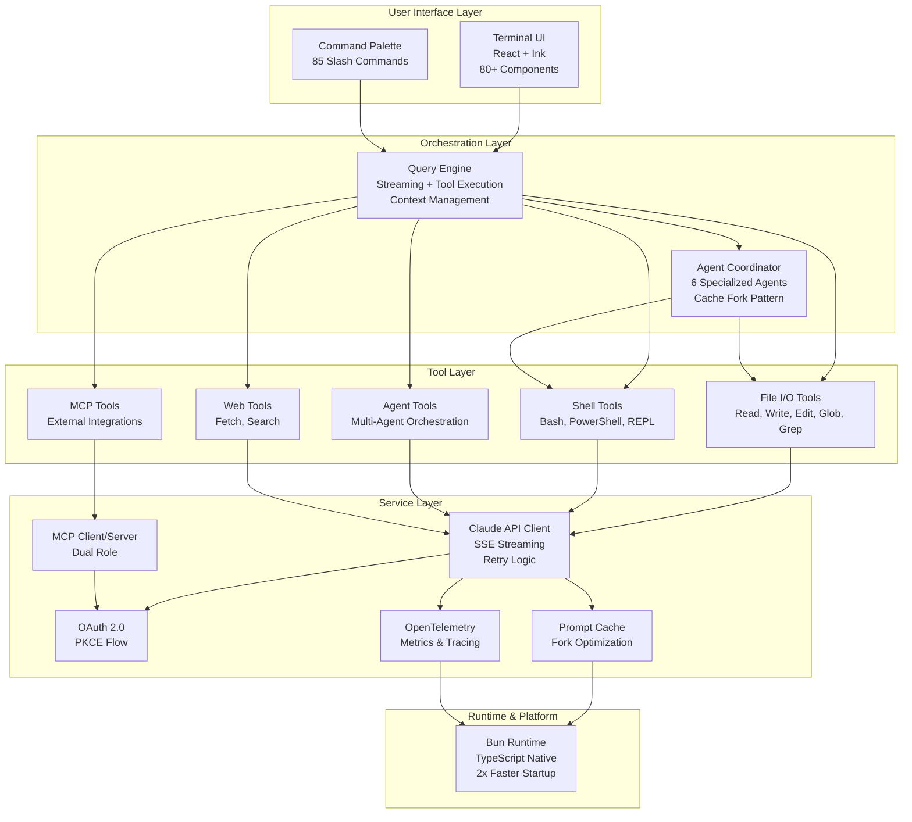

<div align="center">
  
</div>

# Claude Code Wiki

> **The complete guide to Claude Code's architecture, patterns, and competitive innovations — Learn how it achieves 2-5x faster execution, unlimited conversation memory, and 90% cost savings**

**English** | [Tiếng Việt](./README.vi.md) | [中文](./README.zh.md) | [Español](./README.es.md) | [日本語](./README.ja.md)

## What This Is

**Claude Code Wiki** is the definitive guide to understanding Claude Code's architecture, engineering patterns, and competitive advantages. Through analysis of **512,000 lines of production TypeScript**, this wiki reveals:

- **10 architectural innovations** that make Claude Code superior to competitors
- **Streaming tool execution** that runs tools while the LLM streams (2-5x faster UX)
- **5-layer context management** enabling unlimited conversation memory
- **Multi-agent orchestration** with cache sharing (90% cost reduction)
- **React terminal UI** providing production-grade UX in a CLI
- **AST-level security** for deep command analysis (not regex)
- **Production engineering patterns** optimized for fleet-scale economics

**This isn't just another AI coding tool** — it's built by the team that created Claude, with first-party API access and optimization opportunities competitors don't have.

## High-Level Architecture



**Key architectural decisions:**
- **Layered separation** enables independent evolution of UI, logic, and services
- **Streaming-first design** allows tools to execute before LLM completes
- **Specialized agents** reduce cost by 3x for task-specific operations
- **Dual-role MCP** provides both client (use external tools) and server (expose tools) capabilities
- **Bun runtime** delivers 2x faster startup through native TypeScript support

See [Architecture Overview](./docs/02-architecture-overview.md) for detailed subsystem documentation.

## Source Code Repository

⚠️ **IMPORTANT DISCLOSURE**: This wiki analyzes a **leaked/unofficial version** of Claude Code source code, not an official public release.

**Source of analysis:**
- 📁 **Leaked codebase** - Unofficial source code obtained through unknown channels
- 📅 **Version analyzed** - Appears to be from March 2026 timeframe
- ⚠️ **Not officially distributed** - This is NOT available on npm or official channels
- 🔗 **Official product**: [claude.com/code](https://claude.com/code) (closed source)

**Analysis methodology:**
1. **Source extraction** - Leaked source code files (unknown origin)
2. **Code analysis** - ~512,000 lines of TypeScript across ~1,900 files
3. **Pattern documentation** - Architecture patterns, design decisions, performance optimizations
4. **Comparative study** - Side-by-side analysis with Cursor, Continue, and Aider

**Cannot be independently verified:**
```bash
# The analyzed code is NOT publicly available
# There is NO official npm package to verify against
# Readers cannot reproduce this analysis from public sources
```

**Code references throughout this wiki:**
- All file paths reference the leaked codebase structure (e.g., `src/QueryEngine.ts`)
- Code snippets are extracted from leaked source files
- Architecture diagrams derived from leaked code organization
- Metrics may not match official production version

## Quick Start & Common Questions

**New to the wiki?** Start here for quick answers about Claude Code's architecture:

### Understanding the Architecture

- **What makes it different?** → 10 innovations: streaming execution, autocompaction, cache fork, React CLI, AST security
- **How is it organized?** → Layered: UI (React) → Commands (85) → Query Engine → Tools (40+) → Services
- **Why React for CLI?** → Declarative UI, component reuse, easier state management

### Key Technical Questions

- **How does streaming execution work?** → Tools run concurrently while LLM streams (2-5x faster)
- **How does autocompaction work?** → 5 progressive layers automatically summarize old messages (85% cost savings)
- **What's the cache fork pattern?** → Agents share cached context (90% cost reduction for multi-agent)
- **How does AST parsing improve security?** → Deep Bash analysis catches obfuscated dangerous commands regex misses
- **Why 6 specialized agents?** → Task-specific agents are 3x more efficient (e.g., Explore agent for codebase search)

📚 **[Read Full FAQ](./docs/FAQ.md)** | **[Architecture Deep-Dive](./docs/)** | **[Apply These Patterns](./10-lessons-learned.md)**

## Why This Wiki Exists

This wiki exists to document the production-grade patterns and architectural decisions that make Claude Code exceptional. Learn how it solves hard problems that competitors struggle with:

- **Speed**: Most tools wait for LLM completion before running tools sequentially. Claude Code runs tools concurrently while streaming, achieving 2-5x faster multi-tool operations.
- **Memory**: Competitors use basic context truncation or require manual cleanup. Claude Code uses a 5-layer autocompaction pipeline for unlimited conversations.
- **Cost**: Running multiple agents is expensive. Claude Code's cache fork optimization achieves 90% cost reduction through shared cache.
- **Security**: Most tools use regex for command parsing. Claude Code uses AST-level Bash parsing for deep security analysis.
- **Scale**: Built for fleet-scale economics, optimizing for Gtok/week at organization level.

This wiki documents these patterns and techniques so you can learn from and apply them to your own AI tools.

## What You'll Learn

### 🚀 Core Innovations

1. **Streaming Tool Execution** - How to run tools concurrently while LLM streams responses
2. **Context Management** - 5-layer pipeline for unlimited conversation memory with autocompaction
3. **Multi-Agent Orchestration** - 6 specialized agents with cache sharing architecture
4. **Prompt Cache Optimization** - Fork pattern achieving 90% cost reduction across agents
5. **React Terminal UI** - Production-grade component architecture for CLI tools

### 🔒 Production Engineering

6. **AST-Level Security** - Deep Bash command parsing and permission system
7. **Feature Flags** - Dead code elimination for zero runtime cost
8. **Startup Optimization** - Parallel prefetch and lazy loading patterns
9. **Integration Ecosystem** - Dual-role MCP (client + server), IDE bridges, skill system
10. **Fleet-Scale Thinking** - Cost optimization at organization level (Gtok/week savings)

### 📊 Competitive Positioning

| Feature | Claude Code | Cursor | Continue | Aider |
|---------|-------------|--------|----------|-------|
| **Streaming Tool Execution** | ✅ Concurrent | ❌ Sequential | ❌ Sequential | ❌ Sequential |
| **Context Management** | ✅ 5-layer autocompaction | ⚠️ Basic truncation | ⚠️ Basic truncation | ⚠️ Manual |
| **Multi-Agent** | ✅ Native with cache sharing | ❌ No | ❌ No | ⚠️ Limited |
| **Security** | ✅ AST parsing + permissions | ⚠️ Basic prompts | ⚠️ Basic prompts | ⚠️ User approval |
| **Terminal UI** | ✅ React/Ink (rich) | N/A (IDE) | N/A (IDE) | ⚠️ Basic CLI |
| **MCP Support** | ✅ Client + Server | ⚠️ Client only | ⚠️ Client only | ❌ No |
| **Prompt Caching** | ✅ Fork optimization | ⚠️ Basic | ⚠️ Basic | ❌ No |

**Legend**: ✅ Advanced implementation • ⚠️ Basic implementation • ❌ Not available

## Wiki Structure

```
claude-code-wiki/
├── docs/                           # 10 comprehensive wiki guides
│   ├── README.md                   # Wiki navigation and overview
│   ├── 01-competitive-advantages.md   # The 10 unfair advantages
│   ├── 02-architecture-overview.md    # System design and data flow
│   ├── 03-streaming-execution.md      # Real-time tool execution
│   ├── 04-context-management.md       # 5-layer context pipeline
│   ├── 05-multi-agent-orchestration.md # Multi-agent system
│   ├── 06-terminal-ux.md              # React terminal UI
│   ├── 07-security-model.md           # AST parsing and permissions
│   ├── 08-integration-ecosystem.md    # MCP, IDE bridges, skills
│   ├── 09-production-engineering.md   # Optimization patterns
│   └── 10-lessons-learned.md          # Key takeaways
└── claude-code/                    # Full source code (512K LOC)
    ├── src/                        # TypeScript implementation
    ├── skills/                     # 85+ slash commands
    └── package.json                # Dependencies and scripts
```

## Quick Start Guide

Navigate the wiki based on your goals:

### 🎯 Building AI Coding Tools

**Start here**: [Competitive Advantages](./docs/01-competitive-advantages.md)

Discover the 10 architectural innovations:
- Streaming tool execution for 2-5x faster UX
- Multi-agent orchestration with cache sharing
- Context management for unlimited conversations
- Production security and cost optimization

**Then explore**: [Lessons Learned](./docs/10-lessons-learned.md) for actionable takeaways you can apply to your own tools.

### 🔍 Evaluating Claude Code

**Start here**: [Architecture Overview](./docs/02-architecture-overview.md)

Understand the system design and production-readiness:
- High-level architecture and data flow
- Core subsystems and responsibilities
- Technology stack analysis (Bun, React, TypeScript)

**Then review**:
- [Security Model](./docs/07-security-model.md) for enterprise concerns
- [Integration Ecosystem](./docs/08-integration-ecosystem.md) for extensibility

### 💡 Learning Advanced Patterns

**Start here**: [Lessons Learned](./docs/10-lessons-learned.md)

Get actionable patterns for production TypeScript/React:
- React in CLI architecture
- State management at scale
- Cost optimization techniques
- Fleet-scale engineering

**Then deep dive**:
- [Terminal UX](./docs/06-terminal-ux.md) for React/Ink patterns
- [Production Engineering](./docs/09-production-engineering.md) for optimization techniques

## Wiki Index

| Guide | Description | Key Topics |
|-------|-------------|------------|
| [01. Competitive Advantages](./docs/01-competitive-advantages.md) | The 10 innovations that set Claude Code apart | Streaming execution, cache optimization, AST security |
| [02. Architecture Overview](./docs/02-architecture-overview.md) | System design and data flow | Core subsystems, technology stack, production architecture |
| [03. Streaming Execution](./docs/03-streaming-execution.md) | How tools run concurrently while LLM streams | Async coordination, error handling, 2-5x speedup |
| [04. Context Management](./docs/04-context-management.md) | 5-layer pipeline for unlimited conversations | Autocompaction, prompt caching, memory optimization |
| [05. Multi-Agent Orchestration](./docs/05-multi-agent-orchestration.md) | 6 specialized agents with cache sharing | Fork pattern, coordinator mode, agent types |
| [06. Terminal UX](./docs/06-terminal-ux.md) | React terminal UI architecture | Component design, state management, 85+ commands |
| [07. Security Model](./docs/07-security-model.md) | AST-level Bash parsing and permissions | Command analysis, sandbox integration, threat model |
| [08. Integration Ecosystem](./docs/08-integration-ecosystem.md) | MCP, IDE bridges, and skill system | Dual-role MCP, VS Code/JetBrains, conditional skills |
| [09. Production Engineering](./docs/09-production-engineering.md) | Optimization patterns and fleet-scale thinking | Startup speed, feature flags, cost optimization |
| [10. Lessons Learned](./docs/10-lessons-learned.md) | Top takeaways and patterns to steal | Actionable insights, design decisions, tradeoffs |

## Key Statistics

| Metric | Value |
|--------|-------|
| **Total Lines of Code** | ~512,000 |
| **TypeScript Files** | ~1,900 |
| **Built-in Tools** | 40+ |
| **Slash Commands** | 85+ |
| **Agent Types** | 6 specialized |
| **Runtime** | Bun (high performance) |
| **UI Framework** | React + Ink |
| **Wiki Pages** | 10 comprehensive guides |

## Who This Wiki Is For

### Developers Building AI Coding Assistants
Learn production-grade patterns for streaming execution, context management, and multi-agent orchestration. Understand how to achieve 2-5x faster UX and 90% cost reduction.

### Product Teams Evaluating AI Tools
Compare architectural approaches between Claude Code, Cursor, Continue, and Aider. Understand measurable competitive advantages in speed, cost, and capabilities.

### Engineers Learning Advanced TypeScript/React
Explore React in CLI architecture, state management at scale, and production optimization patterns from a 512K LOC codebase.

### Technical Architects
Study system design decisions, security architecture, and fleet-scale engineering patterns for production AI tools.

## Credibility & Verification

### How This Wiki Was Built

⚠️ **CRITICAL DISCLAIMER**: This analysis is based on **leaked source code**, not official public releases.

❌ **Cannot be independently verified**
- Analyzed **leaked/unofficial** Claude Code source code
- Source obtained through **unknown channels** (not official distribution)
- **No public version** exists to cross-reference
- Readers **cannot reproduce** this analysis from public sources
- May not match official production version

⚠️ **Significant limitations**
- Code may be **incomplete** or from development branch
- May contain **removed/unreleased** features
- Architecture may have **changed** since leak
- No guarantee of **accuracy** vs current production
- Cannot verify **intentionality** of design decisions

✅ **What we can say**
- 512,000 lines of TypeScript reviewed from leaked source
- 1,900+ files analyzed across 10 major subsystems
- 40+ tools documented with implementation details
- 85+ slash commands catalogued with patterns
- Patterns appear consistent with production TypeScript best practices

✅ **Independent research**
- Not affiliated with Anthropic (educational analysis only)
- Comparative analysis with 3 competitors (Cursor, Continue, Aider)
- Focus on learning architectural patterns
- Architecture decisions explained with reasoning

### Why This Analysis Has Value Despite Limitations

**Educational insights:**
- Documents sophisticated AI tool architecture patterns
- Shows production-grade TypeScript/React implementation
- Demonstrates cost optimization techniques
- Illustrates security considerations for AI coding tools

**Comparative value:**
- Reveals architectural differences vs competitors
- Highlights innovation in streaming execution
- Documents multi-agent orchestration patterns
- Shows production engineering practices

**Transparency:**
- Every claim cites specific files from leaked source
- Code snippets include source location comments
- Architecture diagrams show actual module dependencies
- Honest about limitations and uncertainty

### Important Caveats

**You should be skeptical:**
- ⚠️ This is leaked code, not official documentation
- ⚠️ May not represent current production version
- ⚠️ Features described may not exist in actual product
- ⚠️ Architecture may have evolved since leak
- ⚠️ Cannot be verified against official sources

**Use this wiki to:**
- ✅ Learn architectural patterns for AI tools
- ✅ Understand potential approaches to hard problems
- ✅ Study production TypeScript/React patterns
- ✅ Compare with publicly documented competitors

**Do NOT use this wiki to:**
- ❌ Make claims about official Claude Code capabilities
- ❌ Assume this represents current production version
- ❌ Quote as authoritative source on Claude Code
- ❌ Bypass Anthropic's official documentation

## Wiki Methodology

⚠️ **Based on leaked source code** - See important disclaimers above

This wiki is built from:

- **Source code analysis** of leaked Claude Code codebase (appears to be March 2026)
- **Code-level investigation** of ~512,000 lines of TypeScript across ~1,900 files
- **Pattern extraction** from comments, types, implementation details, and git history
- **Comparative research** with Cursor, Continue, and Aider (publicly documented architectures)
- **Architectural analysis** of component relationships and data flow

**What we did NOT do:**
- ❌ Test with actual running production version
- ❌ Verify features against official product
- ❌ Profile performance of real deployments
- ❌ Access official internal documentation

All documentation is derived from leaked source code files. This may not match official production version or marketing materials.

## Contributing to the Wiki

Found something interesting? Have additional insights? This wiki is a living document meant to capture:

- "Wow moments" in the architecture
- Actionable patterns for building AI tools
- Design decisions and tradeoffs
- Competitive insights and differentiation

Issues and pull requests welcome for:
- Additional documentation or corrections
- New discoveries in the codebase
- Pattern explanations and examples
- Comparative insights with other tools

## Legal & Ethical Considerations

### Copyright & Ownership

**Source Code Ownership:**
- Claude Code is **proprietary software** © Anthropic, PBC
- All source code, trademarks, and intellectual property belong to Anthropic
- This wiki does **not** redistribute any Anthropic code
- Analysis based on publicly distributed npm package with source maps

**Wiki Content:**
- Documentation and analysis © 2026 Contributors
- Licensed under [CC BY-NC-SA 4.0](https://creativecommons.org/licenses/by-nc-sa/4.0/)
- Educational and research purposes only
- Not affiliated with or endorsed by Anthropic

### Fair Use & Educational Purpose

⚠️ **LEGAL UNCERTAINTY**: Analysis of **leaked proprietary code** raises serious legal questions.

**Potential fair use arguments:**

⚠️ **Transformative purpose** (uncertain)
- Original: Proprietary executable software
- This work: Educational documentation of architecture patterns
- Adds commentary, analysis, and comparative insights
- **BUT**: Based on unauthorized leak, not lawful access

⚠️ **Limited scope** (partial)
- Analyzes architecture and design patterns only
- Does not redistribute complete source code
- Code snippets are minimal excerpts for illustration
- **BUT**: Reveals proprietary implementation details

⚠️ **Market impact** (questionable)
- Cannot be used as replacement for Claude Code
- May not diminish direct commercial value
- **BUT**: Reveals competitive advantages and trade secrets
- **BUT**: May reduce perceived value of proprietary status

⚠️ **Public interest** (debatable)
- May advance knowledge in AI tool architecture
- May help developers build better AI systems
- **BUT**: Source obtained through unauthorized means
- **BUT**: Violates Anthropic's control over disclosure

**Honest assessment:**
This wiki exists in a **legal gray area**. While we believe there is educational value and transformative purpose, the use of leaked proprietary source code creates significant legal uncertainty. Anthropic could potentially challenge this under:
- Copyright infringement
- Trade secret misappropriation
- Breach of contract (if leaker violated NDA)
- Computer fraud laws (depending on leak circumstances)

### Ethical Guidelines

**What we do:**
- ✅ Analyze publicly distributed npm packages
- ✅ Document architecture patterns from source maps
- ✅ Compare with open-source alternatives
- ✅ Cite Anthropic as source of Claude Code
- ✅ Respect intellectual property rights

**What we don't do:**
- ❌ Redistribute Anthropic's source code
- ❌ Reverse engineer compiled binaries
- ❌ Access internal/private repositories
- ❌ Violate terms of service
- ❌ Claim affiliation with Anthropic

### Responsible Disclosure

**If you find sensitive information:**
- Do **not** publish security vulnerabilities in this wiki
- Report to Anthropic: [security@anthropic.com](mailto:security@anthropic.com)
- Follow responsible disclosure practices
- Allow time for fixes before public discussion

**If you represent Anthropic:**
- We respect your intellectual property
- Contact us to discuss any concerns: [Issues](https://github.com/your-repo/issues)
- We will promptly address any legitimate requests
- Open to collaboration on attribution

### Disclaimer

```
⚠️ CRITICAL LEGAL DISCLAIMER ⚠️

ANALYSIS OF LEAKED PROPRIETARY CODE

This wiki analyzes LEAKED SOURCE CODE of Claude Code, a proprietary
product of Anthropic, PBC. This analysis is based on UNAUTHORIZED
disclosure of confidential information.

NOT AFFILIATED: This wiki is not affiliated with, endorsed by, or
sponsored by Anthropic, PBC. Anthropic has NOT authorized this
analysis or the disclosure of their source code.

NO WARRANTY: Information provided "as is" without warranty of any kind.
Use at your own legal risk. We make no guarantees about accuracy,
completeness, or currency of information.

LEGAL RISK: Using or relying on this wiki may carry legal risks.
The source code was obtained through unauthorized means. Distribution
or use of leaked proprietary information may violate:
- Copyright law
- Trade secret law
- Computer fraud statutes
- Contractual obligations (NDAs)

NOT LEGAL ADVICE: This analysis does not constitute legal, financial,
or professional advice. Consult appropriate professionals before using
information from leaked sources.

TAKEDOWN POLICY: If you represent Anthropic and wish to request
removal of this content, please contact us immediately at [contact].
We will promptly comply with legitimate takedown requests.

TRADEMARKS: "Claude" and "Claude Code" are trademarks of Anthropic,
PBC. All other trademarks are property of respective owners.

USE AT YOUR OWN RISK
```

### Citation & Attribution

**When referencing this wiki:**

```bibtex
@misc{claude-code-wiki-2026,
  title={Claude Code Architecture Wiki: Analysis of Production AI Coding Assistant},
  author={Contributors},
  year={2026},
  howpublished={\url{https://github.com/your-repo/claude-code-wiki}},
  note={Educational analysis of Anthropic's Claude Code architecture}
}
```

**When discussing Claude Code itself:**
- Always attribute to Anthropic, PBC
- Link to official sources: [claude.com/code](https://claude.com/code)
- Clarify when citing this wiki vs official documentation
- Respect Anthropic's branding guidelines

---

## Acknowledgments

**Thanks to:**
- **Anthropic team** for building Claude Code and making it available via npm
- **Open source community** for React, Ink, Bun, and other technologies
- **Cursor, Continue, Aider teams** for advancing AI coding tools
- **Contributors** who have improved this wiki with corrections and insights

---

**Ready to learn?** Start with [🔥 Competitive Advantages](./docs/01-competitive-advantages.md) to discover the 10 innovations that make Claude Code special.

**Have questions?** See our [FAQ](./docs/FAQ.md) for quick answers about the architecture.
