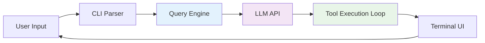

# Claude Code Source Code Study Guide

> **Repository**: https://github.com/777genius/claude-code-source-code-full
> **Analysis Date**: 2026-04-01
> **Purpose**: Learning modules, code patterns, techniques, and architectural decisions

---

## 📋 Table of Contents

1. [Project Overview](#project-overview)
2. [Getting Started](#getting-started)
3. [Core Architecture](#core-architecture)
4. [Module Deep Dive](#module-deep-dive)
5. [Key Techniques & Patterns](#key-techniques--patterns)
6. [Tool System Analysis](#tool-system-analysis)
7. [Command System](#command-system)
8. [Multi-Agent Architecture](#multi-agent-architecture)
9. [Service Integrations](#service-integrations)
10. [Build & Configuration](#build--configuration)
11. [Learning Exercises](#learning-exercises)
12. [Resources & References](#resources--references)

---

## 📖 Project Overview

### What is Claude Code?

Claude Code is Anthropic's official CLI tool for interacting with Claude AI. This repository contains the full source code that was inadvertently exposed through npm package source maps in March 2026.

### Key Statistics

| Metric | Value |
|--------|-------|
| **Total Lines of Code** | ~512,000 |
| **TypeScript Files** | ~1,900 files |
| **Main Language** | TypeScript (strict mode) |
| **Runtime** | Bun |
| **UI Framework** | React + Ink (terminal UI) |
| **Total Size** | 36MB of source code |

### Technology Stack

```
┌─────────────────────────────────────┐
│         User Interface              │
│    React + Ink (Terminal UI)        │
├─────────────────────────────────────┤
│         Command Layer               │
│    ~85 Slash Commands               │
├─────────────────────────────────────┤
│          Tool System                │
│      ~40 Self-Contained Tools       │
├─────────────────────────────────────┤
│       Query Engine                  │
│  LLM API, Streaming, Tool Loops     │
├─────────────────────────────────────┤
│       Service Layer                 │
│  API, MCP, OAuth, LSP, Plugins      │
├─────────────────────────────────────┤
│         Runtime                     │
│      Bun (JavaScript/TS)            │
└─────────────────────────────────────┘
```

---

## 🚀 Getting Started

### Prerequisites

```bash
# Required
- Node.js 18+ or Bun
- Git
- Text editor (VS Code recommended)

# Optional
- TypeScript knowledge
- React familiarity
- Terminal/CLI experience
```

### Clone and Setup

```bash
# Clone the repository
cd ~/Documents
git clone https://github.com/777genius/claude-code-source-code-full.git claude-code-analysis
cd claude-code-analysis

# Install dependencies (if using npm/bun)
bun install
# or
npm install

# Explore the structure
ls -la src/
```

### Repository Structure

```
claude-code-analysis/
├── src/
│   ├── main.tsx                 # Entry point
│   ├── QueryEngine.ts           # Core LLM interaction (~46K lines)
│   ├── Tool.ts                  # Tool base interfaces (~29K lines)
│   ├── commands.ts              # Command registry (~25K lines)
│   ├── tools/                   # 40 tool implementations
│   ├── commands/                # Slash command implementations
│   ├── services/                # External integrations
│   ├── bridge/                  # IDE integration
│   ├── components/              # React UI components
│   ├── hooks/                   # React hooks (~80)
│   ├── screens/                 # Full-screen UIs
│   └── ...
├── mcp-server/                  # MCP server implementation
├── web/                         # Web UI components
├── package.json
├── tsconfig.json
└── README.md
```

---

## 🏗️ Core Architecture

### High-Level Pipeline



### Startup Sequence

```typescript
// src/main.tsx - Simplified startup flow

1. Parallel Prefetch Phase
   ├── MDM Settings Read
   ├── Keychain Token Fetch
   └── API Preconnection

2. CLI Parsing (Commander.js)
   └── Parse arguments and flags

3. Initialization
   ├── Load Configuration (Zod validation)
   ├── OAuth Token Management
   ├── MDM Policy Enforcement
   └── Feature Flag Loading (GrowthBook)

4. REPL Launch
   ├── Session Creation
   └── Message History Load

5. Query Engine Loop
   ├── User Input
   ├── LLM Streaming
   ├── Tool Invocation
   ├── Token Counting
   └── Retry Logic
```

### Key Files to Study First

| File | Lines | Purpose | Learning Priority |
|------|-------|---------|------------------|
| `src/main.tsx` | ~500 | Entry point, startup sequence | ⭐⭐⭐ High |
| `src/QueryEngine.ts` | ~46K | LLM interaction, tool loops | ⭐⭐⭐ High |
| `src/Tool.ts` | ~29K | Tool interface definitions | ⭐⭐⭐ High |
| `src/commands.ts` | ~25K | Command registry | ⭐⭐ Medium |
| `src/tools/BashTool/` | ~3K | Complex tool example | ⭐⭐⭐ High |

---

## 🔍 Module Deep Dive

### 1. Query Engine (`src/QueryEngine.ts`)

**Purpose**: Core orchestrator for LLM API calls, streaming, and tool execution loops.

**Key Responsibilities**:
- Manages conversation context
- Handles streaming responses from Claude API
- Executes tool call loops
- Token counting and cost tracking
- Retry logic with exponential backoff

**Code Example** (Simplified):
```typescript
// Conceptual flow in QueryEngine.ts
class QueryEngine {
  async executeQuery(userInput: string) {
    // 1. Add user message to context
    this.messages.push({ role: 'user', content: userInput });

    // 2. Call LLM API with streaming
    const stream = await this.apiClient.streamMessage({
      model: this.model,
      messages: this.messages,
      tools: this.availableTools,
    });

    // 3. Process streaming response
    for await (const chunk of stream) {
      if (chunk.type === 'tool_use') {
        // 4. Execute tool
        const result = await this.executeTool(chunk.tool, chunk.input);

        // 5. Add tool result to context
        this.messages.push({ role: 'assistant', content: result });

        // 6. Continue conversation loop
        return this.executeQuery(''); // Recursive call
      }
    }
  }
}
```

**Learning Points**:
- Streaming API pattern
- Tool execution loops
- Context management
- Error handling and retries

---

### 2. Tool System (`src/tools/`)

**Architecture**: Each tool is self-contained with schema, execution, permissions, and UI.

**Tool Structure Pattern**:
```typescript
// src/tools/ExampleTool/ExampleTool.tsx
export const ExampleTool = buildTool({
  name: 'ExampleTool',

  // Zod schema for input validation
  inputSchema: z.object({
    requiredParam: z.string(),
    optionalParam: z.number().optional(),
  }),

  // Main execution logic
  async call(args, context, canUseTool, parentMessage, onProgress) {
    // 1. Validate permissions
    const allowed = await canUseTool(this.name, args);
    if (!allowed) throw new Error('Permission denied');

    // 2. Execute tool logic
    const result = await doSomething(args);

    // 3. Report progress
    onProgress({ type: 'progress', message: 'Working...' });

    // 4. Return result
    return { success: true, data: result };
  },

  // Permission check
  async checkPermissions(input, context) {
    return { allowed: true };
  },

  // Concurrency safety
  isConcurrencySafe(input) {
    return true; // Safe for parallel execution
  },

  // Read-only check
  isReadOnly(input) {
    return false;
  },

  // UI rendering for invocation
  renderToolUseMessage(input, options) {
    return <Text>Executing {this.name}...</Text>;
  },

  // UI rendering for result
  renderToolResultMessage(content, progressMessages, options) {
    return <Text color="green">Result: {content}</Text>;
  },
});
```

**40 Tools by Category**:

#### File I/O (7 tools)
- `FileReadTool` - Read text, images, PDFs, notebooks
- `FileWriteTool` - Create/overwrite files
- `FileEditTool` - Partial edits via string replacement
- `NotebookEditTool` - Jupyter notebook editing
- `GlobTool` - File pattern matching
- `GrepTool` - ripgrep content search
- `TodoWriteTool` - Task file management

#### Shell & Execution (3 tools)
- `BashTool` - Shell command execution (highly sophisticated)
- `PowerShellTool` - Windows PowerShell
- `REPLTool` - Python/Node.js REPL

#### Agent Orchestration (9 tools)
- `AgentTool` - Sub-agent spawning
- `SendMessageTool` - Inter-agent messaging
- `TeamCreateTool` / `TeamDeleteTool` - Multi-agent teams
- `EnterPlanModeTool` / `ExitPlanModeTool` - Planning mode
- `EnterWorktreeTool` / `ExitWorktreeTool` - Git worktree
- `SleepTool` - Proactive mode delays

#### Task Management (6 tools)
- `TaskCreateTool` - Create background tasks
- `TaskUpdateTool` - Update task status
- `TaskGetTool` - Retrieve task details
- `TaskListTool` - List all tasks
- `TaskOutputTool` - Get task output
- `TaskStopTool` - Stop running task

#### Web Tools (2 tools)
- `WebFetchTool` - Fetch URL content
- `WebSearchTool` - Web search

#### MCP Tools (5 tools)
- `MCPTool` - Invoke MCP server tools
- `ListMcpResourcesTool` - List MCP resources
- `ReadMcpResourceTool` - Read MCP resource
- `McpAuthTool` - MCP authentication
- `ToolSearchTool` - Dynamic tool discovery

#### Integration (2 tools)
- `LSPTool` - Language Server Protocol
- `SkillTool` - Execute registered skills

#### Utility (6 tools)
- `AskUserQuestionTool` - Prompt user for input
- `BriefTool` - Generate summaries
- `ConfigTool` - Configuration management
- `ScheduleCronTool` - Scheduled triggers
- `RemoteTriggerTool` - Remote triggers
- `SyntheticOutputTool` - Structured output

---

### 3. BashTool Deep Dive

The most sophisticated tool with 17+ supporting files.

**File Structure**:
```
src/tools/BashTool/
├── BashTool.tsx              # Main implementation
├── BashToolResultMessage.tsx # Result rendering
├── UI.tsx                    # Invocation UI
├── bashPermissions.ts        # Permission rules
├── bashSecurity.ts           # Security validation
├── commandSemantics.ts       # Command classification
├── readOnlyValidation.ts     # Destructive command detection
├── sedEditParser.ts          # Sed script parsing
├── ast.js                    # AST parsing for bash
├── sandbox/                  # Sandboxing adapter
└── ... (11 more utility files)
```

**Key Features**:
1. **AST Parsing**: Analyzes bash command structure for safety
2. **Command Classification**: Read, search, write, execute
3. **Security Checks**: Prevents destructive operations
4. **Permission System**: Fine-grained command approval
5. **Sandboxing**: Optional isolated execution
6. **Sed Validation**: Safe sed script checking

**Example Security Check**:
```typescript
// src/tools/BashTool/bashSecurity.ts
export function isDestructiveCommand(command: string): boolean {
  const dangerous = [
    /rm\s+-rf\s+\//,           // rm -rf /
    /mkfs/,                     // Format filesystem
    /dd\s+if=/,                 // Disk operations
    />\/dev\/sd[a-z]/,          // Direct disk write
    /fork\s*bomb/,              // Fork bomb
  ];

  return dangerous.some(pattern => pattern.test(command));
}
```

---

### 4. Command System (`src/commands.ts`)

**~85 Slash Commands** organized by category.

**Command Type Definitions**:
```typescript
type Command =
  | PromptCommand      // Sends formatted prompt with tools
  | LocalCommand       // In-process, returns text
  | LocalJSXCommand    // In-process, returns React JSX
```

**Example Command Definition**:
```typescript
// src/commands/commit.ts
export const commitCommand: PromptCommand = {
  name: 'commit',
  category: 'git',
  description: 'Generate and create a git commit',

  async buildPrompt(context) {
    // 1. Check git status
    const status = await exec('git status');
    const diff = await exec('git diff');

    // 2. Build prompt with context
    return `
      Analyze these changes and create a commit:

      Status:
      ${status}

      Diff:
      ${diff}

      Generate a commit message and create the commit.
    `;
  },

  // Tools allowed for this command
  allowedTools: ['BashTool', 'FileReadTool'],

  // Feature flag requirement
  requiresFeature: 'GIT_COMMANDS',
};
```

**Command Categories**:
- Git & Version Control (6)
- Code Quality (4)
- Session & Context (8)
- Configuration & Settings (11)
- Memory & Knowledge (3)
- MCP & Plugins (3)
- Authentication (3)
- Tasks & Agents (4)
- Diagnostics (6)
- IDE & Desktop (3)
- Miscellaneous (5)

---

### 5. Multi-Agent System

**Architecture**:
```
┌─────────────────────────────────────────┐
│         Coordinator Mode                │
│  (Task Delegation & Orchestration)      │
└─────────────────┬───────────────────────┘
                  │
        ┌─────────┴─────────┐
        │                   │
    ┌───▼────┐        ┌─────▼──┐
    │ Agent  │        │ Agent  │
    │   1    │        │   2    │
    └───┬────┘        └────┬───┘
        │                  │
    ┌───▼────────────────┬─▼─────────┐
    │  Shared Memory     │  Messages  │
    └────────────────────┴────────────┘
```

**Key Components**:

1. **AgentTool** - Spawns sub-agents
2. **TeamCreateTool** - Creates multi-agent teams
3. **SendMessageTool** - Inter-agent messaging
4. **Coordinator Mode** - Orchestrates workflows

**Example Multi-Agent Pattern**:
```typescript
// Conceptual multi-agent workflow
async function researchAndWrite(topic: string) {
  // 1. Create research team
  const team = await createTeam({
    agents: [
      { role: 'researcher', model: 'opus' },
      { role: 'writer', model: 'sonnet' },
      { role: 'reviewer', model: 'haiku' },
    ]
  });

  // 2. Parallel research
  const [findings1, findings2] = await Promise.all([
    sendMessage(team.agents[0], `Research ${topic} - part 1`),
    sendMessage(team.agents[0], `Research ${topic} - part 2`),
  ]);

  // 3. Write based on research
  const draft = await sendMessage(
    team.agents[1],
    `Write article based on: ${findings1} ${findings2}`
  );

  // 4. Review
  const final = await sendMessage(
    team.agents[2],
    `Review and improve: ${draft}`
  );

  return final;
}
```

---

## 🎯 Key Techniques & Patterns

### 1. Parallel Prefetch (Startup Optimization)

**Problem**: Heavy module imports slow down startup.

**Solution**: Load critical data in parallel before importing modules.

```typescript
// src/main.tsx
async function optimizedStartup() {
  // Start async operations BEFORE heavy imports
  const mdmPromise = startMdmRawRead();
  const keychainPromise = startKeychainPrefetch();
  const apiPromise = preconnectToAPI();

  // Now import heavy modules while data loads
  const { QueryEngine } = await import('./QueryEngine.js');
  const { ToolRegistry } = await import('./tools/index.js');

  // Wait for prefetch to complete
  const [mdm, keychain, api] = await Promise.all([
    mdmPromise,
    keychainPromise,
    apiPromise,
  ]);

  // Continue initialization with loaded data
}
```

**Learning Point**: Overlap I/O with computation for faster startup.

---

### 2. Lazy Loading (Module Deferral)

**Problem**: Heavy modules (OpenTelemetry, gRPC) increase bundle size and startup time.

**Solution**: Dynamic imports only when needed.

```typescript
// src/services/telemetry.ts
let telemetryModule: any;

export async function initTelemetry() {
  // Only load OpenTelemetry when telemetry is enabled
  if (!telemetryModule && shouldEnableTelemetry()) {
    telemetryModule = await import('@opentelemetry/sdk-node');
    // Initialize telemetry
  }
}

// Usage
if (feature('TELEMETRY')) {
  await initTelemetry();
}
```

**Benefits**:
- Faster startup for users without telemetry
- Smaller initial bundle size
- On-demand loading

---

### 3. React Context + Custom Store

**Pattern**: Immutable state with React Context and custom store.

```typescript
// src/state/AppState.tsx
export type AppState = DeepImmutable<{
  settings: SettingsJson;
  messages: Message[];
  currentModel: ModelSetting;
  permissions: PermissionRules;
  // ... 50+ properties
}>;

// src/state/AppStateStore.ts
class AppStateStore {
  private state: AppState;
  private listeners: Set<(state: AppState) => void> = new Set();

  getState(): AppState {
    return this.state;
  }

  setState(updater: (prev: AppState) => AppState) {
    this.state = updater(this.state);
    this.notifyListeners();
  }

  subscribe(listener: (state: AppState) => void) {
    this.listeners.add(listener);
    return () => this.listeners.delete(listener);
  }

  private notifyListeners() {
    this.listeners.forEach(listener => listener(this.state));
  }
}
```

**Learning Point**: Centralized state management with immutability guarantees.

---

### 4. Permission System

**Architecture**:
```
Tool Invocation
    ↓
checkPermissions()
    ↓
Permission Mode Decision
    ├── default → Prompt user
    ├── plan → Show plan, ask once
    ├── auto → ML classifier
    └── bypassPermissions → Auto-approve
    ↓
User Response / Auto-Decision
    ↓
Tool Execution
```

**Wildcard Rules**:
```typescript
// src/types/permissions.ts
type PermissionRule = {
  pattern: string;  // e.g., "Bash(git *)" or "FileEdit(/src/*)"
  allowed: boolean;
};

// Example rules
const rules: PermissionRule[] = [
  { pattern: 'Bash(git *)', allowed: true },        // All git commands
  { pattern: 'Bash(rm -rf *)', allowed: false },    // Dangerous commands
  { pattern: 'FileRead(*)', allowed: true },        // All file reads
  { pattern: 'FileEdit(/etc/*)', allowed: false },  // System files
];
```

---

### 5. Streaming API Pattern

**Implementation**:
```typescript
// src/services/api/claude.ts
async function* streamMessage(request: MessageRequest) {
  const response = await fetch(API_URL, {
    method: 'POST',
    body: JSON.stringify(request),
  });

  const reader = response.body!.getReader();
  let buffer = '';

  while (true) {
    const { done, value } = await reader.read();
    if (done) break;

    // Parse SSE format
    buffer += new TextDecoder().decode(value);
    const lines = buffer.split('\n');
    buffer = lines.pop() || '';

    for (const line of lines) {
      if (line.startsWith('data: ')) {
        const data = JSON.parse(line.slice(6));

        // Yield different event types
        if (data.type === 'content_block_delta') {
          yield { type: 'text', text: data.delta.text };
        } else if (data.type === 'tool_use') {
          yield { type: 'tool_use', tool: data.name, input: data.input };
        }
      }
    }
  }
}

// Usage
for await (const chunk of streamMessage(request)) {
  if (chunk.type === 'text') {
    console.log(chunk.text);
  } else if (chunk.type === 'tool_use') {
    await executeTool(chunk.tool, chunk.input);
  }
}
```

---

### 6. Feature Flags with Dead Code Elimination

**Bun's `bun:bundle` feature**:
```typescript
import { feature } from 'bun:bundle';

// This code is REMOVED at build time if VOICE_MODE is disabled
if (feature('VOICE_MODE')) {
  const voiceEngine = await import('./voiceEngine.js');
  voiceEngine.initialize();
}

// Common flags
if (feature('BRIDGE_MODE')) { /* IDE integration */ }
if (feature('COORDINATOR_MODE')) { /* Multi-agent */ }
if (feature('PROACTIVE')) { /* Autonomous mode */ }
```

**Benefits**:
- Zero runtime cost for disabled features
- Smaller bundle size
- Type-safe feature detection

---

### 7. Tool Context Pattern

**Rich context passed to every tool**:
```typescript
// src/Tool.ts
interface ToolUseContext {
  // Core options
  options: {
    commands: Command[];
    tools: Tool[];
    mcpClients: MCPClient[];
    thinkingConfig: ThinkingConfig;
  };

  // Abort control
  abortController: AbortController;

  // File state cache
  readFileState: FileStateCache;

  // App state access
  getAppState(): AppState;
  setAppState(updater: (prev: AppState) => AppState): void;

  // Message history
  messages: Message[];

  // Agent identity
  agentId?: AgentId;

  // Permission callback
  requestPrompt?: (request: PromptRequest) => Promise<PromptResponse>;

  // ... 20+ more context properties
}
```

**Learning Point**: Dependency injection via context object.

---

### 8. Message Pipeline & Normalization

**Flow**:
```
LLM API Response
    ↓
normalizeContentFromAPI()
    ↓
splitMessages()
    ↓
stripBlocks()
    ↓
ensureToolResultPairing()
    ↓
normalizeMessagesForAPI()
    ↓
LLM API Request
```

**Content Block Types**:
```typescript
type ContentBlock =
  | { type: 'text'; text: string }
  | { type: 'tool_use'; id: string; name: string; input: any }
  | { type: 'tool_result'; tool_use_id: string; content: any }
  | { type: 'image'; source: { type: 'base64'; data: string } }
  | { type: 'reference'; data: any };
```

---

### 9. Cost Tracking

**Implementation**:
```typescript
// src/cost-tracker.ts
class CostTracker {
  private usage = new Map<ModelId, {
    inputTokens: number;
    outputTokens: number;
    cacheCreationTokens: number;
    cacheReadTokens: number;
  }>();

  track(model: ModelId, usage: TokenUsage) {
    const current = this.usage.get(model) || { /* zeros */ };
    this.usage.set(model, {
      inputTokens: current.inputTokens + usage.input_tokens,
      outputTokens: current.outputTokens + usage.output_tokens,
      cacheCreationTokens: current.cacheCreationTokens + usage.cache_creation_input_tokens,
      cacheReadTokens: current.cacheReadTokens + usage.cache_read_input_tokens,
    });
  }

  getTotalCost(): number {
    let total = 0;
    for (const [model, usage] of this.usage) {
      const pricing = MODEL_PRICING[model];
      total += (usage.inputTokens * pricing.input) / 1_000_000;
      total += (usage.outputTokens * pricing.output) / 1_000_000;
      total += (usage.cacheCreationTokens * pricing.cacheWrite) / 1_000_000;
      total += (usage.cacheReadTokens * pricing.cacheRead) / 1_000_000;
    }
    return total;
  }
}
```

---

### 10. Config Schema & Migrations

**Zod Schemas**:
```typescript
// src/schemas/settings.ts
const SettingsSchema = z.object({
  model: z.enum(['sonnet', 'opus', 'haiku']),
  apiKey: z.string().optional(),
  maxTokens: z.number().min(100).max(200000),
  temperature: z.number().min(0).max(1),
  permissions: PermissionRulesSchema,
  // ... 50+ more fields
});

type SettingsJson = z.infer<typeof SettingsSchema>;
```

**Migrations**:
```typescript
// src/migrations/v1-to-v2.ts
export function migrateV1toV2(config: V1Config): V2Config {
  return {
    ...config,
    // Add new field with default
    newFeature: config.experimental?.newFeature ?? false,
    // Rename field
    modelSetting: config.model_setting,
  };
}
```

---

## 📊 Service Integrations

### 1. API Layer (`src/services/api/`)

**Key Files**:
- `claude.ts` (125KB) - Anthropic API client
- `withRetry.ts` (28KB) - Retry logic
- `errors.ts` (42KB) - Error handling
- `logging.ts` (24KB) - Telemetry
- `filesApi.ts` (21KB) - File upload/download

**Retry Pattern**:
```typescript
// src/services/api/withRetry.ts
async function withRetry<T>(
  fn: () => Promise<T>,
  options: RetryOptions
): Promise<T> {
  let lastError: Error;

  for (let attempt = 0; attempt < options.maxAttempts; attempt++) {
    try {
      return await fn();
    } catch (error) {
      lastError = error;

      // Don't retry on client errors (4xx)
      if (isClientError(error)) throw error;

      // Exponential backoff
      const delay = Math.min(
        options.baseDelay * Math.pow(2, attempt),
        options.maxDelay
      );

      await sleep(delay);
    }
  }

  throw lastError!;
}
```

---

### 2. MCP (Model Context Protocol)

**Client Mode**:
```typescript
// src/services/mcp/client.ts
class MCPClient {
  async listTools(): Promise<Tool[]> {
    const response = await this.send({
      jsonrpc: '2.0',
      method: 'tools/list',
    });
    return response.result.tools;
  }

  async callTool(name: string, args: any): Promise<any> {
    const response = await this.send({
      jsonrpc: '2.0',
      method: 'tools/call',
      params: { name, arguments: args },
    });
    return response.result;
  }
}
```

**Server Mode**:
```typescript
// src/entrypoints/mcp.ts
const mcpServer = new MCPServer({
  name: 'claude-code',
  version: '1.0.0',

  tools: [
    {
      name: 'read_file',
      description: 'Read file contents',
      inputSchema: { /* ... */ },
      handler: async (args) => {
        return await fs.readFile(args.path, 'utf-8');
      },
    },
    // ... more tools
  ],
});
```

---

### 3. OAuth 2.0 Authentication

**Flow**:
```typescript
// src/services/oauth/flow.ts
async function consoleOAuthFlow(): Promise<TokenResponse> {
  // 1. Generate PKCE challenge
  const verifier = generateCodeVerifier();
  const challenge = await generateCodeChallenge(verifier);

  // 2. Build authorization URL
  const authUrl = buildAuthUrl({
    client_id: CLIENT_ID,
    redirect_uri: REDIRECT_URI,
    code_challenge: challenge,
    code_challenge_method: 'S256',
    scope: 'api',
  });

  // 3. Display URL and wait for callback
  console.log(`Open: ${authUrl}`);
  const code = await waitForCallback();

  // 4. Exchange code for token
  const tokenResponse = await fetch(TOKEN_URL, {
    method: 'POST',
    body: JSON.stringify({
      grant_type: 'authorization_code',
      code,
      code_verifier: verifier,
      redirect_uri: REDIRECT_URI,
    }),
  });

  const tokens = await tokenResponse.json();

  // 5. Store in keychain (macOS)
  await storeInKeychain(tokens);

  return tokens;
}
```

---

## 🛠️ Build & Configuration

### TypeScript Configuration

```json
{
  "compilerOptions": {
    "target": "ESNext",
    "module": "ESNext",
    "jsx": "react-jsx",
    "jsxImportSource": "react",
    "strict": true,
    "moduleResolution": "bundler",
    "verbatimModuleSyntax": false,
    "allowImportingTsExtensions": true,
    "noEmit": true,
    "esModuleInterop": true,
    "skipLibCheck": true
  }
}
```

### Build Scripts

```typescript
// src/scripts/build-bundle.ts
import { build } from 'bun';

await build({
  entrypoints: ['./src/main.tsx'],
  outdir: './dist',
  target: 'bun',
  minify: true,
  splitting: false,

  // Dead code elimination
  define: {
    'feature("VOICE_MODE")': 'false',
    'feature("BRIDGE_MODE")': 'true',
  },
});
```

---

## 🎓 Learning Exercises

### Exercise 1: Create a Simple Tool

**Goal**: Understand tool creation pattern.

**Task**: Create a `WordCountTool` that counts words in a file.

```typescript
// src/tools/WordCountTool/WordCountTool.tsx
import { buildTool } from '../buildTool.js';
import { z } from 'zod';
import { Text } from 'ink';

export const WordCountTool = buildTool({
  name: 'WordCount',

  inputSchema: z.object({
    file_path: z.string(),
  }),

  async call(args, context) {
    // Read file using FileReadTool
    const content = await context.tools.FileRead.call({
      file_path: args.file_path,
    }, context);

    // Count words
    const words = content.split(/\s+/).length;

    return {
      word_count: words,
      file_path: args.file_path,
    };
  },

  async checkPermissions(input, context) {
    return { allowed: true };
  },

  isConcurrencySafe() {
    return true;
  },

  isReadOnly() {
    return true;
  },

  renderToolUseMessage(input) {
    return <Text>Counting words in {input.file_path}...</Text>;
  },

  renderToolResultMessage(content) {
    return (
      <Text color="green">
        Word count: {content.word_count}
      </Text>
    );
  },
});
```

---

### Exercise 2: Create a Slash Command

**Goal**: Understand command system.

**Task**: Create `/analyze` command that analyzes code complexity.

```typescript
// src/commands/analyze.ts
export const analyzeCommand: PromptCommand = {
  name: 'analyze',
  category: 'code-quality',
  description: 'Analyze code complexity',

  async buildPrompt(context, args) {
    return `
      Analyze the code complexity of files in the current directory.

      1. Use GlobTool to find all source files
      2. Use FileReadTool to read each file
      3. Calculate cyclomatic complexity
      4. Report files with high complexity

      Focus on: ${args.join(' ') || 'all files'}
    `;
  },

  allowedTools: ['GlobTool', 'FileReadTool'],
};
```

---

### Exercise 3: Implement Permission Check

**Goal**: Understand permission system.

**Task**: Add permission check for destructive file operations.

```typescript
// src/tools/FileDeleteTool/permissions.ts
export async function checkDeletePermission(
  input: { file_path: string },
  context: ToolUseContext
): Promise<PermissionCheckResult> {
  // Check if file is in protected directory
  const protectedDirs = ['/etc', '/usr', '/bin', '/sbin'];
  const isProtected = protectedDirs.some(dir =>
    input.file_path.startsWith(dir)
  );

  if (isProtected) {
    return {
      allowed: false,
      reason: 'Cannot delete files in protected system directories',
    };
  }

  // Check permission mode
  const mode = context.getAppState().permissionMode;

  if (mode === 'bypassPermissions') {
    return { allowed: true };
  }

  // Ask user for confirmation
  if (mode === 'default') {
    const response = await context.requestPrompt?.({
      type: 'confirm',
      message: `Delete file ${input.file_path}?`,
    });

    return { allowed: response?.confirmed ?? false };
  }

  return { allowed: false };
}
```

---

### Exercise 4: Build a Multi-Agent Workflow

**Goal**: Understand multi-agent orchestration.

**Task**: Create a research-and-summarize workflow.

```typescript
// Example multi-agent workflow
async function researchTopic(topic: string, context: ToolUseContext) {
  // 1. Spawn research agent
  const researchAgent = await context.tools.Agent.call({
    subagent_type: 'general-purpose',
    prompt: `Research ${topic} and gather 3-5 key points`,
    model: 'opus',
  }, context);

  // 2. Wait for research to complete
  const research = await context.tools.TaskOutput.call({
    task_id: researchAgent.agent_id,
    block: true,
  }, context);

  // 3. Spawn summarizer agent
  const summaryAgent = await context.tools.Agent.call({
    subagent_type: 'general-purpose',
    prompt: `Summarize this research in 2 paragraphs:\n\n${research.output}`,
    model: 'haiku',
  }, context);

  // 4. Get final summary
  const summary = await context.tools.TaskOutput.call({
    task_id: summaryAgent.agent_id,
    block: true,
  }, context);

  return summary.output;
}
```

---

### Exercise 5: Implement Caching

**Goal**: Understand caching patterns.

**Task**: Add LRU cache for file reads.

```typescript
// src/services/cache/lru.ts
class LRUCache<K, V> {
  private cache = new Map<K, { value: V; timestamp: number }>();
  private maxSize: number;
  private ttl: number;

  constructor(maxSize = 100, ttl = 5 * 60 * 1000) {
    this.maxSize = maxSize;
    this.ttl = ttl;
  }

  get(key: K): V | undefined {
    const item = this.cache.get(key);

    if (!item) return undefined;

    // Check TTL
    if (Date.now() - item.timestamp > this.ttl) {
      this.cache.delete(key);
      return undefined;
    }

    // Move to end (most recently used)
    this.cache.delete(key);
    this.cache.set(key, item);

    return item.value;
  }

  set(key: K, value: V) {
    // Remove if exists
    this.cache.delete(key);

    // Evict oldest if at capacity
    if (this.cache.size >= this.maxSize) {
      const oldest = this.cache.keys().next().value;
      this.cache.delete(oldest);
    }

    // Add new item
    this.cache.set(key, { value, timestamp: Date.now() });
  }
}

// Usage in FileReadTool
const fileCache = new LRUCache<string, string>(100);

export const FileReadTool = buildTool({
  async call(args, context) {
    // Check cache
    const cached = fileCache.get(args.file_path);
    if (cached) return cached;

    // Read file
    const content = await fs.readFile(args.file_path, 'utf-8');

    // Cache result
    fileCache.set(args.file_path, content);

    return content;
  },
});
```

---

## 📚 Resources & References

### Official Documentation
- [Anthropic API Docs](https://docs.anthropic.com/)
- [Claude Code GitHub](https://github.com/777genius/claude-code-source-code-full)
- [Model Context Protocol](https://modelcontextprotocol.io/)

### Key Technologies
- [Bun Documentation](https://bun.sh/docs)
- [React Documentation](https://react.dev/)
- [Ink (Terminal UI)](https://github.com/vadimdemedes/ink)
- [Zod (Schema Validation)](https://zod.dev/)
- [Commander.js (CLI)](https://github.com/tj/commander.js)

### Related Projects
- **Cursor** - AI code editor
- **Continue** - VS Code extension for AI assistance
- **Aider** - AI pair programming tool

### Learning Path

**Beginner** (Week 1-2):
1. Understand TypeScript/React basics
2. Explore `src/main.tsx` startup flow
3. Read `Tool.ts` interface definitions
4. Study simple tools (FileReadTool, GlobTool)

**Intermediate** (Week 3-4):
1. Deep dive into QueryEngine.ts
2. Study BashTool implementation
3. Understand permission system
4. Build custom tools

**Advanced** (Week 5-8):
1. Multi-agent architecture
2. MCP integration
3. Service layer (API, OAuth, LSP)
4. Build system and feature flags

### Study Approach

1. **Top-Down**: Start with high-level architecture, then drill into modules
2. **Bottom-Up**: Pick one tool, understand completely, then expand
3. **Feature-Based**: Choose a feature (e.g., git commits), trace through entire flow
4. **Comparative**: Compare with similar tools (Aider, Continue) to understand design choices

---

## 🎯 Key Takeaways

### Architectural Patterns
✅ **Modular Tool System** - Self-contained tools with clear interfaces
✅ **Permission-Based Security** - Fine-grained access control
✅ **Streaming API Integration** - Real-time LLM responses
✅ **Multi-Agent Orchestration** - Parallel and sequential agent workflows
✅ **React for Terminal UI** - Declarative UI with Ink

### Code Quality Practices
✅ **Strict TypeScript** - Type safety throughout
✅ **Schema Validation** - Zod for all inputs
✅ **Error Handling** - Comprehensive error categorization
✅ **Performance Optimization** - Lazy loading, parallel prefetch
✅ **Extensibility** - Plugin/skill/MCP systems

### Advanced Techniques
✅ **Dead Code Elimination** - Feature flags with build-time removal
✅ **Concurrency Safety** - Declared tool safety for parallelization
✅ **Context Management** - Rich dependency injection
✅ **AST Parsing** - Security validation for shell commands
✅ **Caching Strategies** - Multiple cache layers (prompt cache, file cache)

---

## 📖 Next Steps

1. **Clone and Explore**: Clone the repo and explore the structure
2. **Run Examples**: Try building simple tools and commands
3. **Deep Dive**: Pick one module (e.g., BashTool) and understand completely
4. **Build Something**: Create a custom tool or command
5. **Contribute**: Consider contributing insights back to the community

---

**Happy Learning!** 🚀

*This study guide is a living document. Update as you discover new insights.*
