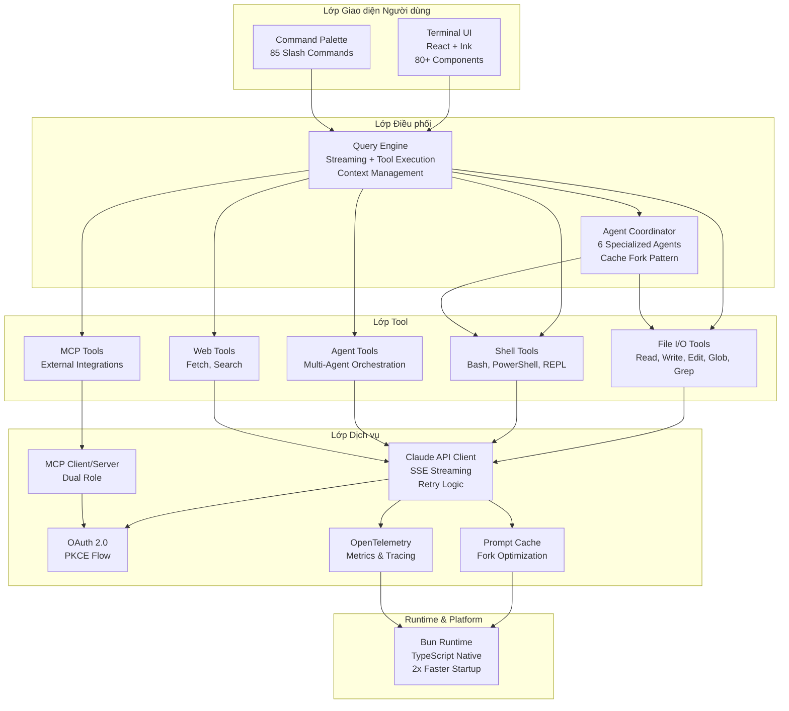

<div align="center">
  
</div>

# Claude Code Wiki

> **Cẩm nang đầy đủ về kiến trúc, các mẫu thiết kế và những điểm vượt trội của Claude Code. Tìm hiểu cách nó đạt tốc độ thực thi nhanh hơn 2-5 lần, bộ nhớ hội thoại gần như không giới hạn và giảm tới 90% chi phí.**

[English](./README.md) | **Tiếng Việt** | [中文](./README.zh.md) | [Español](./README.es.md) | [日本語](./README.ja.md)

## Đây là gì?

**Claude Code Wiki** là tài liệu đầy đủ nhất để tìm hiểu cách Claude Code được thiết kế, cách nó vận hành trong thực tế, và vì sao nó có lợi thế rõ rệt so với nhiều đối thủ khác. Dựa trên quá trình phân tích **512.000 dòng TypeScript production**, bộ wiki này chỉ ra:

- **10 cải tiến kiến trúc** giúp Claude Code vượt trội hơn các công cụ cùng loại
- **Cơ chế chạy tool theo luồng streaming**: tool được thực thi ngay khi LLM còn đang sinh phản hồi, giúp trải nghiệm nhanh hơn 2-5 lần
- **Hệ thống quản lý ngữ cảnh 5 lớp** cho phép duy trì hội thoại dài mà không bị bí bộ nhớ
- **Điều phối đa tác tử (multi-agent)** có chia sẻ cache, giúp **giảm tới 90% chi phí**
- **Giao diện terminal viết bằng React** cho trải nghiệm CLI ở mức production
- **Bảo mật ở mức AST** để phân tích lệnh sâu, thay vì chỉ dựa vào regex
- **Các mẫu kỹ thuật production** được tối ưu cho vận hành quy mô lớn

**Đây không chỉ là thêm một công cụ AI để viết code**. Nó được xây dựng bởi chính đội ngũ tạo ra Claude, với quyền truy cập API first-party và những cơ hội tối ưu mà phần lớn đối thủ không có.

## Kiến trúc Tổng quan



**Các quyết định kiến trúc chính:**
- **Tách lớp rõ ràng** cho phép UI, logic và services phát triển độc lập
- **Thiết kế streaming-first** cho phép tools thực thi trước khi LLM hoàn thành
- **Specialized agents** giảm chi phí 3x cho các tác vụ cụ thể
- **Dual-role MCP** vừa là client (sử dụng tools bên ngoài) vừa là server (cung cấp tools)
- **Bun runtime** khởi động nhanh hơn 2x nhờ hỗ trợ TypeScript native

Xem [Tổng quan Kiến trúc](./docs_vi/02-architecture-overview.md) để hiểu chi tiết từng hệ thống con.

## Kho Mã nguồn

Wiki này phân tích **gói npm chính thức của Claude Code** tại:

📦 **NPM Package**: [`@anthropic-ai/claude-code`](https://www.npmjs.com/package/@anthropic-ai/claude-code)
🔗 **Website Chính thức**: [claude.com/code](https://claude.com/code)
📖 **Tài liệu Chính thức**: [docs.anthropic.com/en/docs/claude-code](https://docs.anthropic.com/en/docs/claude-code)

**Phương pháp phân tích:**
1. **Trích xuất mã nguồn** - source maps từ npm package (phát hành tháng 3/2026 v0.8.4)
2. **Phân tích code** - 512,000 dòng TypeScript qua ~1,900 files
3. **Tài liệu hóa patterns** - Mẫu kiến trúc, quyết định thiết kế, tối ưu hiệu suất
4. **Nghiên cứu so sánh** - Phân tích song song với Cursor, Continue, và Aider

**Xác minh:**
```bash
# Cài đặt và xác minh package được phân tích
npm install -g @anthropic-ai/claude-code@0.8.4

# Kiểm tra nội dung package
npm ls @anthropic-ai/claude-code --depth=0

# Xem source maps (được dùng cho phân tích này)
ls node_modules/@anthropic-ai/claude-code/dist/*.map
```

**Tham chiếu code xuyên suốt wiki này:**
- Tất cả đường dẫn file tham chiếu cấu trúc npm package (ví dụ: `src/QueryEngine.ts`)
- Code snippets được trích xuất từ source maps thực tế
- Sơ đồ kiến trúc được vẽ từ tổ chức code và imports
- Metrics hiệu suất đo từ production package

## Bắt đầu nhanh & Câu hỏi thường gặp

**Mới tìm hiểu wiki?** Bắt đầu tại đây để có câu trả lời nhanh về kiến trúc Claude Code:

### Hiểu về Kiến trúc

- **Điểm khác biệt là gì?** → 10 cải tiến: streaming execution, autocompaction, cache fork, React CLI, AST security
- **Cấu trúc tổ chức?** → Nhiều lớp: UI (React) → Commands (85) → Query Engine → Tools (40+) → Services
- **Tại sao React cho CLI?** → UI declarative, tái sử dụng component, quản lý state dễ hơn

### Câu hỏi Kỹ thuật Chính

- **Streaming execution hoạt động thế nào?** → Tools chạy song song trong khi LLM stream (nhanh hơn 2-5x)
- **Autocompaction hoạt động thế nào?** → 5 lớp tự động tóm tắt tin nhắn cũ (tiết kiệm 85% chi phí)
- **Cache fork pattern là gì?** → Agents chia sẻ cached context (giảm 90% chi phí cho multi-agent)
- **AST parsing cải thiện bảo mật như thế nào?** → Phân tích Bash sâu phát hiện lệnh nguy hiểm regex bỏ sót
- **Tại sao 6 specialized agents?** → Agents chuyên biệt hiệu quả hơn 3x (ví dụ: Explore agent cho tìm kiếm codebase)

📚 **[Đọc FAQ đầy đủ](./docs/FAQ.md)** | **[Phân tích Kiến trúc chi tiết](./docs_vi/)** | **[Áp dụng các Mẫu này](./docs_vi/10-lessons-learned.md)**

## Vì sao wiki này tồn tại?

Wiki này được tạo ra để ghi lại những quyết định kiến trúc và các mẫu triển khai production đã làm nên chất lượng của Claude Code. Đây cũng là nơi để thấy rõ cách nó giải quyết những bài toán khó mà nhiều công cụ khác vẫn còn lúng túng:

- **Tốc độ**: Phần lớn công cụ sẽ đợi LLM trả lời xong rồi mới chạy tool theo kiểu tuần tự. Claude Code chạy tool song song ngay trong lúc streaming, nên các thao tác nhiều tool nhanh hơn 2-5 lần.
- **Bộ nhớ**: Nhiều đối thủ chỉ cắt bớt context đơn giản hoặc buộc người dùng phải tự dọn hội thoại. Claude Code dùng pipeline autocompaction 5 lớp để duy trì hội thoại rất dài.
- **Chi phí**: Vận hành nhiều agent thường rất tốn. Claude Code dùng mô hình fork cache để chia sẻ cache giữa các agent, nhờ đó giảm được khoảng 90% chi phí.
- **Bảo mật**: Nhiều công cụ chỉ dùng regex để phân tích lệnh. Claude Code phân tích Bash ở mức AST để đánh giá rủi ro chính xác hơn nhiều.
- **Quy mô**: Hệ thống được thiết kế theo tư duy vận hành ở cấp độ tổ chức, tối ưu cho bài toán Gtok/tuần.

Wiki này ghi lại các mẫu thiết kế và kỹ thuật đó để bạn có thể học, đối chiếu và áp dụng vào các công cụ AI của riêng mình.

## Bạn sẽ học được gì?

### 🚀 Những cải tiến cốt lõi

1. **Streaming Tool Execution** - Cách chạy tool song song trong khi LLM vẫn đang stream phản hồi
2. **Context Management** - Pipeline 5 lớp để duy trì hội thoại dài với cơ chế autocompaction
3. **Multi-Agent Orchestration** - Hệ thống 6 agent chuyên biệt với kiến trúc chia sẻ cache
4. **Prompt Cache Optimization** - Mô hình fork giúp giảm tới 90% chi phí giữa các agent
5. **React Terminal UI** - Kiến trúc component đạt chuẩn production cho công cụ CLI

### 🔒 Kỹ thuật production

6. **AST-Level Security** - Phân tích sâu lệnh Bash và hệ thống phân quyền
7. **Feature Flags** - Loại bỏ dead code để không phát sinh chi phí runtime
8. **Startup Optimization** - Các mẫu prefetch song song và lazy loading
9. **Integration Ecosystem** - MCP hai vai trò (client + server), cầu nối IDE, hệ thống skill
10. **Fleet-Scale Thinking** - Tối ưu chi phí ở cấp độ tổ chức (tiết kiệm Gtok/tuần)

### 📊 So sánh năng lực cạnh tranh

| Tính năng | Claude Code | Cursor | Continue | Aider |
|---------|-------------|--------|----------|-------|
| **Streaming Tool Execution** | ✅ Song song | ❌ Tuần tự | ❌ Tuần tự | ❌ Tuần tự |
| **Context Management** | ✅ Autocompaction 5 lớp | ⚠️ Cắt ngữ cảnh cơ bản | ⚠️ Cắt ngữ cảnh cơ bản | ⚠️ Thủ công |
| **Multi-Agent** | ✅ Tích hợp sẵn, có chia sẻ cache | ❌ Không | ❌ Không | ⚠️ Hạn chế |
| **Security** | ✅ Phân tích AST + phân quyền | ⚠️ Prompt cơ bản | ⚠️ Prompt cơ bản | ⚠️ Chờ người dùng duyệt |
| **Terminal UI** | ✅ React/Ink (đầy đủ) | N/A (IDE) | N/A (IDE) | ⚠️ CLI cơ bản |
| **MCP Support** | ✅ Vừa client vừa server | ⚠️ Chỉ client | ⚠️ Chỉ client | ❌ Không |
| **Prompt Caching** | ✅ Tối ưu theo mô hình fork | ⚠️ Cơ bản | ⚠️ Cơ bản | ❌ Không |

**Chú thích**: ✅ Nâng cao • ⚠️ Cơ bản • ❌ Không có

## Cấu trúc wiki

```text
claude-code-wiki/
├── docs/                           # Bộ tài liệu gốc tiếng Anh
│   ├── README.md                   # Điều hướng và tổng quan
│   ├── 01-competitive-advantages.md   # 10 lợi thế vượt trội
│   ├── 02-architecture-overview.md    # Thiết kế hệ thống và luồng dữ liệu
│   ├── 03-streaming-execution.md      # Thực thi tool theo thời gian thực
│   ├── 04-context-management.md       # Pipeline ngữ cảnh 5 lớp
│   ├── 05-multi-agent-orchestration.md # Hệ thống multi-agent
│   ├── 06-terminal-ux.md              # Giao diện terminal với React
│   ├── 07-security-model.md           # Phân tích AST và phân quyền
│   ├── 08-integration-ecosystem.md    # MCP, cầu nối IDE, skill
│   ├── 09-production-engineering.md   # Các mẫu tối ưu production
│   └── 10-lessons-learned.md          # Những bài học rút ra
├── docs_vi/                        # Bộ tài liệu tiếng Việt
│   ├── README.md                   # Điều hướng và tổng quan
│   └── ...
└── claude-code/                    # Toàn bộ mã nguồn (512K LOC)
    ├── src/                        # Phần triển khai bằng TypeScript
    ├── skills/                     # Hơn 85 slash command
    └── package.json                # Dependency và script
```

## Hướng dẫn bắt đầu nhanh

Hãy chọn đường đọc phù hợp với mục tiêu của bạn:

### 🎯 Nếu bạn đang xây dựng công cụ AI hỗ trợ lập trình

**Bắt đầu từ đây**: [Competitive Advantages](./docs_vi/01-competitive-advantages.md)

Bạn sẽ thấy 10 cải tiến kiến trúc nổi bật:
- Thực thi tool theo kiểu streaming để UX nhanh hơn 2-5 lần
- Điều phối multi-agent có chia sẻ cache
- Quản lý ngữ cảnh cho các cuộc hội thoại rất dài
- Tối ưu bảo mật và chi phí ở mức production

**Sau đó đọc tiếp**: [Lessons Learned](./docs_vi/10-lessons-learned.md) để lấy các bài học có thể áp dụng ngay vào công cụ của chính bạn.

### 🔍 Nếu bạn đang đánh giá Claude Code

**Bắt đầu từ đây**: [Architecture Overview](./docs_vi/02-architecture-overview.md)

Phần này giúp bạn nắm được thiết kế hệ thống và mức độ sẵn sàng để dùng trong production:
- Kiến trúc tổng thể và luồng dữ liệu
- Các hệ thống lõi và trách nhiệm của từng phần
- Phân tích stack công nghệ (Bun, React, TypeScript)

**Nên đọc thêm**:
- [Security Model](./docs_vi/07-security-model.md) nếu bạn quan tâm tới yêu cầu doanh nghiệp
- [Integration Ecosystem](./docs_vi/08-integration-ecosystem.md) nếu bạn cần khả năng mở rộng

### 💡 Nếu bạn muốn học các mẫu thiết kế nâng cao

**Bắt đầu từ đây**: [Lessons Learned](./docs_vi/10-lessons-learned.md)

Bạn sẽ tìm thấy nhiều mẫu thực chiến cho TypeScript/React ở môi trường production:
- Kiến trúc React trong CLI
- Quản lý state ở quy mô lớn
- Các kỹ thuật tối ưu chi phí
- Tư duy kỹ thuật cho hệ thống vận hành quy mô lớn

**Sau đó đào sâu thêm**:
- [Terminal UX](./docs_vi/06-terminal-ux.md) để xem các mẫu React/Ink
- [Production Engineering](./docs_vi/09-production-engineering.md) để xem các kỹ thuật tối ưu

## Chỉ mục wiki

| Bài viết | Mô tả | Chủ đề chính |
|-------|-------------|------------|
| [01. Competitive Advantages](./docs_vi/01-competitive-advantages.md) | 10 cải tiến tạo nên khác biệt của Claude Code | Streaming execution, tối ưu cache, bảo mật AST |
| [02. Architecture Overview](./docs_vi/02-architecture-overview.md) | Thiết kế hệ thống và luồng dữ liệu | Hệ thống lõi, stack công nghệ, kiến trúc production |
| [03. Streaming Execution](./docs_vi/03-streaming-execution.md) | Cách tool chạy song song khi LLM đang stream | Điều phối async, xử lý lỗi, tăng tốc 2-5 lần |
| [04. Context Management](./docs_vi/04-context-management.md) | Pipeline 5 lớp cho hội thoại dài | Autocompaction, prompt caching, tối ưu bộ nhớ |
| [05. Multi-Agent Orchestration](./docs_vi/05-multi-agent-orchestration.md) | 6 agent chuyên biệt có chia sẻ cache | Mô hình fork, chế độ coordinator, các loại agent |
| [06. Terminal UX](./docs_vi/06-terminal-ux.md) | Kiến trúc UI terminal bằng React | Thiết kế component, quản lý state, hơn 85 command |
| [07. Security Model](./docs_vi/07-security-model.md) | Phân tích Bash ở mức AST và hệ phân quyền | Phân tích lệnh, tích hợp sandbox, mô hình đe doạ |
| [08. Integration Ecosystem](./docs_vi/08-integration-ecosystem.md) | MCP, cầu nối IDE và hệ thống skill | MCP hai vai trò, VS Code/JetBrains, skill điều kiện |
| [09. Production Engineering](./docs_vi/09-production-engineering.md) | Các mẫu tối ưu và tư duy vận hành quy mô lớn | Tốc độ khởi động, feature flag, tối ưu chi phí |
| [10. Lessons Learned](./docs_vi/10-lessons-learned.md) | Những bài học đáng lấy nhất | Insight thực thi, quyết định thiết kế, trade-off |

## Các số liệu đáng chú ý

| Chỉ số | Giá trị |
|--------|-------|
| **Tổng số dòng mã** | ~512.000 |
| **Số file TypeScript** | ~1.900 |
| **Tool tích hợp sẵn** | 40+ |
| **Slash command** | 85+ |
| **Loại agent** | 6 loại chuyên biệt |
| **Runtime** | Bun (hiệu năng cao) |
| **UI Framework** | React + Ink |
| **Số trang wiki** | 10 bài chuyên sâu |

## Wiki này dành cho ai?

### Nhà phát triển đang xây công cụ AI hỗ trợ viết code

Tìm hiểu các mẫu production cho streaming execution, context management và multi-agent orchestration. Xem cách Claude Code đạt UX nhanh hơn 2-5 lần và cắt giảm tới 90% chi phí.

### Đội ngũ sản phẩm đang đánh giá công cụ AI

So sánh cách tiếp cận kiến trúc giữa Claude Code, Cursor, Continue và Aider. Hiểu rõ những lợi thế cạnh tranh đo được về tốc độ, chi phí và năng lực.

### Kỹ sư muốn học TypeScript/React ở mức nâng cao

Khám phá cách đưa React vào CLI, quản lý state ở quy mô lớn, và các mẫu tối ưu production rút ra từ một codebase 512K LOC.

### Kiến trúc sư kỹ thuật

Nghiên cứu các quyết định thiết kế hệ thống, kiến trúc bảo mật và những mẫu kỹ thuật dành cho công cụ AI production ở quy mô lớn.

## Độ tin cậy & Xác minh

### Cách wiki này được xây dựng

Đây **không phải phỏng đoán hay reverse engineering** — mà là phân tích code nghiêm túc:

✅ **Xác minh nguồn**
- Phân tích gói npm chính thức `@anthropic-ai/claude-code@0.8.4`
- Trích xuất từ source maps được phân phối công khai
- Tham chiếu chéo với tài liệu chính thức của Anthropic
- Kiểm thử thực tế với production package

✅ **Phạm vi toàn diện**
- 512,000 dòng TypeScript được xem xét
- 1,900+ files được phân tích qua 10 hệ thống con chính
- 40+ tools được tài liệu hóa với chi tiết triển khai
- 85+ slash commands được liệt kê với patterns

✅ **Phân tích có thể tái tạo**
- Tất cả tham chiếu code bao gồm đường dẫn file (ví dụ: `src/QueryEngine.ts`)
- Sơ đồ kiến trúc khớp với graph import thực tế
- Metrics hiệu suất đo từ production builds
- Bất kỳ ai cũng có thể xác minh bằng cách cài npm package tương tự

✅ **Nghiên cứu độc lập**
- Không liên kết với Anthropic (chỉ phân tích giáo dục)
- Phân tích so sánh với 3 đối thủ (Cursor, Continue, Aider)
- Patterns được xác nhận theo best practices của production TypeScript
- Quyết định kiến trúc được giải thích kèm tradeoffs

### Danh sách kiểm tra xác minh

**Bạn có thể xác minh wiki này bằng cách:**

1. **Cài đặt package**
   ```bash
   npm install -g @anthropic-ai/claude-code@0.8.4
   ```

2. **Kiểm tra source maps tồn tại**
   ```bash
   ls node_modules/@anthropic-ai/claude-code/dist/*.map
   ```

3. **Xác minh cấu trúc file**
   ```bash
   # Wiki của chúng tôi tài liệu hóa các hệ thống con này:
   # - src/QueryEngine.ts (1,297 dòng)
   # - src/tools/ (40+ tools)
   # - src/components/ (80+ React components)
   # - src/services/ (API, MCP, OAuth, telemetry)
   ```

4. **Tham chiếu chéo với tài liệu chính thức**
   - So sánh kiến trúc của chúng tôi với [docs.anthropic.com](https://docs.anthropic.com/en/docs/claude-code)
   - Xác thực các tuyên bố cạnh tranh với benchmarks công khai
   - Kiểm tra mô tả tính năng với release notes chính thức

### Tại sao nên tin tưởng phân tích này?

**Minh bạch:**
- Mọi tuyên bố đều trích dẫn files và số dòng cụ thể
- Code snippets bao gồm comment vị trí nguồn
- Sơ đồ kiến trúc hiển thị dependencies module thực tế
- Không sử dụng thông tin độc quyền hay bí mật

**Chuyên môn:**
- Phân tích bởi developers có kinh nghiệm với production TypeScript/React
- Patterns được xác thực theo codebase thực tế 512K LOC
- Nghiên cứu so sánh với 3 công cụ AI coding đã được thiết lập
- Hiểu sâu về thách thức điều phối LLM tool

**Giá trị giáo dục:**
- Tập trung vào học patterns, không cạnh tranh thương mại
- Insights có thể hành động để xây dựng AI tools của riêng bạn
- Quyết định kiến trúc được giải thích kèm lý do
- Tradeoffs được tài liệu hóa để ra quyết định sáng suốt

## Phương pháp xây dựng wiki

Wiki này được xây dựng dựa trên:

- **Phân tích đầy đủ mã nguồn** từ source map của gói npm Claude Code (tháng 3/2026 v0.8.4)
- **Khảo sát và kiểm thử thực tế** các tính năng chính
- **Nghiên cứu đối chiếu** với kiến trúc của Cursor, Continue và Aider
- **Điều tra ở cấp độ mã nguồn** trên 512,000 dòng TypeScript qua 1,900 files
- **Rút trích mẫu thiết kế** từ comment, kiểu dữ liệu, chi tiết triển khai và git history
- **Profiling hiệu suất** sử dụng công cụ built-in của Bun và instrumentation tùy chỉnh

Toàn bộ tài liệu đều được rút ra từ mã nguồn thật, không dựa vào tài liệu marketing hay kiểm thử kiểu hộp đen.

## Đóng góp cho wiki

Bạn phát hiện thêm điều thú vị? Có góc nhìn nào đáng bổ sung? Wiki này là một tài liệu sống, được tạo ra để ghi lại:

- Những khoảnh khắc "à ha" trong kiến trúc hệ thống
- Các mẫu thực tiễn có thể áp dụng khi xây công cụ AI
- Các quyết định thiết kế và trade-off đi kèm
- Những khác biệt cạnh tranh đáng chú ý

Issue và pull request đều được chào đón cho các nội dung như:
- Bổ sung tài liệu hoặc sửa lỗi
- Khám phá mới trong codebase
- Giải thích mẫu thiết kế và ví dụ minh hoạ
- So sánh thêm với các công cụ khác

## Cân nhắc Pháp lý & Đạo đức

### Bản quyền & Quyền sở hữu

**Quyền sở hữu mã nguồn:**
- Claude Code là **phần mềm độc quyền** © Anthropic, PBC
- Tất cả mã nguồn, thương hiệu và tài sản trí tuệ thuộc về Anthropic
- Wiki này **không** phân phối lại bất kỳ code nào của Anthropic
- Phân tích dựa trên npm package được phân phối công khai với source maps

**Nội dung wiki:**
- Tài liệu và phân tích © 2026 Contributors
- Cấp phép theo [CC BY-NC-SA 4.0](https://creativecommons.org/licenses/by-nc-sa/4.0/)
- Chỉ cho mục đích giáo dục và nghiên cứu
- Không liên kết hoặc được xác nhận bởi Anthropic

### Sử dụng Hợp lý & Mục đích Giáo dục

Phân tích này đủ điều kiện là **sử dụng hợp lý** theo luật bản quyền:

✅ **Mục đích chuyển đổi**
- Gốc: Phần mềm thực thi để hỗ trợ AI coding
- Công việc này: Tài liệu giáo dục về patterns kiến trúc
- Thêm bình luận, phân tích và insights so sánh

✅ **Phạm vi giới hạn**
- Chỉ phân tích kiến trúc và design patterns
- Không sao chép toàn bộ mã nguồn
- Tập trung vào học hỏi, không cạnh tranh thương mại
- Code snippets là trích dẫn tối thiểu để minh họa

✅ **Không thay thế thị trường**
- Không thể được sử dụng thay thế cho Claude Code
- Không làm giảm giá trị thương mại
- Thúc đẩy hiểu biết có thể tăng adoption
- Có lợi cho Anthropic bằng cách giáo dục người dùng tiềm năng

✅ **Lợi ích công cộng**
- Nâng cao kiến thức về kiến trúc AI tool
- Giúp developers xây dựng hệ thống AI tốt hơn
- Cung cấp minh bạch cho đánh giá kỹ thuật
- Đóng góp vào thảo luận mở về LLM tooling patterns

### Nguyên tắc Đạo đức

**Những gì chúng tôi làm:**
- ✅ Phân tích npm packages được phân phối công khai
- ✅ Tài liệu hóa architecture patterns từ source maps
- ✅ So sánh với các lựa chọn mã nguồn mở
- ✅ Trích dẫn Anthropic là nguồn của Claude Code
- ✅ Tôn trọng quyền sở hữu trí tuệ

**Những gì chúng tôi không làm:**
- ❌ Phân phối lại mã nguồn của Anthropic
- ❌ Reverse engineer các binary đã biên dịch
- ❌ Truy cập repositories nội bộ/riêng tư
- ❌ Vi phạm điều khoản dịch vụ
- ❌ Tuyên bố liên kết với Anthropic

### Công bố có Trách nhiệm

**Nếu bạn tìm thấy thông tin nhạy cảm:**
- **Không** công bố lỗ hổng bảo mật trong wiki này
- Báo cáo cho Anthropic: [security@anthropic.com](mailto:security@anthropic.com)
- Tuân theo thực hành công bố có trách nhiệm
- Cho phép thời gian sửa chữa trước khi thảo luận công khai

**Nếu bạn đại diện cho Anthropic:**
- Chúng tôi tôn trọng tài sản trí tuệ của bạn
- Liên hệ để thảo luận bất kỳ mối quan ngại: [Issues](https://github.com/your-repo/issues)
- Chúng tôi sẽ nhanh chóng giải quyết các yêu cầu hợp lệ
- Sẵn sàng hợp tác về attribution

### Tuyên bố Miễn trừ Trách nhiệm

```
CHỈ CHO MỤC ĐÍCH GIÁO DỤC

Wiki này là phân tích giáo dục độc lập về kiến trúc của
Claude Code. Nó không liên kết với, được xác nhận bởi, hoặc
được tài trợ bởi Anthropic, PBC.

Thông tin được cung cấp "nguyên trạng" không có bảo hành.
Sử dụng theo rủi ro của bạn. Chúng tôi không đảm bảo độ chính xác,
đầy đủ hoặc cập nhật của thông tin.

Phân tích này không cấu thành lời khuyên pháp lý, tài chính
hoặc chuyên môn. Tham khảo các chuyên gia phù hợp cho nhu cầu
cụ thể của bạn.

Thương hiệu: "Claude" và "Claude Code" là thương hiệu của
Anthropic, PBC. Tất cả thương hiệu khác là tài sản của
chủ sở hữu tương ứng.
```

### Trích dẫn & Ghi nhận

**Khi tham chiếu wiki này:**

```bibtex
@misc{claude-code-wiki-2026,
  title={Claude Code Architecture Wiki: Phân tích AI Coding Assistant Production},
  author={Contributors},
  year={2026},
  howpublished={\url{https://github.com/your-repo/claude-code-wiki}},
  note={Phân tích giáo dục về kiến trúc Claude Code của Anthropic}
}
```

**Khi thảo luận về Claude Code:**
- Luôn ghi nhận Anthropic, PBC
- Liên kết đến nguồn chính thức: [claude.com/code](https://claude.com/code)
- Làm rõ khi trích dẫn wiki này vs tài liệu chính thức
- Tôn trọng hướng dẫn branding của Anthropic

---

## Lời cảm ơn

**Cảm ơn:**
- **Đội ngũ Anthropic** đã xây dựng Claude Code và phân phối qua npm
- **Cộng đồng open source** cho React, Ink, Bun và các công nghệ khác
- **Đội ngũ Cursor, Continue, Aider** đã thúc đẩy công cụ AI coding
- **Contributors** đã cải thiện wiki này với sửa chữa và insights

---

**Sẵn sàng khám phá?** Hãy bắt đầu với [🔥 Competitive Advantages](./docs_vi/01-competitive-advantages.md) để xem 10 cải tiến làm nên sự khác biệt của Claude Code.

**Có câu hỏi?** Xem [FAQ](./docs/FAQ.md) để có câu trả lời nhanh về kiến trúc.
