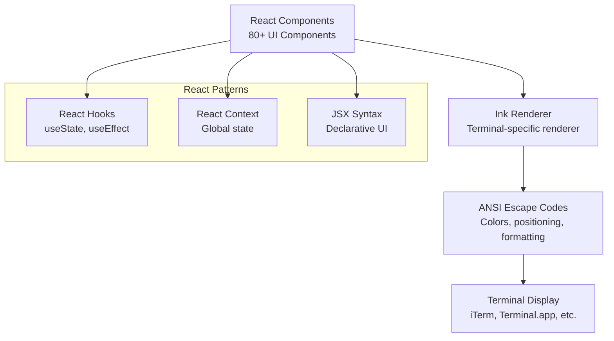

# Terminal UX: React in the Terminal

> **How Claude Code achieves IDE-quality user experience in a CLI using React + Ink**

## TLDR

- **React + Ink** brings component-based UI to the terminal
- **80+ React components** create rich, interactive CLI experience
- **Real-time updates** with streaming progress bars and spinners
- **Vim mode** for keyboard-first interaction
- **Command palette** with fuzzy search for all commands
- **Visual diff rendering** shows code changes inline

**WOW:** Production-grade terminal UI that rivals VS Code extensions, but runs in any shell.

---

## The Problem: CLI UX is Usually Terrible

Traditional CLI tools have **limited, clunky interfaces:**

```
┌────────────────────────────────────┐
│   Traditional CLI Problems         │
└────────────────────────────────────┘

1. Static output
   $ aider "fix bugs"
   Thinking...
   [5 seconds of nothing]
   Done.
   ❌ No progress feedback

2. No interactivity
   $ aider "refactor"
   Approve changes? (y/n)
   ❌ Can't navigate, can't preview

3. Ugly formatting
   $ aider --help
   [Wall of text]
   ❌ No structure, hard to scan

4. Poor error display
   $ aider "test"
   Error: Failed
   ❌ No context, no actionable info
```

**Users resort to IDE extensions** because CLI UX is too primitive.

---

## Claude Code's Solution: React + Ink

**Bring modern web UI patterns to the terminal:**



**Benefits:**
- **Component-based** - Reusable, testable UI elements
- **Declarative** - Describe what to show, not how
- **State-driven** - React hooks manage complex state
- **Rich ecosystem** - Use React patterns (context, hooks, etc.)

---

## Architecture Deep Dive

### 1. Component Structure

```
src/components/
├── App.tsx                    # Root component
├── MessageList.tsx            # Conversation display
├── MessageItem/
│   ├── UserMessage.tsx        # User message rendering
│   ├── AssistantMessage.tsx   # Assistant response
│   ├── ToolUseMessage.tsx     # Tool invocation UI
│   └── ToolResultMessage.tsx  # Tool result display
├── Input/
│   ├── InputBox.tsx           # User input area
│   ├── VimModeInput.tsx       # Vim keybindings
│   └── MultilineInput.tsx     # Long input support
├── UI/
│   ├── CommandPalette.tsx     # Fuzzy command search
│   ├── ProgressBar.tsx        # Progress indicators
│   ├── Spinner.tsx            # Loading animations
│   ├── StatusBar.tsx          # Bottom status line
│   └── DiffView.tsx           # Code diff rendering
├── Screens/
│   ├── ConfigScreen.tsx       # Settings UI
│   ├── CostScreen.tsx         # Cost tracking display
│   └── HelpScreen.tsx         # Interactive help
└── Hooks/
    ├── useKeyboard.tsx        # Keyboard shortcuts
    ├── useFocus.tsx          # Focus management
    └── useScroll.tsx         # Scrollable content
```

### 2. Basic Ink Component

```tsx
// src/components/UI/ProgressBar.tsx
import { Box, Text } from 'ink'
import React from 'react'

interface ProgressBarProps {
  percent: number // 0-100
  width?: number
  message?: string
  color?: string
}

export function ProgressBar({
  percent,
  width = 40,
  message,
  color = 'cyan',
}: ProgressBarProps) {
  // Calculate bar segments
  const filled = Math.round((percent / 100) * width)
  const empty = width - filled

  return (
    <Box flexDirection="column">
      <Box>
        <Text color={color}>
          {'█'.repeat(filled)}
          {'░'.repeat(empty)}
        </Text>
        <Text dimColor> {percent}%</Text>
      </Box>
      {message && (
        <Text dimColor>{message}</Text>
      )}
    </Box>
  )
}

// Usage:
<ProgressBar
  percent={65}
  message="Processing files..."
  color="green"
/>

// Renders:
// ██████████████████████████░░░░░░░░░░░░░░ 65%
// Processing files...
```

### 3. Streaming Tool Display

**Real-time updates during tool execution:**

```tsx
// src/components/MessageItem/ToolUseMessage.tsx
import { Box, Text } from 'ink'
import Spinner from 'ink-spinner'
import React from 'react'
import type { ToolExecution } from '../../types/tool'

interface ToolUseMessageProps {
  tool: ToolExecution
}

export function ToolUseMessage({ tool }: ToolUseMessageProps) {
  return (
    <Box borderStyle="round" borderColor="cyan" padding={1}>
      {/* Tool name and status */}
      <Box marginBottom={1}>
        {tool.status === 'running' && (
          <>
            <Spinner type="dots" />
            <Text color="cyan"> {tool.name}</Text>
          </>
        )}
        {tool.status === 'complete' && (
          <Text color="green">✓ {tool.name}</Text>
        )}
        {tool.status === 'error' && (
          <Text color="red">✗ {tool.name}</Text>
        )}
      </Box>

      {/* Tool parameters */}
      <Box marginBottom={1}>
        <Text dimColor>
          {JSON.stringify(tool.input, null, 2)}
        </Text>
      </Box>

      {/* Progress bar if available */}
      {tool.progress && (
        <ProgressBar
          percent={tool.progress.percent}
          message={tool.progress.message}
        />
      )}

      {/* Execution time */}
      {tool.duration && (
        <Text dimColor>
          Completed in {tool.duration}ms
        </Text>
      )}
    </Box>
  )
}
```

**Live rendering:**

```
┌─────────────────────────────────────┐
│ ◠◡◠ Bash                            │
│ {                                   │
│   "command": "npm run typecheck"    │
│ }                                   │
│ ████████████████░░░░░░░░ 65%        │
│ Checking 1523 files...              │
└─────────────────────────────────────┘
```

### 4. Interactive Command Palette

**Fuzzy search all commands:**

```tsx
// src/components/UI/CommandPalette.tsx
import { Box, Text, useInput } from 'ink'
import React, { useState } from 'react'
import type { Command } from '../../commands'
import { fuzzySearch } from '../../utils/fuzzySearch'

interface CommandPaletteProps {
  commands: Command[]
  onSelect: (command: Command) => void
  onClose: () => void
}

export function CommandPalette({
  commands,
  onSelect,
  onClose,
}: CommandPaletteProps) {
  const [query, setQuery] = useState('')
  const [selectedIndex, setSelectedIndex] = useState(0)

  // Fuzzy filter commands
  const filtered = fuzzySearch(commands, query, cmd => cmd.name)

  // Keyboard navigation
  useInput((input, key) => {
    if (key.escape) {
      onClose()
    } else if (key.upArrow) {
      setSelectedIndex(Math.max(0, selectedIndex - 1))
    } else if (key.downArrow) {
      setSelectedIndex(Math.min(filtered.length - 1, selectedIndex + 1))
    } else if (key.return) {
      onSelect(filtered[selectedIndex])
    } else if (key.delete || key.backspace) {
      setQuery(query.slice(0, -1))
    } else if (input) {
      setQuery(query + input)
    }
  })

  return (
    <Box
      flexDirection="column"
      borderStyle="double"
      borderColor="magenta"
      padding={1}
    >
      {/* Search input */}
      <Box marginBottom={1}>
        <Text color="magenta">❯ </Text>
        <Text>{query}</Text>
        <Text dimColor>█</Text> {/* Cursor */}
      </Box>

      {/* Results */}
      <Box flexDirection="column">
        {filtered.map((cmd, i) => (
          <Box key={cmd.name}>
            {i === selectedIndex ? (
              <Text color="cyan" bold>▶ {cmd.name}</Text>
            ) : (
              <Text dimColor>  {cmd.name}</Text>
            )}
            <Text dimColor> - {cmd.description}</Text>
          </Box>
        ))}
      </Box>

      {/* Footer */}
      <Box marginTop={1}>
        <Text dimColor>
          ↑↓ Navigate | Enter Select | Esc Close
        </Text>
      </Box>
    </Box>
  )
}

// Usage: Ctrl+P opens palette
// User types: "comm"
// Shows: /commit, /commands, etc.
```

**Renders as:**

```
╔════════════════════════════════════╗
║ ❯ comm█                            ║
║                                    ║
║ ▶ commit - Create a git commit    ║
║   commands - List all commands    ║
║   compact - Compact conversation  ║
║                                    ║
║ ↑↓ Navigate | Enter Select | Esc  ║
╚════════════════════════════════════╝
```

### 5. Vim Mode Input

**Full Vim keybindings in terminal:**

```tsx
// src/components/Input/VimModeInput.tsx
import { useInput } from 'ink'
import React, { useState } from 'react'

type VimMode = 'normal' | 'insert' | 'visual'

export function VimModeInput({ onSubmit }: Props) {
  const [mode, setMode] = useState<VimMode>('normal')
  const [text, setText] = useState('')
  const [cursor, setCursor] = useState(0)

  useInput((input, key) => {
    if (mode === 'normal') {
      // Normal mode commands
      if (input === 'i') setMode('insert')
      if (input === 'a') {
        setCursor(cursor + 1)
        setMode('insert')
      }
      if (input === 'A') {
        setCursor(text.length)
        setMode('insert')
      }
      if (input === 'h') setCursor(Math.max(0, cursor - 1))
      if (input === 'l') setCursor(Math.min(text.length, cursor + 1))
      if (input === 'w') {
        // Jump to next word
        const nextSpace = text.indexOf(' ', cursor + 1)
        setCursor(nextSpace === -1 ? text.length : nextSpace)
      }
      if (input === 'b') {
        // Jump to previous word
        const prevSpace = text.lastIndexOf(' ', cursor - 1)
        setCursor(Math.max(0, prevSpace))
      }
      if (input === 'x') {
        // Delete char
        setText(text.slice(0, cursor) + text.slice(cursor + 1))
      }
      if (input === 'd') {
        // Delete line
        setText('')
        setCursor(0)
      }
    } else if (mode === 'insert') {
      // Insert mode
      if (key.escape) {
        setMode('normal')
      } else if (key.return) {
        onSubmit(text)
      } else if (input) {
        setText(
          text.slice(0, cursor) + input + text.slice(cursor)
        )
        setCursor(cursor + 1)
      }
    }
  })

  return (
    <Box>
      <Text color={mode === 'insert' ? 'green' : 'yellow'}>
        [{mode.toUpperCase()}]
      </Text>
      <Text>
        {text.slice(0, cursor)}
        <Text inverse>{text[cursor] || ' '}</Text>
        {text.slice(cursor + 1)}
      </Text>
    </Box>
  )
}
```

**Vim users feel at home:**

```
[NORMAL] Fix the bugs█

Commands:
- i: Insert mode
- h/j/k/l: Navigate
- w/b: Word jumps
- x: Delete char
- dd: Delete line
```

### 6. Diff View

**Visual code change display:**

```tsx
// src/components/UI/DiffView.tsx
import { Box, Text } from 'ink'
import React from 'react'
import { diffLines } from 'diff'

interface DiffViewProps {
  oldContent: string
  newContent: string
  filename: string
}

export function DiffView({
  oldContent,
  newContent,
  filename,
}: DiffViewProps) {
  const changes = diffLines(oldContent, newContent)

  return (
    <Box flexDirection="column" borderStyle="round" padding={1}>
      {/* Header */}
      <Box marginBottom={1}>
        <Text bold color="cyan">
          {filename}
        </Text>
      </Box>

      {/* Diff content */}
      <Box flexDirection="column">
        {changes.map((change, i) => {
          if (change.added) {
            return (
              <Text key={i} color="green" backgroundColor="greenBright">
                + {change.value}
              </Text>
            )
          }
          if (change.removed) {
            return (
              <Text key={i} color="red" backgroundColor="redBright">
                - {change.value}
              </Text>
            )
          }
          return (
            <Text key={i} dimColor>
              {change.value}
            </Text>
          )
        })}
      </Box>
    </Box>
  )
}
```

**Renders as:**

```
┌─────────────────────────────────────┐
│ src/main.ts                         │
│                                     │
│   const port = 3000                 │
│ - app.listen(port)                  │
│ + app.listen(port, () => {          │
│ +   console.log(`Server on ${port}`)│
│ + })                                │
└─────────────────────────────────────┘
```

---

## Advanced Features

### 1. Scrollable Message List

**Navigate long conversations:**

```tsx
// src/components/MessageList.tsx
import { Box, useInput } from 'ink'
import React, { useState } from 'react'

export function MessageList({ messages }: Props) {
  const [scrollOffset, setScrollOffset] = useState(0)
  const VISIBLE_LINES = 30

  // Keyboard scrolling
  useInput((input, key) => {
    if (key.upArrow) {
      setScrollOffset(Math.max(0, scrollOffset - 1))
    }
    if (key.downArrow) {
      setScrollOffset(Math.min(messages.length - VISIBLE_LINES, scrollOffset + 1))
    }
    if (key.pageUp) {
      setScrollOffset(Math.max(0, scrollOffset - VISIBLE_LINES))
    }
    if (key.pageDown) {
      setScrollOffset(Math.min(messages.length - VISIBLE_LINES, scrollOffset + VISIBLE_LINES))
    }
  })

  const visible = messages.slice(scrollOffset, scrollOffset + VISIBLE_LINES)

  return (
    <Box flexDirection="column">
      {visible.map(msg => (
        <MessageItem key={msg.id} message={msg} />
      ))}

      {/* Scroll indicator */}
      <Box justifyContent="center" marginTop={1}>
        <Text dimColor>
          {scrollOffset + 1}-{scrollOffset + visible.length} of {messages.length}
        </Text>
      </Box>
    </Box>
  )
}
```

### 2. Status Bar

**Always-visible bottom status:**

```tsx
// src/components/UI/StatusBar.tsx
export function StatusBar({ appState }: Props) {
  return (
    <Box
      justifyContent="space-between"
      borderStyle="single"
      borderTop={true}
      paddingX={1}
    >
      {/* Left side: Model and cost */}
      <Box>
        <Text color="cyan">{appState.model}</Text>
        <Text dimColor> | </Text>
        <Text color="green">${appState.cost.toFixed(3)}</Text>
      </Box>

      {/* Center: Active tools */}
      <Box>
        {appState.runningTools.length > 0 && (
          <>
            <Spinner type="dots" />
            <Text> {appState.runningTools.length} tools running</Text>
          </>
        )}
      </Box>

      {/* Right side: Shortcuts */}
      <Box>
        <Text dimColor>
          ^C Exit | ^P Commands | ^L Clear
        </Text>
      </Box>
    </Box>
  )
}
```

**Renders as:**

```
┌──────────────────────────────────────────────────────┐
│ claude-sonnet-4.5 | $0.127   ◠◡◠ 2 tools   ^C ^P ^L │
└──────────────────────────────────────────────────────┘
```

### 3. Error Display

**Rich error rendering:**

```tsx
// src/components/UI/ErrorBox.tsx
export function ErrorBox({ error }: Props) {
  return (
    <Box
      flexDirection="column"
      borderStyle="bold"
      borderColor="red"
      padding={1}
    >
      {/* Error title */}
      <Box marginBottom={1}>
        <Text bold color="red">
          ✗ Error: {error.name}
        </Text>
      </Box>

      {/* Error message */}
      <Box marginBottom={1}>
        <Text color="red">{error.message}</Text>
      </Box>

      {/* Stack trace (collapsed by default) */}
      {error.stack && (
        <Box flexDirection="column">
          <Text dimColor>Stack trace:</Text>
          <Text dimColor>{error.stack}</Text>
        </Box>
      )}

      {/* Suggested actions */}
      {error.suggestions && (
        <Box marginTop={1} flexDirection="column">
          <Text color="yellow">Suggestions:</Text>
          {error.suggestions.map(suggestion => (
            <Text key={suggestion}>  • {suggestion}</Text>
          ))}
        </Box>
      )}
    </Box>
  )
}
```

**Renders as:**

```
╔════════════════════════════════════╗
║ ✗ Error: FileNotFoundError         ║
║                                    ║
║ Could not find file: src/main.ts   ║
║                                    ║
║ Suggestions:                       ║
║   • Check file path spelling       ║
║   • Verify file exists in repo     ║
║   • Try: ls src/                   ║
╚════════════════════════════════════╝
```

---

## Real-World Examples

### Example 1: Multi-Tool Progress

**Multiple tools running in parallel:**

```tsx
function MultiToolView({ tools }: Props) {
  return (
    <Box flexDirection="column">
      {tools.map(tool => (
        <Box key={tool.id} marginBottom={1}>
          <ToolUseMessage tool={tool} />
        </Box>
      ))}
    </Box>
  )
}
```

**Renders as:**

```
┌─────────────────────────────────────┐
│ ◠◡◠ Glob                            │
│ { "pattern": "**/*.ts" }            │
│ ████████████████████████████░ 91%   │
│ Found 1523 files                    │
└─────────────────────────────────────┘

┌─────────────────────────────────────┐
│ ◠◡◠ Grep                            │
│ { "pattern": "TODO" }               │
│ ██████████████░░░░░░░░░░░░░░ 45%   │
│ Searching 1523 files...             │
└─────────────────────────────────────┘

┌─────────────────────────────────────┐
│ ◠◡◠ FileRead                        │
│ { "file_path": "src/main.ts" }      │
│ █████████████████████████░░░ 85%   │
│ Reading line 1520/1800              │
└─────────────────────────────────────┘
```

### Example 2: Cost Tracking Screen

**Interactive cost visualization:**

```tsx
// Invoked with /cost command
function CostScreen({ usage }: Props) {
  return (
    <Box flexDirection="column" padding={2}>
      <Text bold underline color="cyan">
        Token Usage & Cost
      </Text>

      <Box marginTop={1} flexDirection="column">
        {Object.entries(usage.byModel).map(([model, tokens]) => (
          <Box key={model} justifyContent="space-between">
            <Text>{model}</Text>
            <Box>
              <Text color="cyan">{tokens.input.toLocaleString()}</Text>
              <Text dimColor> in / </Text>
              <Text color="green">{tokens.output.toLocaleString()}</Text>
              <Text dimColor> out</Text>
            </Box>
            <Text color="yellow">
              ${tokens.cost.toFixed(4)}
            </Text>
          </Box>
        ))}
      </Box>

      <Box marginTop={2} borderStyle="single" borderTop padding={1}>
        <Text bold>Total Cost: </Text>
        <Text bold color="yellow">
          ${usage.totalCost.toFixed(4)}
        </Text>
      </Box>
    </Box>
  )
}
```

**Renders as:**

```
┌────────────────────────────────────────┐
│  Token Usage & Cost                    │
│                                        │
│  claude-sonnet-4.5                     │
│    125,430 in / 18,942 out   $0.4821  │
│                                        │
│  claude-haiku-3.5                      │
│    42,180 in / 5,234 out     $0.0421  │
│                                        │
│  ──────────────────────────────────    │
│  Total Cost: $0.5242                   │
└────────────────────────────────────────┘
```

---

## Performance Optimizations

### 1. Virtualization

**Only render visible messages:**

```tsx
// Only render what fits on screen
const TERMINAL_HEIGHT = process.stdout.rows || 24
const VISIBLE_MESSAGES = Math.floor(TERMINAL_HEIGHT / 5) // ~5 lines per message

function OptimizedMessageList({ messages }: Props) {
  const [scrollOffset, setScrollOffset] = useState(messages.length - VISIBLE_MESSAGES)

  // Only render visible slice
  const visibleMessages = messages.slice(
    scrollOffset,
    scrollOffset + VISIBLE_MESSAGES
  )

  return (
    <Box flexDirection="column">
      {visibleMessages.map(msg => (
        <MessageItem key={msg.id} message={msg} />
      ))}
    </Box>
  )
}

// Performance:
// - Without virtualization: Render 1000 messages = 50MB memory, laggy
// - With virtualization: Render 20 messages = 1MB memory, smooth
```

### 2. Memoization

**Avoid re-rendering unchanged components:**

```tsx
import React, { memo } from 'react'

// Expensive component
const ToolResultMessage = memo(
  ({ result }: Props) => {
    // Complex rendering logic
    return <Box>...</Box>
  },
  // Custom comparison
  (prev, next) => {
    return prev.result.id === next.result.id &&
           prev.result.status === next.result.status
  }
)

// Result: Only re-renders when result actually changes
```

### 3. Lazy Loading

**Defer rendering of hidden content:**

```tsx
function LazyContent({ content }: Props) {
  const [expanded, setExpanded] = useState(false)

  if (!expanded) {
    return (
      <Box>
        <Text dimColor>
          [Large content hidden. Press 'e' to expand]
        </Text>
      </Box>
    )
  }

  return <Box>{content}</Box>
}

// Don't render large tool results until user expands
```

---

## Competitive Analysis

### Terminal UX Quality

| Tool | Framework | Interactivity | Real-time Updates | Visual Quality |
|------|-----------|---------------|------------------|----------------|
| **Claude Code** | React + Ink | ⭐⭐⭐⭐⭐ | ✅ Yes | ⭐⭐⭐⭐⭐ |
| **Cursor** | VS Code (Electron) | ⭐⭐⭐⭐⭐ | ✅ Yes | ⭐⭐⭐⭐⭐ |
| **Continue** | VS Code (Electron) | ⭐⭐⭐⭐⭐ | ✅ Yes | ⭐⭐⭐⭐⭐ |
| **Aider** | Rich (Python) | ⭐⭐⭐ | ⚠️ Limited | ⭐⭐⭐ |

**Notes:**
- Cursor/Continue: Native IDE extensions (not CLI)
- Claude Code: Best terminal-based experience
- Aider: Basic CLI with limited interactivity

### Feature Comparison

| Feature | Claude Code | Aider | Competitors |
|---------|-------------|-------|-------------|
| **Command palette** | ✅ Fuzzy search | ❌ No | N/A (IDE) |
| **Vim mode** | ✅ Full support | ❌ No | N/A (IDE) |
| **Real-time progress** | ✅ Multi-tool | ⚠️ Basic | ✅ (IDE) |
| **Diff view** | ✅ Inline | ⚠️ External | ✅ (IDE) |
| **Scrolling** | ✅ Keyboard | ❌ No | ✅ (IDE) |
| **Status bar** | ✅ Always visible | ❌ No | ✅ (IDE) |
| **Error handling** | ✅ Rich display | ⚠️ Basic | ✅ (IDE) |

---

## WOW Moments

### 1. IDE-Quality in Terminal

**User's first impression:**

```
"Wait, this is just a CLI? It looks like VS Code!"
```

**Features that surprise:**
- Smooth scrolling through 1000+ messages
- Real-time progress bars for parallel tools
- Fuzzy command search (Ctrl+P)
- Inline diff rendering
- Vim keybindings

### 2. Zero-Latency Interactions

**Instant keyboard response:**

```
Traditional CLI:
  Key press → [100ms network roundtrip] → Update

Claude Code:
  Key press → [Immediate React update] → Render
```

**Local-first rendering** means no lag on:
- Scrolling
- Command palette search
- Vim navigation
- Input editing

### 3. Component Reuse

**Same components in CLI and Web:**

```typescript
// Shared component works in both environments
import { Box, Text } from 'ink' // or 'react-dom'

export function ProgressBar({ percent }: Props) {
  // Same code works in:
  // - Terminal (via Ink)
  // - Web (via react-dom)
  // - Native (via React Native)

  return (
    <Box>
      <Text>Progress: {percent}%</Text>
    </Box>
  )
}
```

**DRY principle:** Write UI once, render everywhere.

---

## Key Takeaways

**React + Ink delivers:**

1. **IDE-quality UX** in a terminal
2. **80+ reusable components** for complex interfaces
3. **Real-time updates** with streaming progress
4. **Keyboard-first** interaction (Vim mode, shortcuts)
5. **Production-ready** with performance optimizations

**Why competitors struggle:**

- **Aider** uses basic Python CLI (Rich library) - limited interactivity
- **Cursor/Continue** are IDE extensions - can't run in terminal
- **Traditional CLIs** use imperative APIs (blessed, curses) - harder to maintain

**The magic formula:**

```
React Components + Terminal Rendering + State Management = Modern CLI UX
```

Claude Code proves that **terminal tools don't have to be ugly**. With React + Ink, you can build CLI experiences that rival native IDE extensions.

---

**Next:** [Security Model →](./07-security-model.md)
