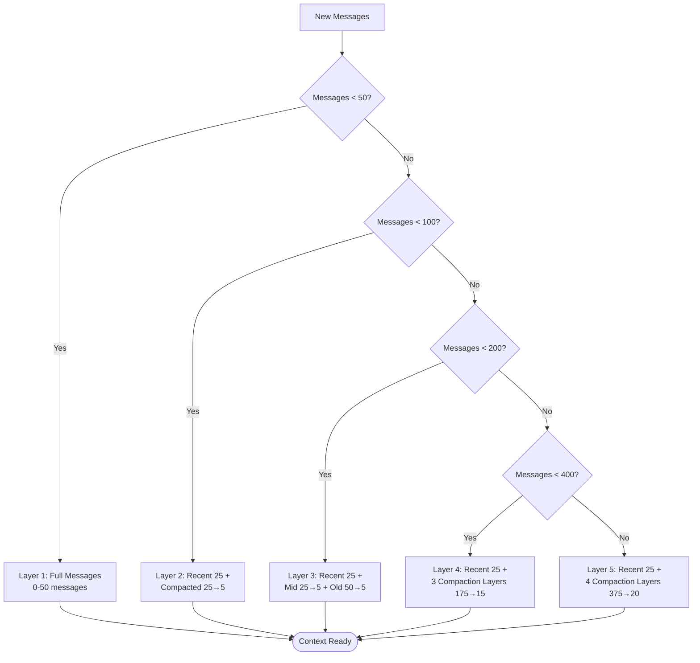
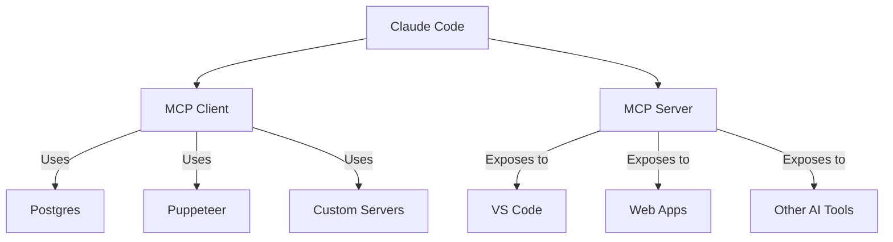

# 🔥 Thành phần bí mật: 10 lợi thế khó sao chép

> **Điều gì khiến Claude Code vượt trội hơn Cursor, Continue và Aider**

## TLDR

Claude Code có 10 điểm mạnh mang tính kiến trúc mà phần lớn đối thủ khó tái tạo đầy đủ:

1. **Streaming tool execution**: tool chạy ngay khi LLM còn đang stream
2. **Context management 5 lớp**: hội thoại dài mà không cần dọn thủ công
3. **Prompt cache fork optimization**: nhiều agent dùng chung cache, giảm mạnh chi phí
4. **React terminal UI**: trải nghiệm CLI ở mức sản phẩm hoàn chỉnh
5. **Bảo mật Bash ở mức AST**: hiểu cấu trúc lệnh, không chỉ pattern chuỗi
6. **MCP hai vai trò**: vừa tiêu thụ tool ngoài, vừa cung cấp tool cho hệ khác
7. **6 agent chuyên biệt**: tách vai trò theo loại công việc
8. **Dead code elimination qua feature flag**: tính năng tắt đi thì gần như không tốn runtime
9. **Lợi thế API từ Anthropic**: truy cập tính năng first-party
10. **Tối ưu vận hành ở quy mô tổ chức**: suy nghĩ theo Gtok/tuần, không chỉ theo từng request

Mỗi điểm trên đều chuyển hóa thành lợi thế cụ thể về tốc độ, chi phí hoặc khả năng mở rộng.

## 1. Streaming Tool Execution ⚡

### Nó là gì?

Claude Code không chờ model trả lời xong mới bắt đầu chạy tool. Ngay khi luồng stream cho thấy model đang gọi tool, hệ thống có thể khởi chạy tool đó lập tức.

### Vì sao quan trọng?

Điểm khác biệt lớn nhất nằm ở UX: thời gian “đứng chờ” bị cắt đi. Với workflow nhiều tool, phần lớn thao tác có thể nhanh hơn 2-5 lần chỉ vì các bước không còn chặn nhau một cách vô ích.

### Cách triển khai

- Parser đọc stream theo từng chunk
- Khi gặp `tool_use`, executor khởi chạy tool ngay
- Văn bản từ model vẫn tiếp tục hiển thị song song
- Hệ thống gom kết quả tool rồi đưa lại cho vòng lặp kế tiếp

### So với đối thủ

Cursor, Continue và Aider chủ yếu theo mô hình tuần tự: đợi model xong rồi mới chạy tool. Muốn bắt chước cơ chế của Claude Code thì phải giải lại toàn bộ bài toán stream parsing, partial parameters, xử lý lỗi giữa luồng và đồng bộ UI.

## 2. Quản lý ngữ cảnh 5 lớp 🧠

### Nó là gì?

Claude Code dùng pipeline nén ngữ cảnh nhiều tầng. Thay vì để cuộc trò chuyện dài dần rồi chạm trần context window, hệ thống tự động rút gọn các phần cũ theo từng lớp.

### Pipeline

- Lớp 1: giữ đầy đủ các message gần đây
- Lớp 2-5: các phần cũ hơn được nén dần thành summary có cấu trúc
- Mỗi lần cuộc trò chuyện dài hơn, hệ thống chỉ nén phần cần nén chứ không "xóa trắng"

### Vì sao quan trọng?

Người dùng có thể làm việc trong cuộc hội thoại rất dài mà không cần tự nhớ lúc nào phải `/clear` hay `/compact`. Quan trọng hơn, lịch sử ngữ nghĩa vẫn được duy trì, nên agent không bị mất bối cảnh làm việc trước đó.

### Kinh tế token

Với các phiên làm việc dài hàng trăm message, chi phí token giảm rất mạnh vì phần cũ được nén và tận dụng lại qua cache. Đây không chỉ là tối ưu kỹ thuật, mà là tối ưu vận hành thực tế.

### So với đối thủ

- Cursor và Continue chủ yếu cắt bớt context cũ
- Aider buộc người dùng can thiệp thủ công nhiều hơn
- Claude Code giữ được lịch sử tốt hơn mà ít đòi hỏi người dùng phải nghĩ về token budget

## 3. Prompt Cache Fork Optimization 💰

### Nó là gì?

Khi spawn nhiều agent, Claude Code không tạo lại toàn bộ prompt từ đầu cho từng agent. Nó “fork” từ cùng một nền ngữ cảnh đã được cache, để phần chung chỉ phải trả chi phí một lần.

### Mẹo cốt lõi

Đây là nước đi rất thông minh: phần đắt nhất của prompt thường là đoạn shared context. Nếu nhiều agent cùng bắt đầu từ một điểm chung, cache có thể được tái sử dụng gần như nguyên vẹn.

### Vì sao quan trọng?

Multi-agent thường bị chê là mạnh nhưng đắt. Claude Code giải quyết đúng nỗi đau đó, nên có thể dùng nhiều agent hơn mà chi phí vẫn chấp nhận được.

### Cách triển khai

- Giữ shared conversation state ở phần đầu prompt
- Spawn agent từ cùng một nhánh context
- Chỉ thêm phần instruction riêng cho agent sau bước fork

### So với đối thủ

Nhiều hệ thống có multi-agent nhưng không tối ưu cache đến nơi đến chốn, dẫn tới giá thành tăng gần tuyến tính theo số agent. Claude Code giảm phần chi phí lặp lại nên lợi thế rõ rệt hơn khi chạy song song.

## 4. React Terminal UI 🎨

### Nó là gì?

Claude Code dùng React + Ink để xây terminal UI như đang xây một ứng dụng frontend thực thụ.

### Vì sao quan trọng?

CLI truyền thống thường nghèo trạng thái, khó tương tác, khó hiển thị tiến độ và diff. Khi dùng React, terminal có thể hưởng lợi từ component, state, render cycle và pattern tái sử dụng giống một app hiện đại.

### Ví dụ mã

Tinh thần triển khai là:

- mỗi khối giao diện là một component riêng
- trạng thái stream và tool execution được đẩy xuống UI theo thời gian thực
- những tương tác như command palette, vim mode, diff view đều được quản lý có cấu trúc

### So với đối thủ

Cursor và Continue né bài toán CLI vì sống trong IDE. Aider là CLI nhưng UX đơn giản hơn nhiều. Claude Code chọn con đường khó hơn, nhưng đổi lại có một CLI đủ mạnh để cạnh tranh với trải nghiệm extension.

## 5. AST-Level Bash Security 🔒

### Nó là gì?

Thay vì regex lệnh kiểu “nếu chuỗi chứa rm -rf thì chặn”, Claude Code parse Bash thành AST rồi đánh giá câu lệnh theo cấu trúc.

### Vì sao quan trọng?

Regex rất dễ bị qua mặt bởi shell expansion, quoting, command substitution hay những biến thể được viết vòng vèo. AST parsing cho phép hệ thống hiểu ý nghĩa thực sự của lệnh.

### Cách triển khai

- Parse command sang AST
- Phân tích từng node nguy hiểm
- Kết hợp với hệ thống permission và sandbox
- Đưa ra quyết định theo ngữ cảnh, không chỉ theo chuỗi bề mặt

### So với đối thủ

Đây là một trong những khác biệt khó sao chép nhất vì nó đòi hỏi đầu tư nghiêm túc vào security model, không chỉ thêm vài prompt cảnh báo.

## 6. Dual-Role MCP 🔌

### Nó là gì?

Claude Code vừa có thể đóng vai trò **MCP client** để dùng tool từ hệ ngoài, vừa có thể làm **MCP server** để cung cấp tool của chính nó cho IDE hoặc tác nhân khác.

### Vì sao quan trọng?

Nó biến Claude Code từ một công cụ đơn lẻ thành một nút trung gian trong hệ sinh thái công cụ AI rộng hơn.

### Kiến trúc

- Nhánh client: kết nối tới MCP server ngoài, ví dụ database, issue tracker, service nội bộ
- Nhánh server: expose tool của Claude Code cho bên khác gọi
- Cả hai nhánh cùng dùng chung một mô hình permission và orchestration

### So với đối thủ

Nhiều công cụ mới chỉ dừng ở vai trò client. Việc hỗ trợ cả hai vai giúp Claude Code linh hoạt hơn hẳn trong enterprise workflow.

## 7. 6 agent chuyên biệt 🤖

### Nó là gì?

Hệ thống không coi mọi tác vụ là việc của một agent tổng quát. Thay vào đó, có các agent được tinh chỉnh cho từng loại công việc như khám phá codebase, thao tác bash, lập kế hoạch hay thực thi.

### Vì sao quan trọng?

Một agent chuyên làm bash không cần nhìn 40 tool như agent tổng quát. Prompt gọn hơn, lựa chọn tool chính xác hơn, chi phí thấp hơn và độ ổn định cũng tốt hơn.

### Cách triển khai

- Mỗi agent type có instruction riêng
- Bộ tool được giới hạn theo nhiệm vụ
- Có thể phối hợp qua coordinator hoặc messaging

### So với đối thủ

Nhiều công cụ chỉ có “một model, một prompt, một bộ tool cho mọi thứ”. Claude Code đẩy specialization thành cấu phần thiết kế.

## 8. Feature Flag + Dead Code Elimination 🗑️

### Nó là gì?

Tính năng được bọc bằng feature flag một cách có hệ thống, đồng thời build pipeline có thể loại bỏ phần code không dùng trong runtime tương ứng.

### Vì sao quan trọng?

Feature flag chỉ thực sự tốt khi nó không kéo theo gánh nặng runtime vĩnh viễn. Claude Code dùng nó như công cụ thử nghiệm và rollout, nhưng vẫn giữ chi phí khởi động thấp.

### Cách triển khai

- Tách module rõ ràng
- Flag được quyết định sớm
- Các nhánh không dùng có thể bị loại khỏi đường thực thi

### So với đối thủ

Phần lớn công cụ nhỏ không có tầng rollout đủ nghiêm túc. Claude Code thì mang hẳn tư duy product infrastructure vào trong CLI.

## 9. Lợi thế Anthropic API 🏢

### Nó là gì?

Là sản phẩm do đội ngũ đứng sau Claude xây, Claude Code có lợi thế tiếp cận nhanh hơn với các tính năng API, hành vi model và khả năng tối ưu prompt/cache.

### Những lợi thế riêng

- Hiểu rõ hơn giới hạn và cơ chế của model
- Khai thác tốt hơn prompt caching, streaming, tool use
- Tối ưu sớm theo hướng phù hợp với roadmap của nền tảng

### So với đối thủ

Đối thủ vẫn có thể xây sản phẩm tốt, nhưng khó ngang bằng nếu không có cùng mức độ kiểm soát và thông tin từ phía nền tảng.

## 10. Tư duy kinh tế ở quy mô fleet 📊

### Nó là gì?

Claude Code không chỉ tối ưu cho “một user chạy một phiên”. Nó được thiết kế để hiệu quả khi triển khai cho cả tổ chức với nhiều nhóm, nhiều máy và lưu lượng lớn.

### Tối ưu chi phí doanh nghiệp

- Theo dõi chi phí theo người dùng, nhóm, tổ chức
- Tối ưu token ở những bước lặp lại nhiều
- Giảm chi phí của workflow multi-agent

### Fleet management

- Policy tập trung
- Quản lý rollout theo nhóm
- Telemetry và quan sát hệ thống đủ sâu để vận hành diện rộng

### So với đối thủ

Đây là kiểu lợi thế chỉ lộ ra khi sản phẩm được dùng ở quy mô lớn. Công cụ dạng “prototype tốt” thường không có tầng này.

## Tổng kết: hào thành cạnh tranh của Claude Code

### Độ khó sao chép

Không phải từng tính năng riêng lẻ là bất khả thi. Điểm khó nằm ở chỗ Claude Code **kết hợp** tất cả chúng thành một hệ thống đồng nhất: streaming, context compaction, cache fork, security AST, React CLI, MCP hai chiều và production telemetry.

### Kết luận

Claude Code mạnh không phải vì có một tính năng “ảo diệu”, mà vì nhiều quyết định kỹ thuật đúng được ghép với nhau rất nhất quán. Đó mới là lợi thế thật sự: tốc độ nhanh hơn, chi phí thấp hơn, UX mượt hơn và khả năng mở rộng tốt hơn trong cùng một sản phẩm.
