# Tổng quan kiến trúc: nhìn bức tranh lớn

> **Claude Code được tổ chức như thế nào để trở thành một AI coding assistant đủ chuẩn production**

## TLDR

- Kiến trúc phân lớp rõ ràng: `UI → Commands → Tools → Services`
- Giao diện terminal xây bằng `React + Ink`
- `Query Engine` là trung tâm điều phối vòng đời LLM, stream và tool loop
- Hơn 40 tool được đóng gói theo interface chung, gắn permission rõ ràng
- Runtime là `Bun`, ưu tiên hiệu năng và DX cho TypeScript
- Hệ thống có sẵn telemetry, error tracking và quản trị ở quy mô lớn

## Kiến trúc cấp cao

```mermaid
graph TB
    subgraph UI["Terminal UI Layer"]
        Messages["Message Display"]
        ToolResults["Tool Results"]
        Progress["Progress Bars"]
        Palette["Command Palette<br/>Vim Mode"]
    end

    subgraph Commands["Command Layer (85)"]
        Commit["/commit"]
        Review["/review"]
        Test["/test"]
        Remember["/remember"]
    end

    subgraph QueryEngine["Query Engine"]
        State["Conversation State"]
        LLM["LLM API Streaming"]
        ToolExec["Tool Execution Loops"]
        Compact["Context Autocompaction"]
        Tracking["Token/Cost Tracking"]
    end

    subgraph Tools["Tool System (40+)"]
        FileIO["File I/O (7)"]
        Bash["Bash (3)"]
        Agents["Agents (9)"]
        Tasks["Tasks (6)"]
        Web["Web (2)"]
        MCP["MCP (5)"]
        LSP["LSP (1)"]
        Utils["Utilities (6)"]
    end

    subgraph Services["Service Layer"]
        API["Claude API"]
        MCPClient["MCP Client"]
        OAuth["OAuth 2.0"]
        Telemetry["Telemetry"]
        Files["Files API"]
        LSPServ["LSP Server"]
        MDM["MDM Policy"]
        Flags["Feature Flags"]
    end

    subgraph Runtime["Runtime & Platform"]
        Bun["Bun Runtime"]
    end

    UI <--> Commands
    Commands <--> QueryEngine
    QueryEngine <--> Tools
    Tools <--> Services
    Services <--> Runtime
```

Claude Code có thể được hiểu như một hệ thống nhiều lớp, mỗi lớp chịu trách nhiệm riêng:

- **Terminal UI layer**: hiển thị message, tiến độ, tool result, palette, diff
- **Command layer**: slash command và các interaction shortcut
- **Query engine**: xử lý conversation state, gọi model, nhận stream, chạy tool
- **Tool system**: tập công cụ độc lập, có permission và schema
- **Service layer**: config, auth, telemetry, cache, policy, tích hợp ngoài

Điểm hay ở đây là các lớp liên kết chặt nhưng không dẫm lên nhau. Nhờ vậy, việc thêm tính năng mới ít khi phải sửa xuyên suốt toàn hệ thống.

## Các subsystem cốt lõi

### 1. Terminal UI (`src/components/`)

UI layer phụ trách hiển thị và tương tác. Việc dùng React giúp component hóa triệt để những phần như:

- khung message
- vùng hiển thị tiến độ tool
- input hỗ trợ vim mode
- bảng lệnh và fuzzy search
- diff, error, trạng thái session

### 2. Query Engine (`src/QueryEngine.ts`)

Đây là trái tim của hệ thống. Nó lo:

- quản lý lịch sử hội thoại
- kết nối model API
- xử lý stream từng chunk
- phát hiện tool call
- vòng lặp đưa kết quả tool lại cho model
- đồng bộ trạng thái với UI

Nếu UI là “thứ người dùng nhìn thấy”, thì Query Engine là phần quyết định cảm giác nhanh, mượt và ổn định của sản phẩm.

### 3. Tool System (`src/tools/`)

Mỗi tool được tách thành một khối có schema đầu vào, logic thực thi và policy riêng. Nhờ đó:

- tool dễ kiểm thử hơn
- có thể giới hạn quyền rõ ràng
- ít bị rò rỉ logic giữa các tool với nhau

### 4. Command System (`src/commands.ts`)

Slash command là lớp tương tác rất quan trọng trong terminal app. Hệ thống lệnh của Claude Code không chỉ là vài shortcut lẻ mà là một subsystem thực thụ:

- chuẩn hóa command definition
- gắn help text và autocompletion
- kết nối thẳng với state của phiên làm việc

### 5. Service Layer (`src/services/`)

Các concern “không phải business logic chính” nhưng bắt buộc phải có ở production nằm ở đây:

- auth
- config
- telemetry
- cache
- policy
- fleet/enterprise setting

## Nguyên tắc thiết kế

### 1. Tính mô-đun

Chức năng được tách theo vai trò, không để mọi thứ chui vào một hàm query khổng lồ. Đây là lý do hệ thống có thể lớn mà vẫn mở rộng được.

### 2. Type safety

TypeScript không chỉ dùng để “đỡ lỗi cú pháp”. Nó là công cụ để khóa contract giữa UI, engine, tool và service.

### 3. Immutability

Ở những chỗ quan trọng như conversation state hay event flow, tư duy dữ liệu bất biến giúp việc debug và suy luận trạng thái rõ ràng hơn.

### 4. Composition

Nhiều tính năng của Claude Code mạnh vì được ghép từ những khối đơn giản nhưng chặt chẽ, không phải từ một abstraction thần kỳ nào đó.

### 5. Progressive enhancement

Ngay cả trong CLI, hệ thống vẫn ưu tiên trải nghiệm tăng dần: có thể chạy tốt ở mức cơ bản, nhưng khi môi trường hỗ trợ thì hiển thị đầy đủ hơn.

## Stack công nghệ

### Runtime

`Bun` được chọn vì tốc độ khởi động tốt, hỗ trợ TypeScript hiện đại, và phù hợp với công cụ CLI có nhiều module.

### UI framework

`React + Ink` đem mô hình component từ frontend vào terminal, giảm rất nhiều độ phức tạp khi cần làm UI giàu trạng thái.

### Schema validation

Schema giúp chuẩn hóa dữ liệu giữa model, tool và hệ tích hợp. Đây là lớp rất quan trọng để không biến tool-calling thành một mớ dữ liệu ad-hoc.

### CLI framework

Lớp CLI chịu trách nhiệm boot app, nạp command và kết nối input/output của terminal.

### State management

Không nhất thiết là một thư viện state duy nhất. Điều đáng chú ý hơn là cách trạng thái được chia tách rõ: UI state, session state, tool state, config state.

## Đặc tính hiệu năng

### Thời gian khởi động

Dù codebase lớn, Claude Code vẫn tối ưu startup tốt bằng prefetch song song, lazy loading và phân lớp khởi tạo.

### Bộ nhớ

Việc dùng React trong terminal thường khiến nhiều người lo overhead, nhưng thiết kế theo component đúng cách giúp chi phí này vẫn nằm trong mức hợp lý.

### Hiệu quả token

Đây là chỗ kiến trúc và kinh tế gắn chặt với nhau. Context compaction, cache fork và tool specialization đều nhằm giảm token waste.

## Mức độ sẵn sàng cho production

### Độ tin cậy

Hệ thống có retry, error handling và những đường fallback đủ rõ để vận hành lâu dài chứ không phải demo ngắn hạn.

### Bảo mật

Security không bị đẩy ra sau cùng. Permission model, AST parsing và sandbox là thành phần gốc của hệ thống.

### Khả năng quan sát

Telemetry, logging và trace giúp Claude Code có thể debug được những lỗi khó tái hiện, nhất là trong workflow nhiều tool và nhiều agent.

### Khả năng mở rộng

Tư duy thiết kế hướng tới nhiều user, nhiều session, nhiều chính sách và nhiều tích hợp. Đây là khác biệt lớn giữa sản phẩm thật với project thử nghiệm.

## Điều rút ra

- Kiến trúc tốt không chỉ giúp code sạch hơn, mà trực tiếp tạo ra UX tốt hơn
- Query engine là trung tâm thật sự của AI coding assistant
- Tool system, permission system và UI system phải được thiết kế cùng nhau
- Những quyết định “hạ tầng” như telemetry hay config management chính là thứ làm nên chất production của sản phẩm
