# Streaming Execution: lợi thế về tốc độ

> **Cách Claude Code đạt tốc độ workflow nhiều tool nhanh hơn 2-5 lần nhờ chạy song song ngay trong lúc model còn đang stream**

## TLDR

- Tool được khởi chạy khi stream còn đang diễn ra
- Nhiều tool an toàn có thể chạy song song
- Hệ thống xử lý được cả trường hợp tham số tool còn đến dần theo stream
- UI cập nhật tiến độ theo thời gian thực
- Có cơ chế phục hồi lỗi giữa luồng
- Đây là lý do lớn nhất tạo ra cảm giác “Claude Code nhanh hơn”

## Vấn đề: mô hình tuần tự quá chậm

```mermaid
gantt
    title Traditional Sequential Execution (8s total)
    dateFormat X
    axisFormat %Ls

    section LLM
    LLM generates response    :0, 2000ms

    section Parsing
    Parse tool call 1         :2000, 100ms
    Parse tool call 2         :4000, 100ms

    section Tools
    Execute tool 1            :2100, 1900ms
    Execute tool 2            :4100, 1900ms

    section API
    Send results to LLM       :6000, 2000ms
```

Đa số AI coding assistant hoạt động như sau:

1. Model sinh xong toàn bộ phản hồi
2. Hệ thống parse tool call
3. Tool chạy lần lượt từng cái một
4. Kết quả quay lại model

Mô hình này lãng phí thời gian ở cả hai đầu:

- tool phải ngồi chờ model nói xong
- các tool độc lập vẫn bị ép chạy nối đuôi nhau

## Cách Claude Code giải bài toán

```mermaid
gantt
    title Claude Code Streaming Execution (5s total - 37% faster!)
    dateFormat X
    axisFormat %Ls

    section LLM
    LLM streaming             :0, 2000ms

    section Tools (Parallel)
    Tool 1 detected & runs    :500, 2000ms
    Tool 2 detected & runs    :1000, 2000ms

    section API
    Send results to LLM       :3000, 2000ms
```

Claude Code kết hợp hai ý:

- **streaming execution**: phát hiện tool là chạy ngay
- **concurrency**: những tool không phụ thuộc nhau có thể chạy đồng thời

Điều này khiến thời gian chết gần như biến mất. Người dùng cũng thấy tiến độ xuất hiện ngay, thay vì chờ im lặng vài giây rồi mọi thứ mới "đổ ra một cục".

## Đi sâu vào kiến trúc

### 1. Streaming parser

Parser đọc từng chunk từ model và phân biệt:

- text thông thường
- tool call
- phần tham số đang được stream dần
- tín hiệu kết thúc lượt phản hồi

### 2. Concurrent executor

Executor giữ danh sách tool đang chạy. Khi một tool mới xuất hiện và đủ điều kiện, nó được thêm ngay vào hàng đợi thực thi thay vì đợi toàn bộ phản hồi hoàn tất.

### 3. Tích lũy tham số dần dần

Một điểm khó là model có thể stream tham số tool theo từng mảnh. Claude Code phải quyết định:

- lúc nào đủ thông tin để chạy
- lúc nào cần chờ thêm
- nếu tham số đổi giữa chừng thì xử lý ra sao

### 4. Theo dõi tiến độ

UI không chỉ hiển thị “thinking...”. Nó phản ánh:

- tool nào đang chạy
- tool nào đã xong
- đầu ra nào đã có
- bước nào đang chờ

## Ví dụ thực tế: sửa lỗi TypeScript

### Cách tuần tự hoạt động

Một tool kiểu `typecheck`, sau đó đến `read file`, rồi `edit file`, rồi chạy lại kiểm tra. Nếu đi tuần tự, mỗi bước đều chờ bước trước xong hoàn toàn.

### Cách Claude Code hoạt động

Trong lúc model còn đang nói “tôi sẽ kiểm tra lỗi trước”, lệnh `npm run typecheck` có thể đã bắt đầu. Đến lúc phần mô tả của model kết thúc, kết quả typecheck cũng có thể gần xong hoặc đã xong. Sau đó các thao tác đọc/chỉnh nhiều file tiếp tục được triển khai song song khi an toàn.

## Phục hồi lỗi

Một hệ thống stream tốt không chỉ nhanh, mà còn phải vững:

- nếu tool lỗi giữa chừng, UI vẫn phải hiển thị rõ
- nếu stream bị gián đoạn, engine cần biết phần nào đã chạy
- nếu model sinh tool call không hợp lệ, hệ thống cần fallback thay vì treo cả vòng lặp

## Benchmark hiệu năng

Trong các workflow có nhiều bước như:

- grep nhiều file
- đọc nhiều file cấu hình
- chạy typecheck rồi sửa hàng loạt
- điều tra lỗi cần kết hợp bash và file reads

Claude Code thường tạo ra cảm giác nhanh hơn rõ rệt vì công việc bắt đầu sớm hơn và chồng lấp tốt hơn.

## Phân tích cạnh tranh

### Mô hình thực thi

- **Claude Code**: streaming + concurrent
- **Cursor/Continue**: thường thiên về tuần tự
- **Aider**: tuần tự hơn nữa vì còn dính vòng phê duyệt thủ công

### So sánh tính năng

Claude Code không chỉ nhanh hơn ở tốc độ nền mà còn ở chất lượng phản hồi thị giác: người dùng thấy việc đang diễn ra, không phải đoán xem ứng dụng còn sống hay đã đứng.

## Những điểm “wow”

### 1. Phản hồi gần như tức thì

Người dùng nhận được tín hiệu hoạt động trong vài trăm mili giây đầu tiên.

### 2. Grep song song

Nhiều lượt quét file có thể bắt đầu gần như đồng thời, rất hữu ích khi agent đang khám phá codebase.

### 3. Đọc file khi model còn stream

Tool read có thể được kích hoạt sớm, khiến vòng lặp kế tiếp quay lại nhanh hơn.

### 4. Song song có chọn lọc

Không phải cứ chạy hết cùng lúc là tốt. Claude Code có xu hướng chỉ song song hóa những việc thực sự an toàn và độc lập.

## Thách thức triển khai

### 1. Race condition

Khi nhiều tool cùng chạy, trạng thái UI và conversation state rất dễ lệch nhau nếu không thiết kế kỹ.

### 2. Validation với tham số chưa hoàn chỉnh

Tool call chưa nhận đủ tham số là một bài toán không hề đơn giản.

### 3. Stream interruption

Mất kết nối hoặc stream lỗi giữa chừng phải được xử lý sao cho không làm hỏng cả session.

## Điều rút ra

- Tốc độ trong AI tool không chỉ đến từ model, mà đến từ cách điều phối hệ thống
- Streaming execution là lợi thế khó làm giả chỉ bằng prompt
- Khi UI, engine và tool system được thiết kế cùng nhau, trải nghiệm người dùng tăng lên rất rõ
