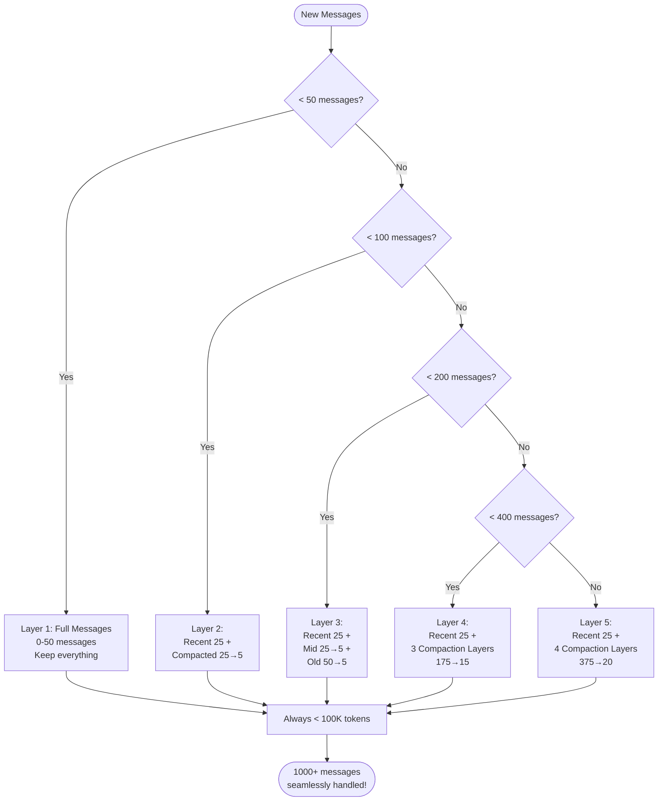

# Context Management: hội thoại dài mà không vỡ trận

> **Cách Claude Code xử lý hội thoại rất dài bằng cơ chế autocompaction 5 lớp**

## TLDR

- Tự động nén ngữ cảnh theo 5 lớp
- Giảm rất mạnh chi phí cho hội thoại dài
- Không buộc người dùng phải can thiệp thủ công
- Giữ được chất lượng ngữ nghĩa sau khi nén
- Kết hợp với prompt cache để giảm thêm chi phí
- Luôn kiểm soát token budget để không tràn context window

## Vấn đề: context window luôn hữu hạn

```mermaid
graph TD
    Start([Start Conversation]) --> M50[Messages 1-50<br/>50K tokens<br/>✅ OK]
    M50 --> M100[Messages 51-100<br/>100K tokens<br/>✅ OK]
    M100 --> M150[Messages 101-150<br/>150K tokens<br/>✅ OK]
    M150 --> M180[Messages 151-180<br/>180K tokens<br/>⚠️ WARNING]
    M180 --> Error[Messages 181+<br/>❌ ERROR<br/>Prompt too long]

    Error --> Manual{Manual Solutions}
    Manual -->|Option 1| Clear[/clear conversation<br/>❌ Lose all context]
    Manual -->|Option 2| Compact[/compact manually<br/>❌ Know when to do it]
    Manual -->|Option 3| New[Start new session<br/>❌ Lose history]
```

Dù model mạnh đến đâu, context window vẫn có giới hạn. Khi cuộc trò chuyện kéo dài:

- số token tăng đều
- chi phí mỗi lượt càng lúc càng đắt
- đến một ngưỡng nào đó thì prompt quá dài và thất bại

Nếu giao hết việc này cho người dùng, trải nghiệm sẽ tệ:

- phải nhớ lúc nào cần `/clear`
- phải chấp nhận mất lịch sử
- hoặc làm việc trong nỗi lo "lát nữa sẽ vỡ context"

## Lời giải của Claude Code: autocompaction



Claude Code không giữ nguyên mọi message mãi mãi. Nó chia lịch sử thành các lớp:

- phần gần hiện tại giữ nguyên chi tiết
- phần xa hơn được nén thành summary
- càng cũ càng được nén mạnh hơn

Kết quả là hội thoại có thể kéo dài rất lâu nhưng trọng tâm vẫn nằm ở phần mới nhất.

## Đi sâu vào kiến trúc

### 1. Cấu trúc message

Message không chỉ là một chuỗi text. Hệ thống cần biết:

- loại message
- vai trò của nó trong tool loop
- phần nào là user intent quan trọng
- phần nào là tool result có thể rút gọn

### 2. Khi nào kích hoạt nén?

Việc nén không diễn ra ngẫu nhiên. Nó được kích hoạt khi:

- số message vượt ngưỡng
- token budget tiến gần mức nguy hiểm
- hệ thống dự đoán phiên làm việc sẽ còn tiếp tục dài

### 3. Thuật toán nén

Nguyên tắc là không nén toàn bộ một cách mù quáng. Hệ thống cố:

- giữ lại phần gần nhất dưới dạng đầy đủ
- rút gọn phần cũ hơn thành summary có ích
- bảo toàn quyết định kỹ thuật, file đang thao tác, lỗi đã gặp và những ràng buộc quan trọng

### 4. Tạo summary

Summary tốt không phải bản rút gọn chung chung. Nó phải trả lời được:

- đang làm gì
- đã thử gì
- file hoặc subsystem nào liên quan
- còn vướng ở đâu

### 5. Nhiều lớp tiến triển

Chính cơ chế nhiều lớp làm Claude Code khác hẳn cách “cắt bỏ” đơn thuần. Ngữ cảnh không mất đột ngột mà được chuyển hóa dần sang dạng cô đọng hơn.

## Ví dụ thực tế: cuộc hội thoại 500 message

### Nếu không có compaction

Phiên làm việc sẽ tiến tới ngưỡng không thể tiếp tục. Tệ hơn, mỗi lượt gọi model trước đó đã trở nên ngày càng đắt.

### Nếu có compaction

Phần gần vẫn đầy đủ để agent làm việc chính xác, còn phần xa được bảo tồn dưới dạng tóm tắt. Người dùng tiếp tục làm việc gần như không phải nghĩ về token.

## Kinh tế token

### Phân tích chi phí

Trong các phiên dài, hiệu quả chi phí không đến từ một mẹo duy nhất mà từ chuỗi quyết định:

- giảm độ dài prompt hiện tại
- tránh phải nhồi toàn bộ lịch sử cũ
- tái sử dụng phần đã được cache

### Tích hợp prompt cache

Compaction càng ổn định và có cấu trúc, khả năng tận dụng cache càng tốt. Đây là chỗ kỹ thuật quản lý context nối trực tiếp với bài toán chi phí.

## Bảo toàn ngữ nghĩa

### Thử thách

Tóm tắt quá mạnh thì mất bối cảnh. Tóm tắt quá nhẹ thì không tiết kiệm được gì.

### Prompt engineering cho chất lượng

Summary phải ưu tiên:

- ý định người dùng
- kết quả quan trọng đã có
- quyết định kỹ thuật đã chốt
- lỗi hay nhánh điều tra còn dang dở

### Chỉ số chất lượng

Một hệ thống compaction tốt được đo bằng việc agent có còn “nhớ đúng” sau nhiều vòng nén hay không, chứ không chỉ bằng số token giảm được.

## Tính năng nâng cao

### 1. Partial compaction

Chỉ nén phần cũ, không đụng vào phần hiện tại đang nóng.

### 2. Content-aware compaction

Không phải message nào cũng quan trọng như nhau. Hệ thống tốt sẽ ưu tiên giữ lại các phần có giá trị suy luận cao.

### 3. Snip compaction

Một số chiến lược nén có thể được đặt sau feature flag để thử nghiệm dần.

## Phân tích cạnh tranh

### Các chiến lược phổ biến

- cắt bớt message cũ
- yêu cầu người dùng dọn lịch sử
- tóm tắt thủ công bằng lệnh riêng

### Claude Code khác ở đâu?

Nó coi context management là subsystem lõi. Nhờ vậy người dùng có trải nghiệm liền mạch hơn nhiều trong các phiên làm việc dài.

## Những điểm “wow”

### 1. Hội thoại 1000+ message

Điểm gây ấn tượng không phải chỉ là “chạy được”, mà là vẫn giữ được tính liên tục của công việc.

### 2. Gần như không cần cấu hình

Người dùng không phải học thêm một bộ quy tắc mới chỉ để né giới hạn context.

### 3. Giữ chất lượng ngữ cảnh

Đây là phần khó nhất, và cũng là chỗ Claude Code làm tốt hơn cách cắt ngữ cảnh thô.

## Điều rút ra

- Context management là bài toán sản phẩm, không chỉ là bài toán token
- Autocompaction nhiều lớp giúp hội thoại dài trở nên thực tế
- Khi kết hợp với cache, lợi ích về chi phí tăng mạnh hơn rất nhiều
