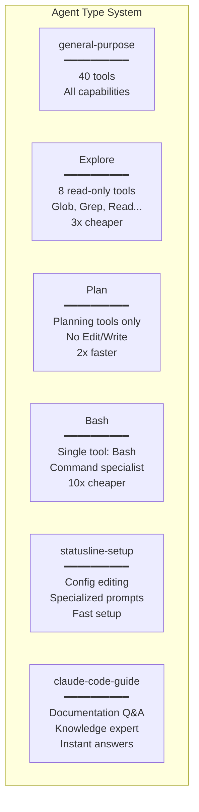

# Multi-Agent Orchestration: chia để xử lý

> **Cách Claude Code phối hợp nhiều agent chuyên biệt để giải các workflow phức tạp**

## TLDR

- Có 6 loại agent chuyên biệt cho từng kiểu công việc
- Dùng mô hình fork để chia sẻ cache và giảm chi phí
- Có coordinator mode để điều phối workflow song song
- Hỗ trợ nhắn tin giữa các agent
- Có task system cho công việc nền
- Với bài toán phù hợp, agent chuyên biệt hiệu quả hơn agent tổng quát

## Vấn đề: một agent không làm tốt mọi thứ

Một agent “biết tất cả mọi thứ” nghe có vẻ tiện, nhưng trong thực tế nảy sinh nhiều vấn đề:

- prompt quá dài
- bộ tool quá rộng
- tác vụ đơn giản cũng phải mang theo toàn bộ ngữ cảnh không cần thiết
- khó song song hóa các nhiệm vụ độc lập

## Lời giải của Claude Code: agent chuyên biệt

Claude Code chia hệ thống thành các agent có vai trò rõ:

- agent khám phá codebase
- agent thiên về bash
- agent thực thi
- agent hỗ trợ lập kế hoạch
- agent phối hợp hay điều tra

Ý tưởng chính là: mỗi loại công việc nên có prompt, tool set và ràng buộc riêng.

## Đi sâu vào kiến trúc

### 1. Định nghĩa agent

Mỗi agent type thường đi kèm:

- instruction riêng
- danh sách tool phù hợp
- giới hạn nhiệm vụ
- cách phản hồi tối ưu cho loại việc đó

### 2. Spawn agent

Khi gặp tác vụ có thể tách nhỏ, hệ thống có thể tạo agent mới thay vì dồn hết vào agent hiện tại. Điều này đặc biệt hữu ích cho các việc đọc, nghiên cứu và kiểm tra song song.

### 3. Fork context: điểm “ma thuật”

Đây là chỗ multi-agent của Claude Code trở nên thực dụng về mặt chi phí. Các agent không phải dựng lại mọi thứ từ đầu; chúng bắt đầu từ một nền ngữ cảnh chung đã có cache.

### 4. Coordinator mode

Khi nhiều agent chạy cùng lúc, cần có một lớp điều phối:

- giao việc cho từng agent
- gom kết quả
- quyết định bước tiếp theo

Không có coordinator, multi-agent rất dễ trở thành hỗn loạn.

## Ví dụ thực tế

### Ví dụ 1: nghiên cứu song song

Một agent có thể đọc subsystem A, agent khác đọc subsystem B, agent thứ ba kiểm tra config. Sau đó coordinator tổng hợp kết quả thay vì bắt một agent tự làm lần lượt tất cả.

### Ví dụ 2: khám phá codebase

Nếu cần tìm entry point, đường data flow và test liên quan, ba nhánh này có thể chia ra độc lập.

### Ví dụ 3: agent chuyên Bash

Những tác vụ shell nặng được giao cho agent có instruction và toolset tập trung hơn, giúp prompt gọn và hiệu quả hơn.

## Các pattern nâng cao

### 1. Đội agent

Không chỉ có “một main agent + vài helper”, hệ thống có thể hình thành một nhóm agent với vai trò rõ.

### 2. Nhắn tin giữa agent

Khả năng gửi thông tin hoặc kết quả cho nhau giúp giảm việc lặp lại công sức.

### 3. Task nền

Một số việc có thể tiếp tục chạy trong khi người dùng đang đọc hoặc khi main flow đã chuyển sang bước khác.

### 4. Plan mode

Không phải tác vụ nào cũng nên thực thi ngay. Có lúc agent cần chia nhỏ việc, lên thứ tự ưu tiên, rồi mới triển khai.

## So sánh hiệu năng

### Agent chuyên biệt và agent tổng quát

Agent chuyên biệt thường:

- chọn tool ít sai hơn
- dùng prompt ngắn hơn
- xử lý đúng việc hơn

### Song song và tuần tự

Những bài toán như nghiên cứu nhiều chủ đề hoặc kiểm tra nhiều vùng code sẽ hưởng lợi rõ từ multi-agent song song.

## Phân tích cạnh tranh

### Hỗ trợ multi-agent

Không phải công cụ nào có “nhiều phiên” cũng thật sự là multi-agent. Điểm khác của Claude Code là có:

- specialization
- chia sẻ cache
- điều phối có cấu trúc

### Ma trận tính năng

Nếu thiếu một trong ba yếu tố trên, multi-agent thường hoặc quá đắt, hoặc quá rối, hoặc không đem lại lợi ích đủ lớn.

## Những điểm “wow”

### 1. Tác vụ nghiên cứu 10 agent

Điều gây ấn tượng là chi phí không tăng tương ứng với số agent nhờ tận dụng cache chung.

### 2. Hiệu quả của Bash specialist

Việc chuyên biệt hóa đem lại lợi ích rất thực: prompt gọn hơn, tool phù hợp hơn.

### 3. Tự động chọn chuyên môn hóa

Người dùng không cần phải tự tay “đóng vai quản lý dự án AI” cho mọi việc nhỏ.

## Điều rút ra

- Multi-agent chỉ đáng giá khi có specialization và cache sharing
- Càng ở workflow phức tạp, kiến trúc điều phối càng quan trọng
- Claude Code biến multi-agent từ một màn trình diễn thành một cơ chế thực dụng
