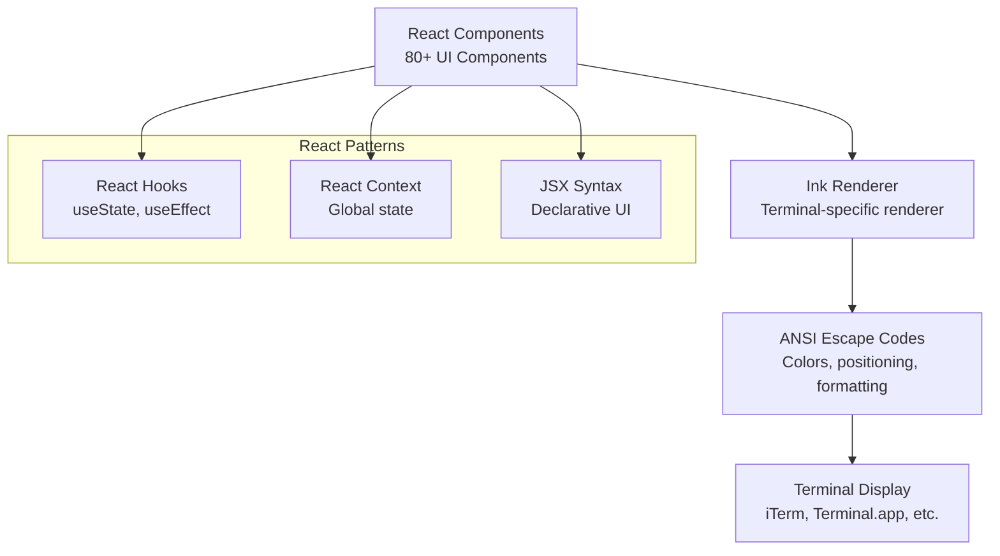

# Terminal UX: đưa React vào terminal

> **Cách Claude Code đạt trải nghiệm gần cấp IDE trong CLI bằng React + Ink**

## TLDR

- `React + Ink` đem mô hình UI hiện đại vào terminal
- Hơn 80 component kết hợp để tạo trải nghiệm CLI giàu trạng thái
- Có cập nhật theo thời gian thực cho progress, spinner và tool result
- Hỗ trợ `vim mode` cho người dùng ưu tiên bàn phím
- Có `command palette` để tìm và chạy lệnh nhanh
- Diff được render rõ ràng ngay trong terminal

## Vấn đề: UX của CLI thường rất tệ

Nhiều công cụ CLI chỉ có:

- output tĩnh
- thiếu phản hồi tiến độ
- tương tác nghèo nàn
- format khó đọc
- khó theo dõi khi có nhiều bước chạy cùng lúc

Trong bối cảnh AI coding, các điểm yếu đó càng lộ rõ vì workflow thường dài, nhiều bước và người dùng cần hiểu hệ thống đang làm gì.

## Lời giải của Claude Code: React + Ink

Claude Code đối xử với terminal như một bề mặt UI nghiêm túc. Khi dùng React + Ink:

- mỗi vùng hiển thị là một component
- trạng thái có vòng đời rõ
- render có thể cập nhật mượt theo event
- hành vi tương tác dễ bảo trì hơn nhiều

## Đi sâu vào kiến trúc

### 1. Cấu trúc component

Các phần UI thường được tách riêng:

- danh sách message
- khu vực tool result
- status bar
- input box
- command palette
- modal xác nhận
- diff viewer

Nhờ đó, việc mở rộng giao diện không cần viết thêm một khối string formatting khổng lồ.

### 2. Ink component cơ bản

Ink cho phép tư duy như React thông thường:

- props đi xuống
- state thay đổi thì UI render lại
- component tái sử dụng được ở nhiều màn hình

### 3. Hiển thị tool đang stream

Một điểm rất đáng giá là UI có thể phản ánh tool execution theo thời gian thực:

- tool nào vừa bắt đầu
- tool nào đang chạy
- kết quả nào đã trả về
- trạng thái nào bị lỗi

### 4. Command palette tương tác

Thay vì buộc người dùng nhớ tất cả slash command, palette giúp:

- tìm nhanh bằng fuzzy search
- xem mô tả lệnh
- chạy lệnh mà không cần thuộc cú pháp

### 5. Input với vim mode

Đây là chi tiết thể hiện rõ tư duy “tool cho power user”. Vim mode giúp người dùng thao tác nhanh hơn trong terminal quen thuộc.

### 6. Diff view

Thay vì nhả ra một mớ patch text khó đọc, Claude Code hiển thị diff theo kiểu trực quan hơn, giúp người dùng đánh giá thay đổi dễ hơn.

## Tính năng nâng cao

### 1. Danh sách message có thể cuộn

Phiên làm việc dài cần một cơ chế hiển thị tốt, không thể chỉ in nối tiếp mãi xuống terminal.

### 2. Status bar

Status bar gom các thông tin quan trọng như:

- trạng thái phiên
- model đang dùng
- chi phí hoặc token
- tiến độ tool

### 3. Hiển thị lỗi

Lỗi được trình bày sao cho người dùng biết:

- lỗi ở đâu
- do tool, model hay permission
- nên làm gì tiếp

## Ví dụ thực tế

### Ví dụ 1: tiến độ nhiều tool

Khi nhiều tool chạy song song, UI vẫn có thể cho người dùng một bức tranh rõ ràng thay vì hỗn loạn.

### Ví dụ 2: màn hình theo dõi chi phí

Với công cụ AI production, cost visibility là một phần của UX chứ không chỉ là telemetry backend.

## Tối ưu hiệu năng

### 1. Virtualization

Giúp giao diện không chậm đi quá mức khi danh sách message hoặc output dài.

### 2. Memoization

Chỉ render lại phần thực sự thay đổi, tránh terminal “nháy” và tốn tài nguyên.

### 3. Lazy loading

Những vùng UI ít dùng hoặc nặng có thể nạp muộn để giảm thời gian khởi động.

## Phân tích cạnh tranh

### Chất lượng UX trong terminal

- Claude Code chọn xây một terminal app thực thụ
- Cursor/Continue phụ thuộc IDE, nên né được bài toán này
- Aider là CLI nhưng đơn giản hơn rất nhiều về mặt hiển thị và tương tác

### So sánh tính năng

Điểm khác biệt không chỉ là đẹp hơn. Giao diện tốt giúp người dùng:

- tin tưởng hệ thống hơn
- hiểu hệ thống đang làm gì
- can thiệp đúng lúc khi cần

## Những điểm “wow”

### 1. Chất lượng gần cấp IDE trong terminal

Đây là thứ nhiều người nghĩ không đáng làm, nhưng khi dùng mới thấy khác biệt lớn.

### 2. Tương tác gần như không độ trễ

Terminal vẫn cho cảm giác nhanh nếu kiến trúc UI đủ tốt.

### 3. Tái sử dụng component

Lợi thế lớn nhất của React không phải chỉ là syntax, mà là khả năng tổ chức UI phức tạp theo các khối dễ quản lý.

## Điều rút ra

- UX tốt không phải đặc quyền của IDE
- React + Ink là lựa chọn rất hợp lý khi CLI cần giàu trạng thái
- Một AI tool mạnh nhưng khó theo dõi sẽ luôn kém hơn một tool vừa mạnh vừa rõ ràng
