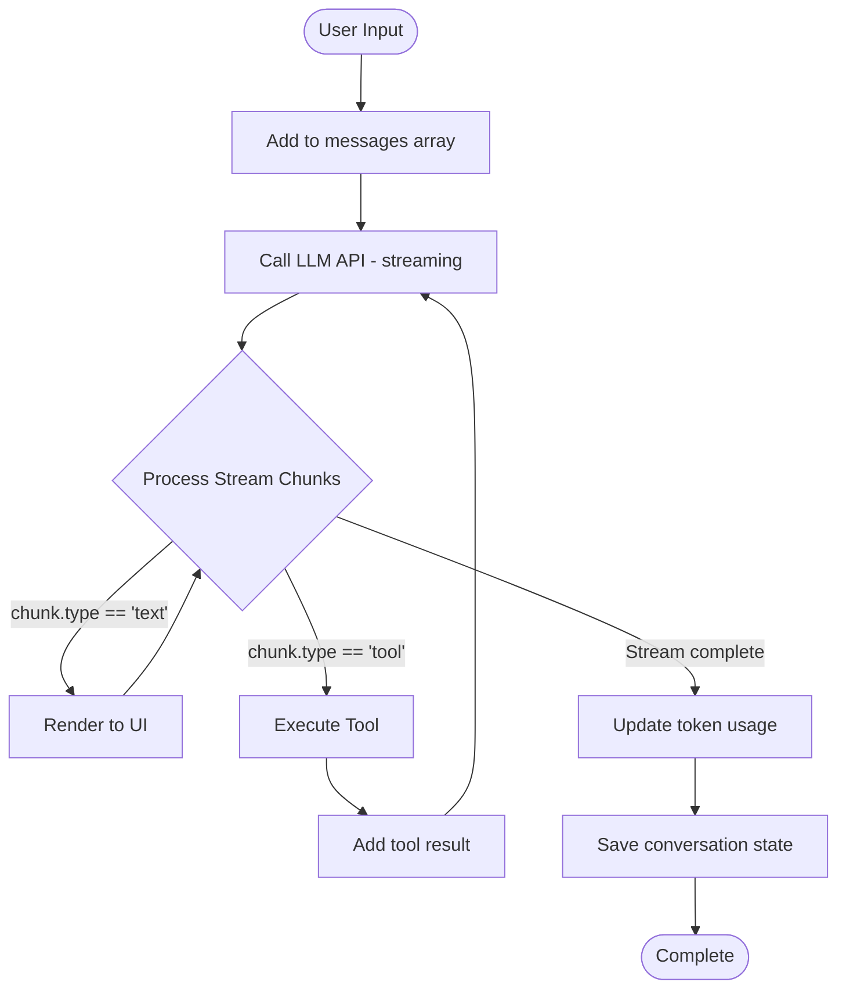
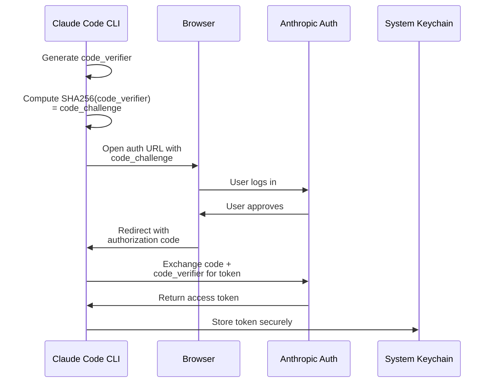

# Architecture Overview: The Big Picture

> **How Claude Code is structured for production-grade AI coding assistance**

## TLDR

- **Layered architecture** with clear separation: UI → Commands → Tools → Services
- **React/Ink terminal UI** with component-based architecture
- **Query Engine** manages LLM lifecycle, streaming, and tool execution loops
- **40+ self-contained tools** with unified interface and permissions
- **Built on Bun** for performance and modern TypeScript support
- **Production-ready** with telemetry, error tracking, and fleet management

---

## High-Level Architecture

```mermaid
graph TB
    subgraph UI["Terminal UI Layer"]
        Messages["Message Display"]
        ToolResults["Tool Results"]
        Progress["Progress Bars"]
        Palette["Command Palette<br/>Vim Mode"]
    end

    subgraph Commands["Command Layer (85)"]
        Commit["/commit"]
        Review["/review"]
        Test["/test"]
        Remember["/remember"]
    end

    subgraph QueryEngine["Query Engine"]
        State["Conversation State"]
        LLM["LLM API Streaming"]
        ToolExec["Tool Execution Loops"]
        Compact["Context Autocompaction"]
        Tracking["Token/Cost Tracking"]
    end

    subgraph Tools["Tool System (40+)"]
        FileIO["File I/O (7)"]
        Bash["Bash (3)"]
        Agents["Agents (9)"]
        Tasks["Tasks (6)"]
        Web["Web (2)"]
        MCP["MCP (5)"]
        LSP["LSP (1)"]
        Utils["Utilities (6)"]
    end

    subgraph Services["Service Layer"]
        API["Claude API"]
        MCPClient["MCP Client"]
        OAuth["OAuth 2.0"]
        Telemetry["Telemetry"]
        Files["Files API"]
        LSPServ["LSP Server"]
        MDM["MDM Policy"]
        Flags["Feature Flags"]
    end

    subgraph Runtime["Runtime & Platform"]
        Bun["Bun Runtime"]
    end

    UI <--> Commands
    Commands <--> QueryEngine
    QueryEngine <--> Tools
    Tools <--> Services
    Services <--> Runtime

```



---

## Core Subsystems

### 1. Terminal UI (`src/components/`)

**Purpose**: Render rich, interactive CLI experience

**Technology**: React + Ink (React renderer for terminals)

**Key Components** (80+):
- `MessageList.tsx` - Conversation display with scrolling
- `ToolUseMessage.tsx` - Tool invocation rendering
- `ToolResultMessage.tsx` - Tool result display
- `CommandPalette.tsx` - Fuzzy-search command picker
- `ProgressBar.tsx` - Live progress indicators
- `VimModeInput.tsx` - Vim keybinding support
- `TokenCounter.tsx` - Real-time token/cost display

**State Management**:
```typescript
// src/state/AppState.tsx
export type AppState = DeepImmutable<{
  messages: Message[];              // Conversation history
  currentModel: ModelSetting;       // Active model
  permissions: PermissionRules;     // Security rules
  activeTools: ToolExecution[];     // Running tools
  tokenUsage: TokenUsage;           // Cost tracking
  settings: SettingsJson;           // User config
  // ... 50+ more properties
}>;
```

**Why React for CLI?**
- **Declarative UI**: Easier to manage complex state
- **Component reuse**: Share logic between CLI and web
- **Rich ecosystem**: Use React patterns (hooks, context, etc.)
- **Maintainability**: Better than imperative terminal manipulation

---

### 2. Query Engine (`src/QueryEngine.ts`, 1,297 lines)

**Purpose**: Orchestrate LLM conversations and tool execution

**Responsibilities**:
1. **Conversation Management**
   - Maintain message history
   - Add user/assistant/tool messages
   - Handle context truncation

2. **LLM API Integration**
   - Stream responses from Claude API
   - Parse SSE (Server-Sent Events) format
   - Handle partial responses

3. **Tool Execution Loop**
   - Detect tool calls in stream
   - Execute tools (concurrent when safe)
   - Inject tool results back into conversation
   - Continue until no more tool calls

4. **Context Autocompaction**
   - Monitor conversation token count
   - Trigger compaction at thresholds
   - Preserve recent messages + summaries

5. **Cost Tracking**
   - Count input/output tokens
   - Track cache creation/read tokens
   - Calculate costs per model

**Data Flow**:



---

### 3. Tool System (`src/tools/`, 40+ tools)

**Purpose**: Provide capabilities to LLM (file I/O, commands, agents, etc.)

**Unified Interface**:
```typescript
// src/Tool.ts
interface Tool {
  // Metadata
  name: string;
  description: string;
  inputSchema: ZodSchema;

  // Execution
  call(input, context, canUseTool, parentMessage, onProgress): Promise<any>;

  // Security
  checkPermissions(input, context): Promise<PermissionCheckResult>;

  // Optimization
  isConcurrencySafe(input): boolean;    // Can run in parallel?
  isReadOnly(input): boolean;           // No side effects?

  // UI
  renderToolUseMessage(input, options): JSX.Element;
  renderToolResultMessage(content, progress, options): JSX.Element;
}
```

**Tool Categories**:

| Category | Tools | Purpose |
|----------|-------|---------|
| **File I/O** | FileRead, FileWrite, FileEdit, Glob, Grep, NotebookEdit, TodoWrite | File operations |
| **Shell** | Bash, PowerShell, REPL | Command execution |
| **Agents** | Agent, TeamCreate, SendMessage, EnterPlanMode, Sleep | Multi-agent orchestration |
| **Tasks** | TaskCreate, TaskUpdate, TaskGet, TaskList, TaskOutput, TaskStop | Background task management |
| **Web** | WebFetch, WebSearch | Internet access |
| **MCP** | MCPTool, ListMcpResources, ReadMcpResource, McpAuth, ToolSearch | MCP integration |
| **Integration** | LSP, Skill | Language servers and skills |
| **Utilities** | AskUserQuestion, Brief, Config, ScheduleCron, RemoteTrigger, SyntheticOutput | Misc utilities |

**Tool Isolation**:
Each tool is self-contained in its own directory:
```
src/tools/BashTool/
├── BashTool.tsx                 # Main implementation
├── UI.tsx                       # Tool use rendering
├── BashToolResultMessage.tsx    # Result rendering
├── bashPermissions.ts           # Permission logic
├── bashSecurity.ts              # Security validation
├── ast.js                       # AST parsing
├── sandbox/                     # Sandboxing
└── __tests__/                   # Unit tests
```

---

### 4. Command System (`src/commands.ts`, 85+ commands)

**Purpose**: Provide high-level workflows via `/slash` commands

**Command Types**:

```typescript
// 1. PromptCommand: Sends formatted prompt with specific tools
type PromptCommand = {
  name: string;
  category: string;
  description: string;
  buildPrompt(context, args): Promise<string>;
  allowedTools?: string[];
  requiresFeature?: string;
};

// 2. LocalCommand: Runs in-process, returns text
type LocalCommand = {
  name: string;
  description: string;
  execute(context, args): Promise<string>;
};

// 3. LocalJSXCommand: Runs in-process, returns React component
type LocalJSXCommand = {
  name: string;
  description: string;
  execute(context, args): Promise<JSX.Element>;
};
```

**Example: `/commit` command**
```typescript
export const commitCommand: PromptCommand = {
  name: 'commit',
  category: 'git',
  description: 'Create a git commit',

  async buildPrompt() {
    const status = await exec('git status');
    const diff = await exec('git diff');

    return `
      Analyze these changes and create a commit:

      ${status}
      ${diff}

      Follow the git commit best practices.
    `;
  },

  allowedTools: ['Bash', 'FileRead'],
};
```

**Command Categories**:
- Git & Version Control (6): `/commit`, `/review-pr`, `/merge`
- Code Quality (4): `/test`, `/lint`, `/refactor`
- Session (8): `/clear`, `/save`, `/restore`
- Configuration (11): `/config`, `/model`, `/api-key`
- Memory (3): `/remember`, `/recall`, `/forget`
- MCP (3): `/mcp-install`, `/mcp-list`, `/mcp-remove`
- Auth (3): `/login`, `/logout`, `/whoami`
- Tasks (4): `/task-create`, `/task-list`, `/task-stop`
- Diagnostics (6): `/debug`, `/cost`, `/tokens`
- IDE (3): `/open-ide`, `/sync-ide`, `/bridge-mode`

---

### 5. Service Layer (`src/services/`)

**Purpose**: External integrations and infrastructure

#### 5.1 Claude API (`src/services/api/`)

**Files**:
- `claude.ts` (125KB) - Anthropic API client
- `withRetry.ts` (28KB) - Retry logic with exponential backoff
- `errors.ts` (42KB) - Error categorization
- `logging.ts` (24KB) - Request/response logging
- `filesApi.ts` (21KB) - File upload/download

**Streaming Implementation**:
```typescript
// src/services/api/claude.ts
async function* streamMessage(request: MessageRequest) {
  const response = await fetch('https://api.anthropic.com/v1/messages', {
    method: 'POST',
    headers: {
      'x-api-key': apiKey,
      'anthropic-version': '2023-06-01',
      'content-type': 'application/json',
    },
    body: JSON.stringify({
      ...request,
      stream: true,
    }),
  });

  // Parse SSE format
  for await (const line of readLines(response.body)) {
    if (line.startsWith('data: ')) {
      const data = JSON.parse(line.slice(6));
      yield data;
    }
  }
}
```

#### 5.2 MCP Client (`src/services/mcp/`)

**Purpose**: Connect to external MCP servers for additional tools

**Flow**:
```
Claude Code (MCP Client)
         ↓
Connect to MCP Server (stdio/HTTP)
         ↓
List available tools
         ↓
Register as MCPTool instances
         ↓
LLM can call MCP tools
```

**Example**:
```typescript
// src/services/mcp/client.ts
const mcpClient = new MCPClient({
  command: 'npx',
  args: ['-y', '@modelcontextprotocol/server-postgres'],
  env: { DATABASE_URL: 'postgres://...' },
});

await mcpClient.connect();
const tools = await mcpClient.listTools();
// → [{ name: 'query', description: 'Execute SQL query', ... }]

const result = await mcpClient.callTool('query', {
  sql: 'SELECT * FROM users LIMIT 10'
});
```

#### 5.3 OAuth 2.0 (`src/services/oauth/`)

**Purpose**: Authenticate users with Anthropic accounts

**PKCE Flow**:



#### 5.4 Feature Flags (`src/services/feature-flags/`)

**Purpose**: Enable/disable features dynamically or at build time

**GrowthBook Integration**:
```typescript
// src/services/feature-flags/growthbook.ts
import { GrowthBook } from '@growthbook/growthbook';

const gb = new GrowthBook({
  apiHost: 'https://cdn.growthbook.io',
  clientKey: GROWTHBOOK_KEY,
  enableDevMode: false,
});

await gb.loadFeatures();

// Runtime check
if (gb.isOn('NEW_UI_REDESIGN')) {
  renderNewUI();
}

// Build-time check (Bun)
if (feature('VOICE_MODE')) {
  // This code is removed if VOICE_MODE=false at build time
}
```

#### 5.5 Telemetry (`src/services/telemetry/`)

**Purpose**: Track usage, errors, and performance

**OpenTelemetry Integration**:
```typescript
// src/services/telemetry/tracing.ts
import { trace } from '@opentelemetry/api';

const tracer = trace.getTracer('claude-code');

const span = tracer.startSpan('tool.execution', {
  attributes: {
    'tool.name': 'Bash',
    'tool.input': JSON.stringify(input),
  },
});

try {
  const result = await executeTool(input);
  span.setStatus({ code: SpanStatusCode.OK });
  return result;
} catch (error) {
  span.recordException(error);
  span.setStatus({ code: SpanStatusCode.ERROR });
  throw error;
} finally {
  span.end();
}
```

---

## Design Principles

### 1. Modularity

**Each subsystem is independent and testable:**
- Tools don't depend on UI
- UI doesn't depend on API
- Services are swappable (e.g., different OAuth providers)

### 2. Type Safety

**Strict TypeScript everywhere:**
```typescript
// All inputs validated with Zod
const inputSchema = z.object({
  file_path: z.string(),
  content: z.string(),
});

type Input = z.infer<typeof inputSchema>;

// Type-safe tool context
interface ToolUseContext {
  options: Options;
  abortController: AbortController;
  messages: Message[];
  // ... fully typed
}
```

### 3. Immutability

**State is immutable using DeepImmutable:**
```typescript
type AppState = DeepImmutable<{
  messages: Message[];
  settings: Settings;
}>;

// Cannot mutate directly:
// state.messages.push(msg); // TypeScript error

// Must create new state:
const newState = {
  ...state,
  messages: [...state.messages, msg],
};
```

### 4. Composition

**Tools compose naturally:**
```typescript
// BashTool can use FileReadTool
const BashTool = {
  async call(input, context) {
    // Read shell script file
    const script = await context.tools.FileRead.call({
      file_path: input.script_path,
    }, context);

    // Execute it
    return await execBash(script);
  },
};
```

### 5. Progressive Enhancement

**Features degrade gracefully:**
- No MCP servers? Use built-in tools
- No OAuth? Use API key
- No telemetry? Still fully functional
- No cache? Slower but works

---

## Technology Stack

### Runtime

**Bun** - Fast, TypeScript-native JavaScript runtime
- **Why Bun?**
  - Fast startup (2x faster than Node.js)
  - Native TypeScript support (no compilation)
  - Built-in bundler and test runner
  - Feature flag support (`bun:bundle`)

### UI Framework

**React + Ink** - Terminal UI with React
- **Why React?**
  - Declarative component model
  - Rich ecosystem (hooks, context, etc.)
  - Testability
  - Code sharing with web version

**Ink** - React renderer for terminals
- **Why Ink?**
  - React patterns in terminal
  - Component-based layouts
  - Built-in hooks (useInput, useFocus, etc.)

### Schema Validation

**Zod** - TypeScript-first schema validation
- **Why Zod?**
  - Type inference (schemas → types)
  - Composable
  - Great error messages
  - Tool input validation

### CLI Framework

**Commander.js** - CLI argument parsing
- **Why Commander?**
  - Industry standard
  - Flag parsing
  - Subcommand support
  - Help text generation

### State Management

**Custom store with React Context**
- **Why custom?**
  - Simpler than Redux
  - Immutable by design
  - Integrates with React
  - No external dependencies

---

## Performance Characteristics

### Startup Time

**Optimized for fast startup:**

| Phase | Time | Optimization |
|-------|------|-------------|
| Prefetch | 0-100ms | Parallel I/O (MDM, keychain, API) |
| Module load | 100-300ms | Lazy imports for heavy modules |
| Config load | 300-400ms | Zod validation |
| OAuth check | 400-500ms | Cached tokens |
| REPL init | 500-600ms | React render |
| **Total** | **~600ms** | Fast for 512K lines of code |

**Compared to competitors:**
- Cursor: N/A (IDE extension, always loaded)
- Continue: N/A (IDE extension, always loaded)
- Aider: ~2000ms (Python startup overhead)

### Memory Usage

**Typical memory footprint:**
- Fresh start: ~80MB
- After 50 messages: ~150MB
- After 200 messages (with compaction): ~200MB
- Long-running session (1000+ messages): ~300MB

**Memory management:**
- Autocompaction prevents unbounded growth
- Old messages summarized and discarded
- Tool results cleaned up after use
- Cache pruning for old file reads

### Token Efficiency

**Context optimization:**
- **Tool definitions**: ~15K tokens (40 tools)
- **System prompt**: ~2K tokens
- **Recent messages**: ~25K tokens average
- **Compacted history**: ~5K tokens
- **Total typical request**: ~47K tokens

**Compared to no optimization:**
- No compaction: ~150K tokens (full history)
- No prompt cache: 3x cost on repeated requests
- No specialized agents: 2x tokens for exploration tasks

---

## Production Readiness

### Reliability

✅ **Error handling** - Comprehensive error categorization
✅ **Retry logic** - Exponential backoff for transient failures
✅ **Circuit breakers** - Prevent cascading failures
✅ **Graceful degradation** - Continue without optional services

### Security

✅ **Permission system** - Fine-grained access control
✅ **AST parsing** - Deep command analysis
✅ **Sandbox support** - Isolated execution
✅ **MDM policy enforcement** - Enterprise controls

### Observability

✅ **OpenTelemetry** - Distributed tracing
✅ **Structured logging** - JSON logs with context
✅ **Error tracking** - Sentry integration
✅ **Analytics** - Usage metrics and A/B testing

### Scalability

✅ **Stateless design** - Easy horizontal scaling
✅ **Session mobility** - Work across devices
✅ **Fleet management** - MDM policies for 10K+ users
✅ **Cost optimization** - Auto-compaction and caching

---

## Key Takeaways

**Architectural Strengths:**
1. **Clean separation of concerns** - UI, logic, services are independent
2. **Type-safe throughout** - Catch bugs at compile time
3. **Production-grade** - Observability, error handling, security
4. **Optimized for scale** - Both performance and cost
5. **Extensible** - MCP, skills, plugins

**What makes this architecture special:**
- **Not a prototype** - Built for 10K+ enterprise users
- **Not a monolith** - Modular, testable, maintainable
- **Not a toy** - Handles real-world complexity (500K LOC)

**Comparison to competitors:**
- **More sophisticated** than Aider (basic CLI)
- **More flexible** than Cursor/Continue (IDE-locked)
- **More production-ready** than all (telemetry, MDM, fleet management)

---

**Next:** [Streaming Execution →](03-streaming-execution)
