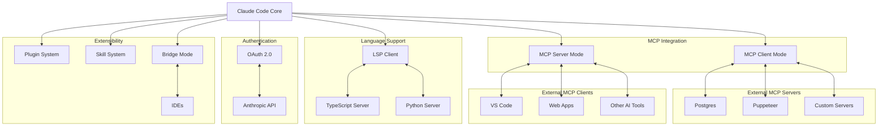

# Integration Ecosystem: The Extensibility Layer

> **How Claude Code integrates with external systems through MCP, LSP, OAuth, and plugins**

## TLDR

- **Dual MCP** - Both client (use external tools) and server (expose tools)
- **LSP integration** - Language Server Protocol for code intelligence
- **OAuth 2.0** - Seamless Anthropic account integration
- **Plugin system** - Custom JavaScript extensions
- **Skill discovery** - Dynamic tool loading from filesystem
- **Bridge mode** - Bidirectional IDE integration

**WOW:** Use database tools from Postgres MCP server while exposing Claude Code's tools to VS Code simultaneously.

---

## The Problem: Closed Ecosystems

Traditional AI tools are **isolated islands**:

```
┌────────────────────────────────────┐
│   Closed System Problems           │
└────────────────────────────────────┘

1. Fixed tool set
   - 20 built-in tools
   - Can't add database access
   - Can't add custom APIs
   ❌ Limited to what's included

2. No interoperability
   - Can't talk to other tools
   - Can't share data
   - Can't compose workflows
   ❌ Isolated silos

3. Hard-coded integrations
   - Each integration is custom code
   - Requires tool maintainer to add
   - Long wait times for new features
   ❌ Slow innovation

4. No extensibility
   - Users can't add tools
   - Enterprises can't customize
   - No plugin ecosystem
   ❌ One-size-fits-all
```

---

## Claude Code's Solution: Open Integration

**Multiple integration points:**



---

## Architecture Deep Dive

### 1. MCP (Model Context Protocol)

**Bidirectional MCP support - unique in the industry:**

#### MCP Client Mode: Use External Tools

```typescript
// src/services/mcp/client.ts
interface MCPClient {
  name: string
  transport: 'stdio' | 'http'
  command?: string
  args?: string[]
  env?: Record<string, string>
}

// Connect to Postgres MCP server
const postgresClient: MCPClient = {
  name: 'postgres',
  transport: 'stdio',
  command: 'npx',
  args: ['-y', '@modelcontextprotocol/server-postgres'],
  env: {
    DATABASE_URL: 'postgres://localhost:5432/mydb',
  },
}

// Initialize connection
await mcpClient.connect()

// List available tools
const tools = await mcpClient.listTools()
// Returns:
// [
//   { name: 'query', description: 'Execute SQL query', inputSchema: {...} },
//   { name: 'schema', description: 'Get database schema', inputSchema: {...} },
// ]

// Call tool
const result = await mcpClient.callTool('query', {
  sql: 'SELECT * FROM users WHERE active = true',
})
```

**Dynamic tool registration:**

```typescript
// src/services/mcp/toolRegistry.ts
class MCPToolRegistry {
  private tools = new Map<string, MCPTool>()

  async registerMCPServer(client: MCPClient) {
    // Fetch tools from server
    const remoteTool = await client.listTools()

    // Register each as a Tool
    for (const toolDef of remoteTools) {
      const tool = this.createMCPToolWrapper(toolDef, client)
      this.tools.set(`mcp:${client.name}:${toolDef.name}`, tool)
    }
  }

  private createMCPToolWrapper(
    toolDef: MCPToolDefinition,
    client: MCPClient
  ): Tool {
    return {
      name: `${client.name}_${toolDef.name}`,
      description: toolDef.description,
      inputSchema: toolDef.inputSchema,

      async call(input, context) {
        // Forward to MCP server
        return await client.callTool(toolDef.name, input)
      },

      // ... other Tool interface methods
    }
  }
}

// LLM now sees MCP tools alongside built-in tools:
// - FileRead (built-in)
// - Bash (built-in)
// - postgres_query (MCP)
// - postgres_schema (MCP)
```

#### MCP Server Mode: Expose Claude Code Tools

```typescript
// mcp-server/src/server.ts
import { MCPServer } from '@modelcontextprotocol/sdk'

const server = new MCPServer({
  name: 'claude-code',
  version: '1.0.0',

  capabilities: {
    tools: true,
    resources: true,
  },
})

// Register tools
server.addTool({
  name: 'read_file',
  description: 'Read file contents',
  inputSchema: {
    type: 'object',
    properties: {
      path: { type: 'string' },
    },
    required: ['path'],
  },
  handler: async (params) => {
    return await fs.readFile(params.path, 'utf-8')
  },
})

server.addTool({
  name: 'run_bash',
  description: 'Execute bash command',
  inputSchema: {
    type: 'object',
    properties: {
      command: { type: 'string' },
    },
    required: ['command'],
  },
  handler: async (params) => {
    return await exec(params.command)
  },
})

// Start server
await server.listen('stdio') // or HTTP
```

**External apps can now use Claude Code's tools:**

```typescript
// In VS Code extension
import { MCPClient } from '@modelcontextprotocol/sdk'

const client = new MCPClient({
  command: 'claude-code',
  args: ['--mcp-server'],
  transport: 'stdio',
})

await client.connect()

// Call Claude Code's tools
const content = await client.callTool('read_file', {
  path: '/path/to/file.ts',
})

const output = await client.callTool('run_bash', {
  command: 'npm test',
})
```

### 2. LSP (Language Server Protocol)

**Code intelligence integration:**

```typescript
// src/services/lsp/client.ts
import {
  createConnection,
  TextDocuments,
  ProposedFeatures,
} from 'vscode-languageserver/node'

interface LSPClient {
  language: string
  serverCommand: string
  serverArgs: string[]
}

// TypeScript LSP
const tsLSP: LSPClient = {
  language: 'typescript',
  serverCommand: 'typescript-language-server',
  serverArgs: ['--stdio'],
}

class LSPManager {
  private clients = new Map<string, LSPConnection>()

  async startServer(config: LSPClient) {
    const connection = await createConnection({
      command: config.serverCommand,
      args: config.serverArgs,
    })

    await connection.initialize({
      processId: process.pid,
      rootUri: `file://${process.cwd()}`,
      capabilities: {
        textDocument: {
          completion: {},
          hover: {},
          definition: {},
          references: {},
        },
      },
    })

    this.clients.set(config.language, connection)
  }

  async getCompletions(file: string, position: Position) {
    const client = this.getClient(file)
    return await client.textDocument.completion({
      textDocument: { uri: `file://${file}` },
      position,
    })
  }

  async getDefinition(file: string, position: Position) {
    const client = this.getClient(file)
    return await client.textDocument.definition({
      textDocument: { uri: `file://${file}` },
      position,
    })
  }

  async getHover(file: string, position: Position) {
    const client = this.getClient(file)
    return await client.textDocument.hover({
      textDocument: { uri: `file://${file}` },
      position,
    })
  }
}
```

**LSP Tool for LLM:**

```typescript
// src/tools/LSPTool/LSPTool.tsx
export const LSPTool = buildTool({
  name: 'LSP',

  inputSchema: z.object({
    operation: z.enum(['completion', 'definition', 'hover', 'references']),
    file: z.string(),
    line: z.number(),
    character: z.number(),
  }),

  async call(input, context) {
    const lsp = context.lspManager

    switch (input.operation) {
      case 'completion':
        return await lsp.getCompletions(input.file, {
          line: input.line,
          character: input.character,
        })

      case 'definition':
        return await lsp.getDefinition(input.file, {
          line: input.line,
          character: input.character,
        })

      case 'hover':
        return await lsp.getHover(input.file, {
          line: input.line,
          character: input.character,
        })

      case 'references':
        return await lsp.getReferences(input.file, {
          line: input.line,
          character: input.character,
        })
    }
  },
})

// LLM can now use LSP:
// "Get type information for variable at line 42"
// → LSP({ operation: 'hover', file: 'src/main.ts', line: 42, character: 10 })
```

### 3. OAuth 2.0 Integration

**Seamless Anthropic account login:**

```typescript
// src/services/oauth/flow.ts
interface OAuthConfig {
  clientId: string
  redirectUri: string
  scopes: string[]
  authEndpoint: string
  tokenEndpoint: string
}

const ANTHROPIC_OAUTH: OAuthConfig = {
  clientId: 'claude-code-cli',
  redirectUri: 'http://localhost:8788/callback',
  scopes: ['api', 'offline_access'],
  authEndpoint: 'https://auth.anthropic.com/oauth/authorize',
  tokenEndpoint: 'https://auth.anthropic.com/oauth/token',
}

// PKCE flow (Proof Key for Code Exchange)
async function startOAuthFlow(): Promise<TokenResponse> {
  // 1. Generate PKCE challenge
  const codeVerifier = generateCodeVerifier() // Random 128-char string
  const codeChallenge = await generateCodeChallenge(codeVerifier)
  // SHA256(codeVerifier) → base64url

  // 2. Build authorization URL
  const authUrl = new URL(ANTHROPIC_OAUTH.authEndpoint)
  authUrl.searchParams.set('client_id', ANTHROPIC_OAUTH.clientId)
  authUrl.searchParams.set('redirect_uri', ANTHROPIC_OAUTH.redirectUri)
  authUrl.searchParams.set('response_type', 'code')
  authUrl.searchParams.set('scope', ANTHROPIC_OAUTH.scopes.join(' '))
  authUrl.searchParams.set('code_challenge', codeChallenge)
  authUrl.searchParams.set('code_challenge_method', 'S256')

  // 3. Open browser
  console.log(`\nOpen this URL in your browser:\n${authUrl}\n`)
  await open(authUrl.toString())

  // 4. Start local callback server
  const code = await startCallbackServer(ANTHROPIC_OAUTH.redirectUri)

  // 5. Exchange code for tokens
  const tokenResponse = await fetch(ANTHROPIC_OAUTH.tokenEndpoint, {
    method: 'POST',
    headers: { 'Content-Type': 'application/json' },
    body: JSON.stringify({
      grant_type: 'authorization_code',
      code,
      code_verifier: codeVerifier,
      client_id: ANTHROPIC_OAUTH.clientId,
      redirect_uri: ANTHROPIC_OAUTH.redirectUri,
    }),
  })

  const tokens = await tokenResponse.json()

  // 6. Store in system keychain (macOS) or encrypted file
  await storeTokens(tokens)

  return tokens
}

// Token refresh
async function refreshAccessToken(refreshToken: string): Promise<TokenResponse> {
  const response = await fetch(ANTHROPIC_OAUTH.tokenEndpoint, {
    method: 'POST',
    headers: { 'Content-Type': 'application/json' },
    body: JSON.stringify({
      grant_type: 'refresh_token',
      refresh_token: refreshToken,
      client_id: ANTHROPIC_OAUTH.clientId,
    }),
  })

  return await response.json()
}
```

**Secure token storage:**

```typescript
// src/services/oauth/storage.ts

// macOS: Use Keychain
async function storeInKeychain(tokens: TokenResponse) {
  await exec(`security add-generic-password \
    -a claude-code \
    -s com.anthropic.claude-code.oauth \
    -w ${tokens.access_token}`)
}

async function getFromKeychain(): Promise<string | null> {
  try {
    const result = await exec(`security find-generic-password \
      -a claude-code \
      -s com.anthropic.claude-code.oauth \
      -w`)
    return result.stdout.trim()
  } catch {
    return null
  }
}

// Linux/Windows: Encrypted file
async function storeInFile(tokens: TokenResponse) {
  const encrypted = await encrypt(
    JSON.stringify(tokens),
    await getMachineKey()
  )

  await fs.writeFile(
    path.join(os.homedir(), '.claude-code', 'tokens.enc'),
    encrypted
  )
}
```

### 4. Plugin System

**JavaScript-based extensions:**

```typescript
// src/utils/plugins/pluginLoader.ts
interface Plugin {
  name: string
  version: string
  description: string
  tools?: ToolDefinition[]
  commands?: CommandDefinition[]
  hooks?: HookDefinition[]
}

// Load plugins from ~/.claude-code/plugins/
async function loadPlugins(): Promise<Plugin[]> {
  const pluginDir = path.join(os.homedir(), '.claude-code', 'plugins')
  const pluginDirs = await fs.readdir(pluginDir)

  const plugins: Plugin[] = []

  for (const dir of pluginDirs) {
    const pluginPath = path.join(pluginDir, dir, 'plugin.js')

    if (await fs.exists(pluginPath)) {
      // Dynamic import
      const plugin = await import(pluginPath)
      plugins.push(plugin.default)
    }
  }

  return plugins
}

// Register plugin tools
function registerPlugin(plugin: Plugin) {
  // Add tools
  for (const toolDef of plugin.tools || []) {
    tools.set(toolDef.name, createToolFromDefinition(toolDef))
  }

  // Add commands
  for (const cmdDef of plugin.commands || []) {
    commands.set(cmdDef.name, createCommandFromDefinition(cmdDef))
  }

  // Add hooks
  for (const hookDef of plugin.hooks || []) {
    hooks.register(hookDef.event, hookDef.handler)
  }
}
```

**Example plugin:**

```javascript
// ~/.claude-code/plugins/jira/plugin.js
export default {
  name: 'jira',
  version: '1.0.0',
  description: 'Jira integration for Claude Code',

  tools: [
    {
      name: 'JiraCreateTicket',
      description: 'Create a Jira ticket',
      inputSchema: {
        type: 'object',
        properties: {
          project: { type: 'string' },
          summary: { type: 'string' },
          description: { type: 'string' },
          type: { type: 'string', enum: ['Bug', 'Task', 'Story'] },
        },
        required: ['project', 'summary', 'description', 'type'],
      },

      async call(input) {
        const response = await fetch('https://jira.company.com/rest/api/2/issue', {
          method: 'POST',
          headers: {
            'Authorization': `Bearer ${process.env.JIRA_TOKEN}`,
            'Content-Type': 'application/json',
          },
          body: JSON.stringify({
            fields: {
              project: { key: input.project },
              summary: input.summary,
              description: input.description,
              issuetype: { name: input.type },
            },
          }),
        })

        return await response.json()
      },
    },
  ],

  commands: [
    {
      name: 'jira-ticket',
      description: 'Create a Jira ticket from conversation',

      async buildPrompt(context) {
        return `
          Review our conversation and create a Jira ticket:
          - Extract the bug/feature request
          - Write clear summary and description
          - Use JiraCreateTicket tool
        `
      },
    },
  ],

  hooks: [
    {
      event: 'post-commit',
      handler: async (context) => {
        // Automatically link commits to Jira tickets
        const message = context.commitMessage
        const ticketId = message.match(/([A-Z]+-\d+)/)?[1]

        if (ticketId) {
          await fetch(`https://jira.company.com/rest/api/2/issue/${ticketId}/comment`, {
            method: 'POST',
            body: JSON.stringify({
              body: `Commit: ${context.commitHash}\n${message}`,
            }),
          })
        }
      },
    },
  ],
}
```

### 5. Skill System

**Filesystem-based tool discovery:**

```typescript
// src/tools/SkillTool/skillLoader.ts
interface Skill {
  name: string
  description: string
  instructions: string
  examples?: string[]
}

// Load skills from ~/.claude-code/skills/
async function loadSkills(): Promise<Skill[]> {
  const skillDir = path.join(os.homedir(), '.claude-code', 'skills')
  const skillFiles = await glob(`${skillDir}/**/*.md`)

  const skills: Skill[] = []

  for (const file of skillFiles) {
    const content = await fs.readFile(file, 'utf-8')
    const skill = parseSkill(content)
    skills.push(skill)
  }

  return skills
}

// Parse skill from markdown
function parseSkill(content: string): Skill {
  const lines = content.split('\n')

  // Extract name from first heading
  const nameMatch = lines.find(l => l.startsWith('# '))
  const name = nameMatch?.slice(2) || 'Unnamed'

  // Extract description from metadata
  const descMatch = content.match(/description: (.+)/)
  const description = descMatch?.[1] || ''

  return {
    name,
    description,
    instructions: content,
  }
}
```

**Example skill:**

```markdown
<!-- ~/.claude-code/skills/api-design.md -->

# API Design Best Practices

description: Guidelines for designing REST APIs

## Instructions

When designing a REST API, follow these principles:

1. Use nouns for resources, not verbs
   - Good: `/users`, `/posts`
   - Bad: `/getUsers`, `/createPost`

2. Use HTTP methods correctly
   - GET: Retrieve resource
   - POST: Create resource
   - PUT/PATCH: Update resource
   - DELETE: Remove resource

3. Use proper status codes
   - 200: Success
   - 201: Created
   - 400: Bad request
   - 401: Unauthorized
   - 404: Not found
   - 500: Server error

4. Version your API
   - Use URL versioning: `/api/v1/users`
   - Or header versioning: `Accept: application/vnd.api+json; version=1`

5. Provide pagination for lists
   - Query params: `?page=1&limit=20`
   - Return metadata: `{ data: [...], total: 100, page: 1 }`

## Examples

### Good API design:

```http
GET /api/v1/users?page=1&limit=20
POST /api/v1/users
PUT /api/v1/users/123
DELETE /api/v1/users/123
```

### Bad API design:

```http
GET /api/getUsers
POST /api/createUser
POST /api/updateUser
POST /api/deleteUser
```
```

**LLM can use skills:**

```typescript
// When user asks: "Design a REST API for blog posts"
// LLM sees skill in context and applies guidelines automatically

// Or explicitly: /skill api-design "Design blog API"
```

### 6. Bridge Mode

**Bidirectional IDE integration:**

```typescript
// src/bridge/bridgeMain.ts
interface BridgeMessage {
  type: 'request' | 'response' | 'event'
  id?: string
  method?: string
  params?: unknown
  result?: unknown
}

// IDE → Claude Code
async function handleIDEMessage(message: BridgeMessage) {
  switch (message.method) {
    case 'executeCommand':
      // IDE requests command execution
      const result = await executeCommand(message.params.command)
      return { id: message.id, result }

    case 'getCompletion':
      // IDE requests AI completion
      const completion = await getCompletion(message.params.context)
      return { id: message.id, result: completion }

    case 'analyzeCode':
      // IDE requests code analysis
      const analysis = await analyzeCode(message.params.code)
      return { id: message.id, result: analysis }
  }
}

// Claude Code → IDE
async function sendToIDE(message: BridgeMessage) {
  // Send via WebSocket/HTTP/stdio
  await bridgeTransport.send(message)
}

// Example: Notify IDE of file change
await sendToIDE({
  type: 'event',
  method: 'fileChanged',
  params: {
    path: '/src/main.ts',
    content: newContent,
  },
})
```

---

## Real-World Integration Examples

### Example 1: Database Query Workflow

**Using Postgres MCP server:**

```typescript
// User: "Show me all active users from the database"

// 1. Claude Code calls MCP tool
await mcpTool.call({
  server: 'postgres',
  tool: 'query',
  params: {
    sql: 'SELECT * FROM users WHERE active = true',
  },
})

// 2. Result returned from Postgres MCP server
// 3. LLM formats results for user
```

**Configuration:**

```json
// ~/.claude-code/mcp-servers.json
{
  "servers": {
    "postgres": {
      "command": "npx",
      "args": ["-y", "@modelcontextprotocol/server-postgres"],
      "env": {
        "DATABASE_URL": "postgres://localhost:5432/mydb"
      }
    },
    "puppeteer": {
      "command": "npx",
      "args": ["-y", "@modelcontextprotocol/server-puppeteer"]
    }
  }
}
```

### Example 2: VS Code Integration

**Claude Code exposes tools to VS Code:**

```typescript
// In VS Code extension
import { MCPClient } from '@modelcontextprotocol/sdk'

const claudeCode = new MCPClient({
  command: 'claude-code',
  args: ['--mcp-server', '--port', '8788'],
})

await claudeCode.connect()

// Use Claude Code's Bash tool from VS Code
const testResult = await claudeCode.callTool('run_bash', {
  command: 'npm test',
})

// Use Claude Code's FileEdit tool from VS Code
await claudeCode.callTool('edit_file', {
  path: 'src/main.ts',
  old_string: 'const port = 3000',
  new_string: 'const port = 8080',
})

// VS Code now has AI-powered file operations!
```

### Example 3: Custom Deployment Plugin

**Deploy to staging on request:**

```javascript
// ~/.claude-code/plugins/deploy/plugin.js
export default {
  name: 'deploy',
  version: '1.0.0',

  tools: [
    {
      name: 'DeployToStaging',
      description: 'Deploy current branch to staging',

      async call(input) {
        // 1. Build
        await exec('npm run build')

        // 2. Run tests
        await exec('npm test')

        // 3. Deploy
        const result = await exec('firebase deploy --only hosting:staging')

        // 4. Notify Slack
        await fetch(process.env.SLACK_WEBHOOK, {
          method: 'POST',
          body: JSON.stringify({
            text: `Deployed to staging: ${result.url}`,
          }),
        })

        return { url: result.url }
      },
    },
  ],

  commands: [
    {
      name: 'deploy-staging',
      description: 'Build, test, and deploy to staging',

      async buildPrompt() {
        return `
          Use the DeployToStaging tool to:
          1. Build the project
          2. Run tests
          3. Deploy to Firebase staging
          4. Notify team on Slack

          Report any errors and suggest fixes.
        `
      },
    },
  ],
}

// Usage: /deploy-staging
```

---

## Competitive Analysis

### Integration Capabilities

| Tool | MCP Client | MCP Server | LSP | OAuth | Plugins | Skills |
|------|-----------|-----------|-----|-------|---------|--------|
| **Claude Code** | ✅ Yes | ✅ Yes | ✅ Yes | ✅ Yes | ✅ Yes | ✅ Yes |
| **Cursor** | ⚠️ Limited | ❌ No | ✅ Yes | ✅ Yes | ⚠️ Limited | ❌ No |
| **Continue** | ✅ Yes | ❌ No | ✅ Yes | ❌ No | ⚠️ Limited | ❌ No |
| **Aider** | ❌ No | ❌ No | ❌ No | ❌ No | ❌ No | ❌ No |

### Extensibility

| Feature | Claude Code | Cursor | Continue | Aider |
|---------|-------------|--------|----------|-------|
| **External tool integration** | ✅ MCP | ⚠️ Limited | ✅ MCP | ❌ None |
| **Custom tools** | ✅ Plugins/Skills | ⚠️ Limited | ⚠️ Limited | ❌ None |
| **Bidirectional integration** | ✅ MCP Server | ❌ No | ❌ No | ❌ No |
| **Language intelligence** | ✅ LSP | ✅ Built-in | ✅ Built-in | ❌ None |
| **Enterprise SSO** | ✅ OAuth | ✅ Yes | ❌ No | ❌ No |

---

## WOW Moments

### 1. The Database-to-Code Pipeline

**Seamless workflow:**

```
User: "Add a new feature: user profiles"

1. Query database schema (Postgres MCP)
   → Gets table structure

2. Generate TypeScript types (LSP)
   → Type-safe models

3. Write API endpoints (FileEdit)
   → REST handlers

4. Create tests (FileWrite)
   → Unit tests

5. Deploy to staging (Custom plugin)
   → Automated deployment

All in one conversation!
```

### 2. The Universal Tool Host

**Claude Code as MCP server:**

```
VS Code Extension
    ↓ calls
Claude Code MCP Server
    ↓ uses
External MCP Servers (Postgres, Puppeteer)

Chain: VS Code → Claude Code → Postgres
Result: VS Code gets database access through Claude Code!
```

### 3. The Skill Library

**Cumulative knowledge base:**

```
Day 1: Create skill "API Design"
Day 2: Create skill "Error Handling"
Day 3: Create skill "Testing Strategy"
...
Day 100: 50+ skills

LLM automatically applies all relevant skills to every task.
Growing intelligence over time!
```

---

## Key Takeaways

**Claude Code's integration ecosystem delivers:**

1. **Dual MCP** - Only tool that's both client AND server
2. **LSP integration** - Code intelligence without IDE
3. **OAuth 2.0** - Seamless authentication
4. **Plugin system** - Custom JavaScript extensions
5. **Skill system** - Markdown-based knowledge
6. **Bridge mode** - Bidirectional IDE integration

**Why competitors can't easily copy:**

- **Dual MCP requires architecture** - Both client and server modes
- **Plugin system needs security** - Sandboxing, permissions
- **OAuth integration is complex** - PKCE flow, token refresh
- **LSP integration requires knowledge** - Protocol understanding

**The magic formula:**

```
MCP + LSP + OAuth + Plugins + Skills = Unlimited Extensibility
```

Claude Code isn't just a tool—it's a **platform** for AI-powered development with an open, extensible architecture that grows with your needs.

---

**Next:** [Production Engineering →](09-production-engineering)
